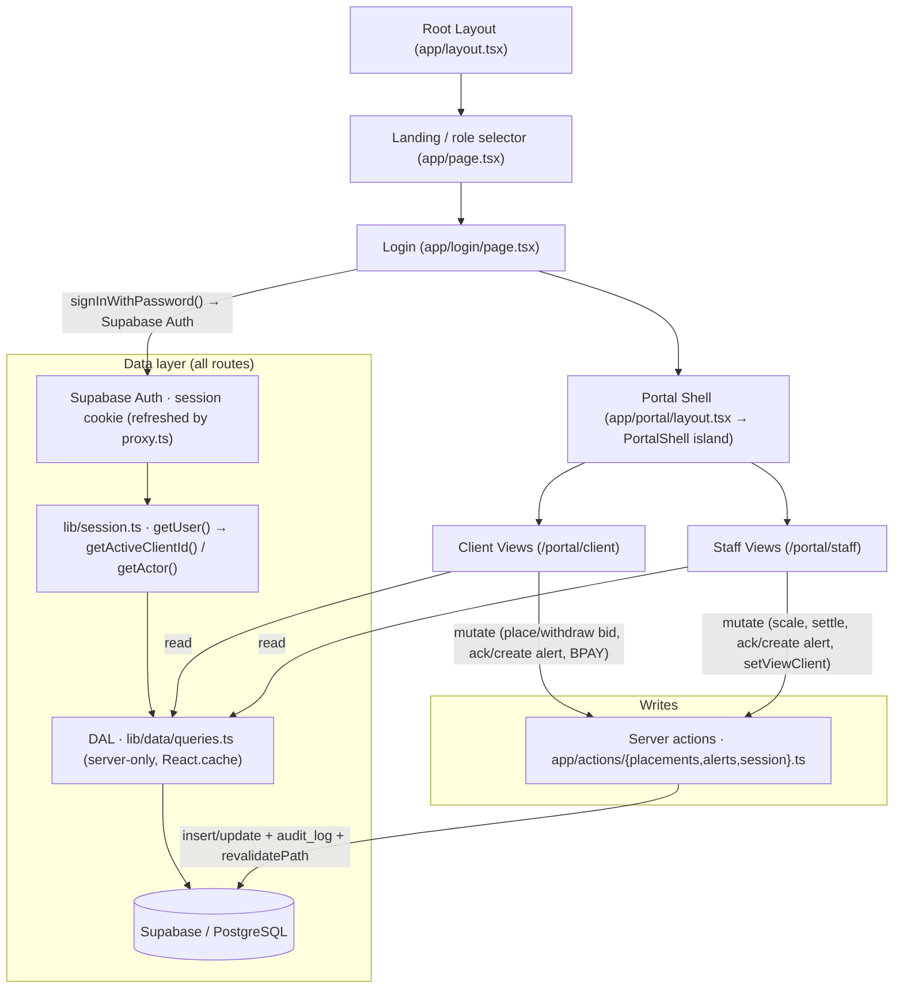

# High-Level Design (HLD) - Vitti Capital Platform

## 1. Project Overview & Objectives
The Vitti Capital Platform is a structured, production-ready Next.js application ported from a single-file HTML prototype (`vitti-capital-platform.html`). It serves as a mock broker dashboard and client desk for high-net-worth (wholesale) clients.

The objectives of the platform are:
- **High Fidelity UI:** Mirroring the aesthetic language of the original mock-up, including custom typography (Fraunces, Hanken Grotesk, IBM Plex Mono), HSL colors (navy, green, paper, etc.), custom option expiry urgency rails, and moneyness bars.
- **Simulated Real-World Functions:** Stateful operations for bidding on open capital raises, scaling allocations, acknowledging system/custom notifications, monitoring option expiration, and viewing transactional audit logs.
- **Dual-role Workspaces:** Dynamic interfaces tailored to **Clients** (portfolio valuation, placing placement bids, options overview, AI assistant) and **Staff/Advisers** (adviser registry, scaling back raises, updating deal stages, auditing trails).

---

## 2. Architecture Layout

The migration from the in-memory prototype to a Supabase backend is **complete**: every portal route is now a Server Component that reads the data-access layer (DAL → Supabase), and all state changes go through **server actions** that write to Supabase and append to `audit_log`. The legacy Zustand store (`lib/db.ts` + `store/useDatabaseStore.ts`) is no longer on any read path — it survives only as a vestigial write in the login page (§3.1) and remains checked in as the reference implementation of the domain logic the schema and DAL were derived from.

> Every interactive route follows a **server page → client island** split: the Server Component resolves the active client (`getActiveClientId`), fetches from the DAL with `Promise.all`, and passes data as props to a `"use client"` island that keeps the interactivity and calls server actions (e.g. `positions/PositionsClient.tsx`, `placements/PlacementsClient.tsx`, `staff/placements/StaffPlacementsClient.tsx`). Pure-display routes (`insights/`) need no island.

---

## 3. High-Level Components

### 3.1 Reactive State Store (`store/useDatabaseStore.ts`) — legacy, off the data path
This store powered the original prototype. It is **no longer read or written by any portal route** — all reads go through the DAL (§3.1b) and all writes through server actions (§3.1c). Its one surviving caller is `app/login/page.tsx`, which still calls `setRole`/`setClientId` alongside the real `signIn` server action; this is a harmless leftover that can be deleted once verified. The store and `lib/db.ts` stay in the tree as the canonical reference implementation of the domain logic (mutation semantics, alert engine, financial helpers) that the SQL schema, DAL, and server actions were ported from. This section documents that legacy path:
- An initial database object (`INITIAL_DATABASE`) is loaded from `lib/db.ts`. At store-init the alerts engine (`scanAlerts`) and audit seeder (`seedAudits`) run once to populate `db.alerts` and `db.audit`.
- The database is managed globally using a **Zustand** store (`useDatabaseStore`), which also tracks session context: `role` (`client | admin`), `clientId`, `viewClient` (the client a staff member is inspecting), and a derived `currentUserLabel` getter used to stamp audit entries.
- Mutators (`mutatePlaceBid`, `mutateWithdrawBid`, `mutateScaleBids`, `mutateUpdatePlacementStage`, `mutateAckAlert`, `mutateAddCustomAlert`, `mutateClientBpayPayment`) copy the database and return updated versions with mutations (e.g., bid increments, allocation scales, custom price alerts, BPAY payment flags).
- The state changes trigger reactively across all active pages via fine-grained slice selectors (e.g., client placements update immediately when a staff member scales allocations).

### 3.1a Production Persistence Model (`db/schema.sql` → Supabase)
The portable PostgreSQL schema (`db/schema.sql`) is now **applied to a live Supabase project** as the first ordered migration (`supabase/migrations/`), with demo data in `supabase/seed.sql`. It normalizes the flat prototype objects into integrity-constrained relations: a shared `securities` price master, per-client `client_accounts` for cash, an append-only month-partitioned `audit_log`, reference/content tables (signals, recommendations, sectors, news, investment ideas, research reports/notes), and a per-client login `email`. See the LLD for the full TypeScript-interface → SQL-table mapping and the deliberate divergences.

### 3.1b Data-Access Layer & Session Bridge (`lib/data`, `lib/session`)
Migrated routes never touch Zustand — they read Supabase through a server-only DAL:
- **DAL (`lib/data/queries.ts`):** one read function per entity (`getPositions`, `getPlacements`, `getSignals`, `getAuditLog`, …), each wrapped in `React.cache` for per-request deduping. It returns **denormalized, UI-ready shapes** — prices/names joined from `securities`, `dte` computed from `expiry_date` (anchored to a demo "today"), bids nested under placements.
- **Multi-account (LLD §8.12):** a client (person) can hold several **accounts**; holdings/cash/bids are account-scoped (`positions`/`option_holdings`/`bids` carry `account_id`). Client holdings reads are account-scoped (`getPositions(accountId)`), staff reads aggregate across a client's accounts (`getClientPositions(clientId)`), and `getActiveAccountId()` picks the active account (a topbar **account switcher** lets clients change it).
- **Compute (`lib/data/compute.ts`):** pure financial math (`posValue`, `posPL`, `portfolioValue`, `isITM`, `unlistedValue`) over DAL shapes; client-safe (type-only imports), so islands reuse it.
- **Supabase clients (`lib/supabase/`):** a browser client and an **async** server client (this Next.js version's `cookies()` is async); types generated into `database.types.ts`.
- **Session bridge (`lib/session.ts` + `app/actions/session.ts`):** now backed by **real Supabase Auth** (email + password). `signInWithPassword` verifies credentials; a root `proxy.ts` refreshes the session cookie on each request; server components read identity via `supabase.auth.getUser()` (`getActiveClientId`, `getActor`), with `role` coming from the user's `app_metadata.role`. The only cookie left is `vitti_view` (which client a staff member is inspecting — UI state).
- **Authorization (Stage 8):** enforced at two layers — **route protection** (`proxy.ts` + portal layout redirect unauthenticated → `/login`; `staff/layout.tsx` blocks non-admins from the staff area) and **Postgres RLS** (LLD §8.11): every DAL read and server-action write runs under the user session, so the database itself guarantees a client only ever touches their own rows while staff (`is_staff()`) see all. Still deferred: real TOTP MFA (the login's OTP screen is cosmetic).

### 3.1c Server Actions (`app/actions/`) — the write path
All mutations are `"use server"` functions that resolve the actor via `getActor()`, write directly to Supabase, insert an `audit_log` row, and call `revalidatePath("/portal", "layout")` so every open surface re-renders with fresh data. They replace the legacy Zustand `mutate*` functions one-for-one (see the LLD §9 mapping):
- **`placements.ts`** — `placeBid`, `withdrawBid`, `scaleBids`, `settlePlacement`, `notifyBpayPayment`. `settlePlacement` carries the settlement engine: it upserts the placement code as a tradable `security`, issues `positions` for each allotted bid, and inserts attaching `option_holdings` (parsing the option ratio from `opts`).
- **`alerts.ts`** — `ackAlert`, `addCustomAlert` (upserts the watchlist row + inserts a triggered `price` alert).
- **`session.ts`** — `signInWithPassword`, `setViewClient`, `setActiveAccount`, `signOut` (cookie/session writes).
- **`accounts.ts`** — `createAccount` (client self-service), `requestAccountMerge` (client → pending request), `decideAccountMerge` (staff approve/reject; approval runs the merge — see LLD §8.13).

### 3.2 Unified Shell Wrapper (`app/portal/layout.tsx` → `PortalShell.tsx`)
The portal layout is now a **Server Component** (`layout.tsx`): it reads the session and fetches badge data (client, clients, alerts, placements) from the DAL, computes the `pendingAllocCount`, and passes everything as props to the `"use client"` **`PortalShell.tsx`** island, which owns the interactive chrome (nav, alerts drawer, sign-out via the `signOut` / `ackAlert` server actions). The shell coordinates a single role-aware navigation config (`navItems.client` / `navItems.admin`) rendered across multiple surfaces:
- **Global Header (Topbar):** Live broker-feed status pill, illustrative search bar, active-user avatar, and the alerts toggle (with unread badge).
- **Desktop Sidebar:** Persistent left panel navigation showing all routes, the workspace label, the signed-in user card, and sign-out.
- **Mobile Bottom Bar:** Fixed bottom tab bar showing the primary (`tab: true`) routes.
- **"More" Overflow Menu:** A mobile modal exposing the secondary routes that don't fit the bottom bar.
- **Alerts Slide-out Drawer:** Pull-out notification interface for acknowledging critical ITM, expiry, exercise-window, and custom price warnings. Staff see firm-wide alerts; clients see only their own.
- **Badges:** The nav computes live badge counts — unread alerts, and (admin only) the count of closed-deal bids still awaiting allocation (`pendingAlloc`).

### 3.3 Responsive Web Layout
The portal layout is fully responsive natively using CSS media queries (Tailwind `md` breakpoint, 768px) — there is no device-frame emulator. On desktop viewports it renders the left navigation sidebar. On mobile or tablet devices it automatically hides the sidebar and renders a fixed bottom navigation bar plus the "More" overflow menu (matching standard mobile app layouts), adjusting page padding (`pb-16 md:pb-0`) so content is never covered by the bottom bar.

---

## 4. Key Architectural Flows

> **Migration note:** these lifecycles now execute as **server actions** (`app/actions/*`, §3.1c) that write to Supabase and insert `audit_log` rows, then `revalidatePath` the portal. The state transitions and audit semantics match the original Zustand `mutate*` implementation (retained as reference in `lib/db.ts`).

### 4.1 Bidding and Allocation Lifecycle
1. **Bid Placement:** Client visits `/portal/client/placements`, uses the bidding workspace to calculate costs, and submits a bid → `placeBid` server action inserts/updates the `bids` row and writes a `Placed bid` audit entry.
2. **Book Close:** Deals are seeded in the `closed` stage; staff work the closed book from `/portal/staff/placements`. (The open→closed transition is part of the data model but not yet wired to a UI control.)
3. **Allocation Scaling:** On a closed deal, staff picks a scaling policy and hits "Publish allocations" → `scaleBids` writes each `bids[i].alloc` and logs `Updated allocations`.
4. **Deal Settlement:** Staff hits "Confirm Settlement" → `settlePlacement` transitions the deal to `settled`, upserts the placement code as a `security`, and converts allotted bids into `positions` (plus attaching `option_holdings`), logging a `Change deal stage` entry.
5. **Confirmation:** Client logs in, sees their dashboard performance updated, and views the placement status as "Allotment confirmed".

### 4.2 Expiry Alert Lifecycle
1. **Options Scan:** The alert engine (originally `scanAlerts`) evaluates options; the resulting `alerts` rows are materialized in Supabase (seeded), and `getAlerts` reads them (scoped per-client for clients, firm-wide for staff).
2. **Alert Triggering:** If an option is within 30 days of expiry, or is in the money (ITM) and unlisted, a warning row is present.
3. **Desk Notice:** The `PortalShell` slide-out drawer (and the alerts pages) render the alerts, unacknowledged first.
4. **Acknowledgement:** Clicking "Ack" calls the `ackAlert` server action, which sets `acknowledged`/`acknowledged_at`/`acknowledged_by` and revalidates the portal, moving it down the priority list.

### 4.3 Account Lifecycle (create + approved merge)
1. **Open account:** A client visits `/portal/client/accounts` and creates a new account (`createAccount`) — it appears immediately in their switcher (empty, s708 "verification pending").
2. **Request merge:** The client requests merging one account into another (`requestAccountMerge`) → a `pending` `account_merge_requests` row; **no data moves yet**.
3. **Desk review:** Staff see the request at `/portal/staff/merge-requests` (with a nav badge) and **Approve** or **Reject** (`decideAccountMerge`).
4. **Execution (on approve):** the source account's cash, positions (weighted-average on shared securities), options and bids move into the target; the source account is deleted; the request is marked `approved`. Rejection just records the decision. Every step is audited. (See LLD §8.13.)
