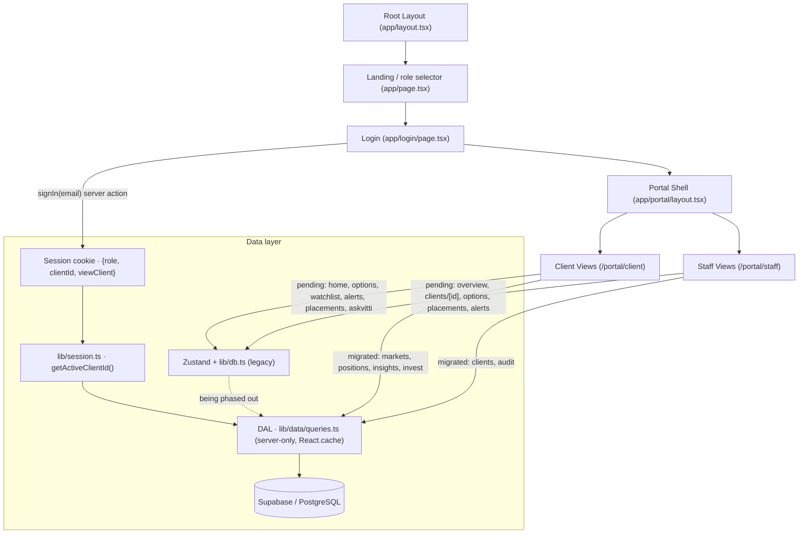

# High-Level Design (HLD) - Vitti Capital Platform

## 1. Project Overview & Objectives
The Vitti Capital Platform is a structured, production-ready Next.js application ported from a single-file HTML prototype (`vitti-capital-platform.html`). It serves as a mock broker dashboard and client desk for high-net-worth (wholesale) clients.

The objectives of the platform are:
- **High Fidelity UI:** Mirroring the aesthetic language of the original mock-up, including custom typography (Fraunces, Hanken Grotesk, IBM Plex Mono), HSL colors (navy, green, paper, etc.), custom option expiry urgency rails, and moneyness bars.
- **Simulated Real-World Functions:** Stateful operations for bidding on open capital raises, scaling allocations, acknowledging system/custom notifications, monitoring option expiration, and viewing transactional audit logs.
- **Dual-role Workspaces:** Dynamic interfaces tailored to **Clients** (portfolio valuation, placing placement bids, options overview, AI assistant) and **Staff/Advisers** (adviser registry, scaling back raises, updating deal stages, auditing trails).

---

## 2. Architecture Layout

The platform is mid-migration from an in-memory prototype to a Supabase backend, so it currently runs **two data paths**: migrated routes are Server Components that read the data-access layer (DAL → Supabase), while not-yet-migrated routes still read the legacy Zustand store.

> Migrated interactive routes follow a **server page → client island** split: the Server Component fetches from the DAL and passes data as props to a `"use client"` island that keeps the interactivity (e.g. `positions/PositionsClient.tsx`, `invest/InvestClient.tsx`).

---

## 3. High-Level Components

### 3.1 Reactive State Store (`store/useDatabaseStore.ts`) — legacy, being phased out
This store powered the original prototype and still backs routes not yet migrated to the DAL (and the portal shell). New work reads Supabase via the data-access layer (§3.1b); this section describes the legacy path:
- An initial database object (`INITIAL_DATABASE`) is loaded from `lib/db.ts`. At store-init the alerts engine (`scanAlerts`) and audit seeder (`seedAudits`) run once to populate `db.alerts` and `db.audit`.
- The database is managed globally using a **Zustand** store (`useDatabaseStore`), which also tracks session context: `role` (`client | admin`), `clientId`, `viewClient` (the client a staff member is inspecting), and a derived `currentUserLabel` getter used to stamp audit entries.
- Mutators (`mutatePlaceBid`, `mutateWithdrawBid`, `mutateScaleBids`, `mutateUpdatePlacementStage`, `mutateAckAlert`, `mutateAddCustomAlert`, `mutateClientBpayPayment`) copy the database and return updated versions with mutations (e.g., bid increments, allocation scales, custom price alerts, BPAY payment flags).
- The state changes trigger reactively across all active pages via fine-grained slice selectors (e.g., client placements update immediately when a staff member scales allocations).

### 3.1a Production Persistence Model (`db/schema.sql` → Supabase)
The portable PostgreSQL schema (`db/schema.sql`) is now **applied to a live Supabase project** as the first ordered migration (`supabase/migrations/`), with demo data in `supabase/seed.sql`. It normalizes the flat prototype objects into integrity-constrained relations: a shared `securities` price master, per-client `client_accounts` for cash, an append-only month-partitioned `audit_log`, reference/content tables (signals, recommendations, sectors, news, investment ideas, research reports/notes), and a per-client login `email`. See the LLD for the full TypeScript-interface → SQL-table mapping and the deliberate divergences.

### 3.1b Data-Access Layer & Session Bridge (`lib/data`, `lib/session`)
Migrated routes never touch Zustand — they read Supabase through a server-only DAL:
- **DAL (`lib/data/queries.ts`):** one read function per entity (`getPositions`, `getPlacements`, `getSignals`, `getAuditLog`, …), each wrapped in `React.cache` for per-request deduping. It returns **denormalized, UI-ready shapes** — prices/names joined from `securities`, `dte` computed from `expiry_date` (anchored to a demo "today"), bids nested under placements.
- **Compute (`lib/data/compute.ts`):** pure financial math (`posValue`, `posPL`, `portfolioValue`, `isITM`, `unlistedValue`) over DAL shapes; client-safe (type-only imports), so islands reuse it.
- **Supabase clients (`lib/supabase/`):** a browser client and an **async** server client (this Next.js version's `cookies()` is async); types generated into `database.types.ts`.
- **Session bridge (`lib/session.ts` + `app/actions/session.ts`):** login resolves the client by email and writes a cookie `{ role, clientId, viewClient }`; server components read `getActiveClientId()` (falling back to the first seeded client pre-login). This is the interim stand-in for real Supabase Auth + RLS, which will replace the cookie read with `getUser()`.

### 3.2 Unified Shell Wrapper (`app/portal/layout.tsx`)
The wrapper coordinates a single role-aware navigation config (`navItems.client` / `navItems.admin`) rendered across multiple surfaces:
- **Global Header (Topbar):** Live broker-feed status pill, illustrative search bar, active-user avatar, and the alerts toggle (with unread badge).
- **Desktop Sidebar:** Persistent left panel navigation showing all routes, the workspace label, the signed-in user card, and sign-out.
- **Mobile Bottom Bar:** Fixed bottom tab bar showing the primary (`tab: true`) routes.
- **"More" Overflow Menu:** A mobile modal exposing the secondary routes that don't fit the bottom bar.
- **Alerts Slide-out Drawer:** Pull-out notification interface for acknowledging critical ITM, expiry, exercise-window, and custom price warnings. Staff see firm-wide alerts; clients see only their own.
- **Badges:** The nav computes live badge counts — unread alerts, and (admin only) the count of closed-deal bids still awaiting allocation (`pendingAlloc`).

### 3.3 Responsive Web Layout
The portal layout is fully responsive natively using CSS media queries (Tailwind `md` breakpoint, 768px) — there is no device-frame emulator. On desktop viewports it renders the left navigation sidebar. On mobile or tablet devices it automatically hides the sidebar and renders a fixed bottom navigation bar plus the "More" overflow menu (matching standard mobile app layouts), adjusting page padding (`pb-16 md:pb-0`) so content is never covered by the bottom bar.

---

## 4. Key Architectural Flows

> **Migration note:** the lifecycles below currently execute as **Zustand mutations** (`mutate*` in `lib/db.ts`). They are being ported to **server actions** that write to Supabase and append to the `audit_log` table; the state transitions and audit semantics stay the same.

### 4.1 Bidding and Allocation Lifecycle
1. **Bid Placement:** Client visits `/portal/client/placements`, uses the bidding workspace to calculate costs, and submits a bid. A `Placed bid` audit entry is created.
2. **Book Close:** Staff member logs in, navigates to `/portal/staff/placements`, and changes the deal stage to "Closed".
3. **Allocation Scaling:** Staff uses the slider or manual inputs to scale back client allocations and hits "Scale & Commit". This updates `bids[i].alloc` values.
4. **Deal Settlement:** Staff transitions the deal stage to "Settled". The database automatically converts allocated bids into equity holdings (adding stocks to `db.positions` and attaching option sweeteners to `db.options`).
5. **Confirmation:** Client logs in, sees their dashboard performance updated, and views the placement status as "Allotment confirmed".

### 4.2 Expiry Alert Lifecycle
1. **Options Scan:** The engine scans options regularly.
2. **Alert Triggering:** If an option is within 30 days of expiry, or is in the money (ITM) and unlisted, it flags warnings.
3. **Desk Notice:** A slide-out alert notification is rendered.
4. **Acknowledgement:** Clicking "Ack" flags the alert as read, moving it down the priority list.
