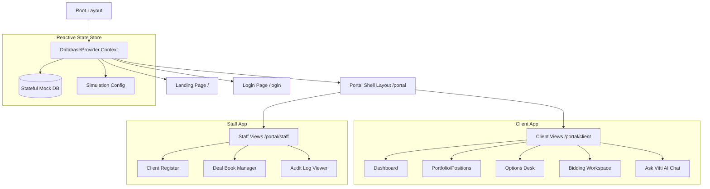

# High-Level Design (HLD) - Vitti Capital Platform

## 1. Project Overview & Objectives
The Vitti Capital Platform is a structured, production-ready Next.js application ported from a single-file HTML prototype (`vitti-capital-platform.html`). It serves as a mock broker dashboard and client desk for high-net-worth (wholesale) clients.

The objectives of the platform are:
- **High Fidelity UI:** Mirroring the aesthetic language of the original mock-up, including custom typography (Fraunces, Hanken Grotesk, IBM Plex Mono), HSL colors (navy, green, paper, etc.), custom option expiry urgency rails, and moneyness bars.
- **Simulated Real-World Functions:** Stateful operations for bidding on open capital raises, scaling allocations, acknowledging system/custom notifications, monitoring option expiration, and viewing transactional audit logs.
- **Dual-role Workspaces:** Dynamic interfaces tailored to **Clients** (portfolio valuation, placing placement bids, options overview, AI assistant) and **Staff/Advisers** (adviser registry, scaling back raises, updating deal stages, auditing trails).

---

## 2. Architecture Layout

---

## 3. High-Level Components

### 3.1 Reactive State Store (`contexts/DatabaseContext.tsx`)
Because this is a self-contained prototype, database interactions are simulated in memory:
- An initial database object (`INITIAL_DATABASE`) is loaded from `lib/db.ts`.
- The database is wrapped in React state (`db`) inside the `DatabaseProvider`.
- Mutators copy the database and return updated versions with mutations (e.g., bid increments, allocation scales, custom price alerts).
- The state changes trigger reactively across all active pages (e.g., client placements update immediately when a staff member scales allocations).

### 3.2 Unified Shell Wrapper (`app/portal/layout.tsx`)
The wrapper coordinates:
- **Global Header (Topbar):** Status indicators, search bar, active user indicators, and global slide-out alerts drawer.
- **Desktop Sidebar:** Persistent left panel navigation.
- **Mobile Bottom Bar:** Navigational tabs for mobile view.
- **Alerts Slide-out Drawer:** Pull-out notification interface for acknowledging critical ITM and expiry warnings.

### 3.3 Responsive Web Layout
The portal layout is fully responsive natively using CSS media queries. On desktop viewports, it renders the left navigation sidebar. On mobile or tablet devices, it automatically hides the sidebar and renders a fixed bottom navigation bar (matching standard mobile app layouts), adjusting page margins to fit nicely.

---

## 4. Key Architectural Flows

### 4.1 Bidding and Allocation Lifecycle
1. **Bid Placement:** Client visits `/portal/client/placements`, uses the bidding workspace to calculate costs, and submits a bid. A `Placed bid` audit entry is created.
2. **Book Close:** Staff member logs in, navigates to `/portal/staff/placements`, and changes the deal stage to "Closed".
3. **Allocation Scaling:** Staff uses the slider or manual inputs to scale back client allocations and hits "Scale & Commit". This updates `bids[i].alloc` values.
4. **Deal Settlement:** Staff transitions the deal stage to "Settled". The database automatically converts allocated bids into equity holdings (adding stocks to `db.positions` and attaching option sweeteners to `db.options`).
5. **Confirmation:** Client logs in, sees their dashboard performance updated, and views the placement status as "Allotment confirmed".

### 4.2 Expiry Alert Lifecycle
1. **Options Scan:** The engine scans options regularly.
2. **Alert Triggering:** If an option is within 30 days of expiry, or is in the money (ITM) and unlisted, it flags warnings.
3. **Desk Notice:** A slide-out alert notification is rendered.
4. **Acknowledgement:** Clicking "Ack" flags the alert as read, moving it down the priority list.
