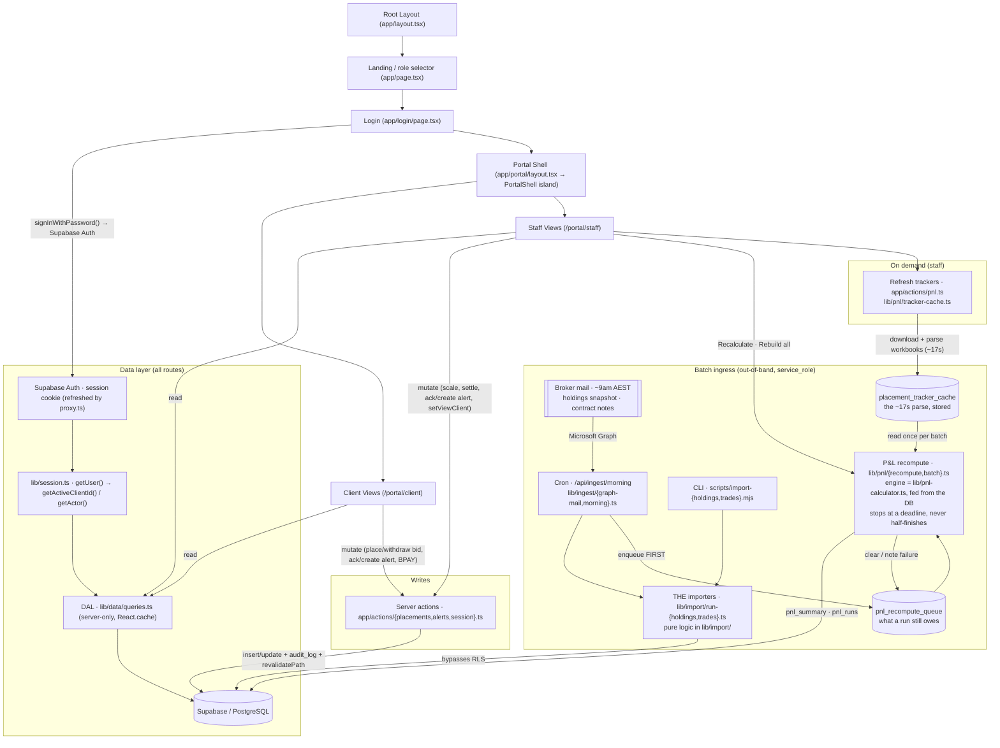

# High-Level Design (HLD) - Vitti Capital Platform

## 1. Project Overview & Objectives
The Vitti Capital Platform is a structured, production-ready Next.js application ported from a single-file HTML prototype (`vitti-capital-platform.html`). It serves as a mock broker dashboard and client desk for high-net-worth (wholesale) clients.

The objectives of the platform are:
- **High Fidelity UI:** Mirroring the aesthetic language of the original mock-up, including custom typography (Fraunces, Hanken Grotesk, IBM Plex Mono), HSL colors (navy, green, paper, etc.), custom option expiry urgency rails, and moneyness bars.
- **Simulated Real-World Functions:** Stateful operations for bidding on open capital raises, scaling allocations, acknowledging system/custom notifications, monitoring option expiration, and viewing transactional audit logs.
- **Real Broker Data:** holdings and P&L are no longer simulated. Two broker CSV exports — a holdings snapshot and a contract-note ledger — are imported by a pipeline (§3.1d) — scheduled off the broker's mail each weekday morning (§3.1f), and runnable by hand — that derives realised P&L from the trade history and reports, rather than silently patches, anything it cannot substantiate.
- **Dual-role Workspaces:** Dynamic interfaces tailored to **Clients** (portfolio valuation, placing placement bids, options overview, AI assistant) and **Staff/Advisers** (adviser registry, scaling back raises, updating deal stages, auditing trails).

---

## 2. Architecture Layout

The migration from the in-memory prototype to a Supabase backend is **complete**: every portal route is now a Server Component that reads the data-access layer (DAL → Supabase), and all state changes go through **server actions** that write to Supabase and append to `audit_log`. The legacy Zustand store (`lib/db.ts` + `store/useDatabaseStore.ts`) is no longer on any read path — it survives only as a vestigial write in the login page (§3.1) and remains checked in as the reference implementation of the domain logic the schema and DAL were derived from.

```mermaid
graph TD
    Root["Root Layout (app/layout.tsx)"] --> Landing["Landing / role selector (app/page.tsx)"]
    Landing --> Login["Login (app/login/page.tsx)"]
    Login -->|"signInWithPassword() → Supabase Auth"| Auth["Supabase Auth · session cookie (refreshed by proxy.ts)"]
    Login --> E["Portal Shell (app/portal/layout.tsx → PortalShell island)"]

    E --> F["Client Views (/portal/client)"]
    E --> G["Staff Views (/portal/staff)"]

    subgraph "Data layer (all routes)"
        Auth --> Session["lib/session.ts · getUser() → getActiveClientId() / getActor()"]
        Session --> DAL["DAL · lib/data/queries.ts (server-only, React.cache)"]
        DAL --> Supa[("Supabase / PostgreSQL")]
    end

    subgraph "Writes"
        Actions["Server actions · app/actions/{placements,alerts,session}.ts"]
        Actions -->|"insert/update + audit_log + revalidatePath"| Supa
    end

    subgraph "Batch ingress (out-of-band, service_role)"
        Mail[["Broker mail · ~9am AEST<br/>holdings snapshot · contract notes"]]
        Cron["Cron · /api/ingest/morning<br/>lib/ingest/{graph-mail,morning}.ts"]
        CLI["CLI · scripts/import-{holdings,trades}.mjs"]
        Runners["THE importers · lib/import/run-{holdings,trades}.ts<br/>pure logic in lib/import/"]

        Mail -->|"Microsoft Graph"| Cron
        Cron --> Runners
        CLI --> Runners
        Runners -->|"bypasses RLS"| Supa

        Cron -->|"enqueue FIRST"| Queue[("pnl_recompute_queue<br/>what a run still owes")]
        Queue --> Recompute["P&L recompute · lib/pnl/{recompute,batch}.ts<br/>engine = lib/pnl-calculator.ts, fed from the DB<br/>stops at a deadline, never half-finishes"]
        Recompute -->|"pnl_summary · pnl_runs"| Supa
        Recompute -->|"clear / note failure"| Queue
        TCache[("placement_tracker_cache<br/>the ~17s parse, stored")] -->|"read once per batch"| Recompute
    end

    subgraph "On demand (staff)"
        Refresh["Refresh trackers · app/actions/pnl.ts<br/>lib/pnl/tracker-cache.ts"]
        Refresh -->|"download + parse workbooks (~17s)"| TCache
    end

    F -->|"read"| DAL
    G -->|"read"| DAL
    F -->|"mutate (place/withdraw bid, ack/create alert, BPAY)"| Actions
    G -->|"mutate (scale, settle, ack/create alert, setViewClient)"| Actions
    G -->|"Recalculate · Rebuild all"| Recompute
    G --> Refresh
```

> **Two write paths, deliberately separate.** Server actions handle *transactional* change originated by a person in the app. The broker importers handle *bulk reconciliation* against an external system of record — they run as `service_role` and rebuild derived tables wholesale. Real client holdings enter the platform only through the second path; nothing in the UI writes `positions` or `trades`.

> **The expensive half is decoupled from the urgent half.** Importing and recomputing are one logical morning, but they are not equally urgent and they are wildly unequal in cost — measured on the first real run, the imports finished and the recompute managed 13 of 43 accounts before the host killed the request at 60s. So the ingest imports, **enqueues** what it touched, and recomputes only what its time budget allows; the rest stays owed in `pnl_recompute_queue`. The one input that made the recompute slow — the Placement Tracker workbooks — moved out of the cron path entirely into `placement_tracker_cache`, refreshed by a staff action rather than re-parsed every cold invocation. §3.1h.

> **Two front doors, one importer.** The scheduled ingest and the CLI are both thin callers of `lib/import/run-*.ts`. The logic used to live inside the CLI scripts as top-level statements that read argv, wrote to stdout and called `process.exit` — fine for one caller and impossible for a second. It now prints nothing and exits nothing: every figure is returned, and a refusal is a typed `ImportError` the caller can act on. That is what lets an unattended job decide between "tell the operator" and "quarantine the file and alert the desk".

> Every interactive route follows a **server page → client island** split: the Server Component resolves the active client (`getActiveClientId`), fetches from the DAL with `Promise.all`, and passes data as props to a `"use client"` island that keeps the interactivity and calls server actions (e.g. `positions/PositionsClient.tsx`, `placements/PlacementsClient.tsx`, `staff/placements/StaffPlacementsClient.tsx`). Pure-display routes (`insights/`) need no island.

---

## 3. High-Level Components

### 3.1 Reactive State Store (`store/useDatabaseStore.ts`) — legacy, off the data path
> Not the only Zustand store: `store/usePnlCalculatorStore.ts` is current and on the live path, holding the P&L Calculator's session state so it survives tab navigation. This section is only about the legacy one.

This store powered the original prototype. It is **no longer read or written by any portal route** — all reads go through the DAL (§3.1b) and all writes through server actions (§3.1c). Its one surviving caller is `app/login/page.tsx`, which still calls `setRole`/`setClientId` alongside the real `signIn` server action; this is a harmless leftover that can be deleted once verified. The store and `lib/db.ts` stay in the tree as the canonical reference implementation of the domain logic (mutation semantics, alert engine, financial helpers) that the SQL schema, DAL, and server actions were ported from. This section documents that legacy path:
- An initial database object (`INITIAL_DATABASE`) is loaded from `lib/db.ts`. At store-init the alerts engine (`scanAlerts`) and audit seeder (`seedAudits`) run once to populate `db.alerts` and `db.audit`.
- The database is managed globally using a **Zustand** store (`useDatabaseStore`), which also tracks session context: `role` (`client | admin`), `clientId`, `viewClient` (the client a staff member is inspecting), and a derived `currentUserLabel` getter used to stamp audit entries.
- Mutators (`mutatePlaceBid`, `mutateWithdrawBid`, `mutateScaleBids`, `mutateUpdatePlacementStage`, `mutateAckAlert`, `mutateAddCustomAlert`, `mutateClientBpayPayment`) copy the database and return updated versions with mutations (e.g., bid increments, allocation scales, custom price alerts, BPAY payment flags).
- The state changes trigger reactively across all active pages via fine-grained slice selectors (e.g., client placements update immediately when a staff member scales allocations).

### 3.1a Production Persistence Model (`db/schema.sql` → Supabase)
The portable PostgreSQL schema (`db/schema.sql`) is now **applied to a live Supabase project** as the first ordered migration (`supabase/migrations/`), with demo data in `supabase/seed.sql`. It normalizes the flat prototype objects into integrity-constrained relations: a shared `securities` price master, per-client `client_accounts` for cash, an append-only month-partitioned `audit_log`, reference/content tables (signals, recommendations, sectors, news, investment ideas, research reports/notes), and a per-client login `email`. See the LLD for the full TypeScript-interface → SQL-table mapping and the deliberate divergences.

### 3.1b Data-Access Layer & Session Bridge (`lib/data`, `lib/session`)
Migrated routes never touch Zustand — they read Supabase through a server-only DAL:
- **DAL (`lib/data/queries.ts`):** one read function per entity (`getPositions`, `getPlacements`, `getSignals`, `getAuditLog`, …), each wrapped in `React.cache` for per-request deduping. It returns **denormalized, UI-ready shapes** — prices/names joined from `securities`, `dte` computed from `expiry_date` (anchored to a demo "today"), bids nested under placements.
- **Multi-account (LLD §8.12):** a client (person) can hold several **accounts**; holdings/cash/bids are account-scoped (`positions`/`option_holdings`/`bids` carry `account_id`). Client holdings reads are account-scoped (`getPositions(accountId)`), staff reads aggregate across a client's accounts (`getClientPositions(clientId)`), and `getActiveAccountId()` picks the active account (a topbar **account switcher** lets clients change it).
- **Compute (`lib/data/compute.ts`):** pure financial math (`posValue`, `posPL`, `portfolioValue`, `isITM`, `unlistedValue`) over DAL shapes; client-safe (type-only imports), so islands reuse it.
- **Supabase clients (`lib/supabase/`):** a browser client and an **async** server client (this Next.js version's `cookies()` is async); types generated into `database.types.ts`.
- **Session bridge (`lib/session.ts` + `app/actions/session.ts`):** backed by **real Supabase Auth**, signing in with a **one-time code emailed to the address — there is no password** (a code sent alongside one is not a second factor: `signInWithPassword` returns a valid session the moment the password is accepted). `requestLoginCode` → `verifyLoginCode`; a root `proxy.ts` refreshes the session cookie on each request; server components read identity via `supabase.auth.getUser()` (`getActiveClientId`, `getActor`), with `role` from `app_metadata.role` — stamped from the **email domain** by a trigger on `auth.users`, so `@vitti.capital` is staff and everything else is a client. The only cookie left is `vitti_view` (which client a staff member is inspecting — UI state). LLD §8.32.
- **Authorization:** enforced at two layers — **route protection** (`proxy.ts` + portal layout redirect unauthenticated → `/login`; `staff/layout.tsx` blocks non-admins from the staff area) and **Postgres RLS** (LLD §8.11): every DAL read and server-action write runs under the user session, so the database itself guarantees a client only ever touches their own rows while staff (`is_staff()`) see all.
- **One source per figure, for both audiences (LLD §8.33):** the client portal reads the **stored P&L** the staff console reads, through the same rollup and with the same corrections applied. It previously computed its own from the current holdings snapshot, which knows nothing about parcels already sold — so a client's realised profit did not appear on their own screen, and their adviser was reading a different number for the same holding. The desk's working notes are not carried across.

### 3.1c Server Actions (`app/actions/`) — the write path
All mutations are `"use server"` functions that resolve the actor via `getActor()`, write directly to Supabase, insert an `audit_log` row, and call `revalidatePath("/portal", "layout")` so every open surface re-renders with fresh data. They replace the legacy Zustand `mutate*` functions one-for-one (see the LLD §8.8 mapping):
- **`placements.ts`** — `placeBid`, `withdrawBid`, `scaleBids`, `settlePlacement`, `notifyBpayPayment`. `settlePlacement` carries the settlement engine: it upserts the placement code as a tradable `security`, issues `positions` for each allotted bid, and inserts attaching `option_holdings` (parsing the option ratio from `opts`).
- **`alerts.ts`** — `ackAlert`, `addCustomAlert` (upserts the watchlist row + inserts a triggered `price` alert).
- **`session.ts`** — `signInWithPassword`, `setViewClient`, `setActiveAccount`, `signOut` (cookie/session writes).
- **`accounts.ts`** — `createAccount` (client self-service), `requestAccountMerge` (client → pending request), `decideAccountMerge` (staff approve/reject; approval runs the merge — see LLD §8.13).
- **`trades.ts`** — `deleteTradeAction`, `deleteAllTradesForTickerAction`, `excludePositionAction`. Deletes raw ledger contract notes with audit trail and triggers client P&L recomputations.

### 3.1d Broker Data Pipeline (`lib/import/`, `scripts/import-*.mjs`) — the batch ingress

Real client holdings come from two broker CSV exports that answer different questions, and are therefore modelled as two sources rather than merged into one:

| Export | Answers | Owns |
|---|---|---|
| **Holdings snapshot** | "what is held right now" — units, average cost, **market price** | `clients`, `accounts`, `securities`, `positions` |
| **Trade ledger** (contract notes) | "how we got here" — BUY/SELL, units, net value | `trades`, and the derived `realized_pnl` |

Neither can do the other's job: a snapshot cannot express what was made on units already sold, and a ledger that starts mid-history cannot value what is still held. Keeping both, each owning its own tables, means neither has to lie.

- **All logic is pure and shared.** Parsing, ticker normalization, the cost-basis reducer and reconciliation live in `lib/import/` with no I/O, no `server-only`, and no dependencies — so the same code is unit-tested, runs in the CLIs today, and could back a staff upload UI tomorrow without a rewrite.
- **Idempotent by construction.** The snapshot import is a full replace scoped to the accounts in the file; the ledger upserts on `(cnote, raw_security, side)`. Re-running any export converges to the same rows.
- **The ledger arrives in two dialects, and only one of them is understood.** The scheduled mail carries `ContractNotesListing` — the same data under different names and different encodings (`B`/`S`, single-letter statuses, negative units on a sale, `Nett` for the fee-inclusive value). `lib/import/trade-formats.ts` translates it into the shape `trades.ts` already knows, in one file a person can read against a sample row, rather than teaching the parser two grammars. Unknown status codes are stored verbatim instead of being mapped to a guess: only `SETTLED` is load-bearing, so an unrecognised code is already excluded from P&L while staying honest about what the broker actually said.
- **A file the snapshot never mentions still has an owner.** The snapshot creates accounts, but it only knows what is *currently held* — a client who has sold everything appears in no snapshot and in a full trade history. The ledger names the holder, so the account is created from that rather than refused; the broker's suspense account is excluded by name, and anything genuinely unidentifiable is dropped and reported rather than failing the whole file.
- **Foreign listings are not ASX codes.** An exchange-qualified code (`RKLB:NAS`) is its own parent and never an option, and the rule that says so is shared with the P&L engine — two copies would drift, and the importer and the calculator disagreeing about what a security *is* surfaces later as a P&L discrepancy nobody can explain.
- **The imports themselves are `run-holdings.ts` / `run-trades.ts`**, and both the CLI (§3.1d) and the scheduled ingest (§3.1f) call them. They return a structured result and throw typed errors rather than printing and exiting, which is the whole reason a second, unattended caller was possible at all.

### 3.1f Scheduled mail ingest (`lib/ingest/`, `app/api/ingest/morning/route.ts`)

The broker mails the same two exports every weekday around 9am AEST. A cron route reads that mailbox and runs the pipeline above.

- **Mailbox, not list.** Read over Microsoft Graph with the app registration already used for private spreadsheet links. `BROKER_MAILBOX` must resolve to a real mailbox — a distribution list forwards to its members and stores nothing, so there is nothing for Graph to open. `Mail.Read` at application level reaches *every* mailbox in the tenant, so the registration is scoped with an `ApplicationAccessPolicy` to just this one.
- **Which mail, then which file.** Sender allowlist first (an env var, because a broker's address changes without a deploy), optionally a subject regex and a mail folder, then a received-time watermark. None of that decides *what a file is*: that is settled by the **CSV headers**, because filenames are a convention someone has to remember and are routinely wrong. A file matching neither export is recorded and skipped rather than guessed at.
- **The server-side filter is an optimisation, never the boundary.** Exchange rejects a `$filter` it considers too expensive (`InefficientFilter`), and which queries qualify depends on the mailbox's size and indexes rather than on anything visible from here. So the reader degrades — drop the sort, then drop the sender clause — and **re-applies the allowlist in memory on every path**. Otherwise "the query degraded" would quietly become "we now import attachments from anyone who can mail this address."
- **Order matters and is enforced.** Holdings before trades — the snapshot creates the accounts a ledger references. Then the touched accounts are **queued**, and recomputed within a budget (§3.1h).
- **Done means done, and only two outcomes qualify.** `imported` and `unrecognised` are final — the work is finished, or a file's columns will not change between runs. `failed` and `quarantined` are explicitly not: their causes are usually what the next run fixes, and treating them as done manufactures a permanent skip out of a temporary problem. That is not hypothetical — three trade files failed on unknown accounts, and once the importer was taught to create those accounts the fix could not take effect because the files had been marked seen. What *is* skipped is a byte-identical resend: the broker mails the same full-history export daily, and identical bytes cannot produce a different outcome.
- **The watermark yields to the attachment table.** It advances only when every attachment in the window is settled and nothing is still owed. The table is what guarantees correctness; the watermark only avoids re-listing old mail. Re-reading a message costs a Graph call — skipping one costs the day's data.
- **The coverage guardrail.** The holdings import is a full replace, so a truncated export would faithfully delete the accounts it omits. A file covering under 90% of the accounts that currently hold positions is **quarantined**, and the watermark does not advance past it — it is re-offered tomorrow rather than skipped. Clients do close accounts; a tenth of the book disappearing overnight is a different event, and the difference is exactly what a threshold encodes.
- **Everything is written down.** `ingest_runs` and `ingest_attachments` record each run and each file with its outcome and reason. Nobody is watching a console at 9am, so the output has to be a table — a quarantined file in particular has to be findable, explainable and re-runnable by hand.
- **And it is read where the desk already looks.** Written-down is not the same as seen: for a while the only way to ask "did this morning land?" was a SQL console, which is the wrong place for an operational answer when the pipeline's worst failure is a *silent* one — a run killed at the host's ceiling writes no row at all, so the evidence is an **absence**. The runs are therefore merged into the audit log's chronology rather than given a page of their own, so a missing morning shows up as a gap in a list the desk reads anyway, and the accounts a run left owed surface as a `Recompute pending` pill on the client profile — the one place a stale figure would otherwise be mistaken for a settled one.
- **Safe to repeat, which is the DST answer.** Cron is UTC and Sydney is UTC+10/+11, so two schedules (00:00 and 01:00 UTC) fire across the window instead of tracking the changeover. Attachment dedupe on Graph's own ids, content-hash dedupe on the bytes, and idempotent importers make a redundant run almost free — and the second entry doubles as the retry for whatever the first run left queued.

### 3.1f-2 Deal mail → the placements book (`placement_candidates`, `/api/ingest/placements`)

Placement and IPO announcements are processed by a **separate system** — `Placement_Email` summarises them into SQLite, `placement_api.py` serves them from EC2, and the ASX_Dashboard app views them. This is how those deals reach the desk's book.

- **A summary is not a deal.** The feed carries a ticker, a subject line and prose. It carries no price, raise size or minimum bid — the three things `placements` requires `NOT NULL`, and the three things a bid is measured against. So candidates land in their own table and a human **promotes** one, supplying the terms. Defaulting them to zero would put a live deal in front of the desk with a $0 minimum: not visibly broken, just quietly accepting the wrong money.
- **Copied on a schedule, not read live.** The upstream endpoint fetches market data per ticker and calls an LLM on a cache miss. A page render must not depend on that, and an EC2 hiccup must not take the Placements tab with it.
- **Its own cron.** The morning ingest is already tight against its ceiling and its work is what must not be crowded out. A deal summary an hour late costs nothing.
- **The desk books in shares.** `amount` stays the money truth because scaling, allocation and BPAY are dollar-denominated, but it is derived from `qty × price` and the quantity is stored beside it — dollars alone round 3,000 shares into something that reads back as 3,000.03.

### 3.1g Stored P&L (`lib/pnl/`, `pnl_summary`, `pnl_runs`)

The client profile's P&L table renders what was computed and **stored**, rather than deriving it on each request.

- **Why store at all.** The full calculation is not a pure function of the database. Free unlisted options are valued with Black-Scholes off a **live** spot price, and the Placement Tracker workbooks cost ~17s to download and parse (which is why they are now parsed on demand into a cache the recompute reads — §3.1h). A figure that depends on the minute it was computed cannot be re-derived later — and one that has been shown to a client must be explainable a week afterwards. `pnl_runs` records the inputs in force (spot sources, tracker count, warnings); `pnl_summary.run_id` ties every row to one.
- **Why not `realized_pnl`.** That table remains the cost-basis rollup over the ledger alone: parent-code grain, no placement enrichment, no open-position valuation, no option rows. It answers a different question and keeps answering it.
- **One engine, two front doors.** The temptation is a second implementation that reads the database — which is how two P&L figures for the same client start disagreeing and the desk has to decide which to believe. Instead `lib/pnl/from-db.ts` reshapes stored `trades` into the *calculator's own* `ParsedTradeRow`, and every stage after that (aggregate → Placement Tracker merge → snapshot valuation → Black-Scholes) is the code the calculator page runs. The file upload and the morning ingest are two ways into one engine.
- **Expensive inputs are injected, not fetched.** `recomputeAccountPnl` refuses to load the trackers, quote a price, or read the security catalogue itself; `lib/pnl/batch.ts` resolves all three once and shares them, memoising quotes per ticker. The catalogue was the one that got missed, and it cost the most in the end: `securities` is the same table for every account and both loaders read it whole, so a 43-account morning read it **86 times** — which is what left 19 accounts queued on a real run long after the tracker parse had been cached away. Fifty clients holding the same option cost one quote — and, less obviously, are all valued at the *same* quote, which per-account fetching would not guarantee. The trackers are now *read from a cache* rather than parsed at all (§3.1h), and if that cache is empty the batch **stores nothing**: rows missing every placement buy side and every option line are indistinguishable from correct ones once written.
- **A row's open/closed state is verified against holdings, not inferred from the ledger.** `open_qty` is `buy_qty − sell_qty`: it says the ledger never saw those units sold, which is not the same as somebody holding them. Read as "still held" it put positions on client profiles that had already been exited — 10,000 bought, 4,000 sold, and nothing in the client's holdings — and hid the missing sell contract notes behind an amber "Open" pill. The recompute now records `not_in_holdings` when the snapshot was checked and came back empty, and the status reads **Missing Sells** / **Closed** on exactly those rows. Only a *positive* check can close a position: with no snapshot consulted the flag stays false and the row is left as it was, because reporting a disposal on the strength of silence is the worse error. See LLD §8.18.
- **Overrides are not baked in.** `pnl_overrides` is still applied at read time (§3.1c / LLD §8.16), so a correction keeps tracking the sources underneath it instead of being frozen into a stored row.
- **Staleness is shown, not hidden.** The tab carries a "calculated at" stamp and the run's warnings, plus a **Recalculate** button; the register has **Rebuild all P&L** for the first fill and after an engine change. A stored figure is only as good as its age, and the age is a fact the reader is entitled to.

### 3.1h Tracker cache & recompute queue (`placement_tracker_cache`, `pnl_recompute_queue`)

Two tables that exist because of one production run. It imported both files, recomputed 13 of 43 accounts, and was killed by the host at its 60s request ceiling — before any `ingest_runs` row was written, so nothing was corrupted and nothing was recorded either. The measured breakdown was ~17s parsing the Placement Trackers and ~3s per account, against the ~150s that 43 accounts needs.

- **The slow input was being recomputed daily for no reason.** The parsed trackers were cached in module memory with a 10-minute TTL, which serves a warm server well and a scheduled job not at all: every cron invocation is a cold function, so every one paid the full parse for a workbook nobody had edited. The parsed output is ~0.23 MB of JSON, so it is **stored in Postgres** and the cost becomes one row read. The parse now happens only when a human presses **Refresh trackers**, which is the right cadence anyway — placements are issued occasionally, not daily.
- **The cache is a materialisation, never a source of truth**, and a stale one is a real risk: a placement issued this morning is invisible until the cache is refreshed. So its age is reported wherever the figures are, and the merged map reports its **oldest** input rather than its newest, because a merge is only as fresh as its stalest part.
- **The URL is hashed, not stored.** For an "anyone with the link" sheet the URL *is* the credential, and this table is readable by every staff member.
- **An empty cache is a refusal, not a default.** The batch declines to compute rather than storing rows with no placement buy sides and no option lines — once stored, those are indistinguishable from correct ones.
- **The queue makes an interrupted morning visible rather than lost.** Accounts are enqueued *before* the recompute is attempted (enqueueing afterwards loses exactly the case the queue exists for), the batch stops starting new accounts at a deadline while always letting a running one finish — abandoning one mid-write is how a half-replaced `pnl_summary` happens — and whatever is left stays queued for the next run or the desk's **Rebuild all P&L**. Each row carries an `attempts` count and its `last_error`, so an account that fails every morning stops looking like ordinary backlog. Owed work is picked up regardless of which accounts today's file happened to mention.

### 3.1e In-Memory PNL Calculator (`/portal/staff/pnl-calculator`)
A dedicated admin utility that parses broker trade ledger files (`.xlsx`, `.xls`, `.csv`, `.xlsm`, `.xlsb`) and Placement Tracker workbooks entirely in-memory with **zero database persistence**:
- **Zero-Storage Execution:** Processes trade files without writing to PostgreSQL or Supabase storage buckets. Client-side `ArrayBuffer` parsing executes in 5ms directly in browser memory, avoiding server action payload limits.
- **Trade Ledger Upload — one file at a time:** a trade file is uploaded on its own and a new upload replaces it, shown as a badge with its trade count and a `✕` to clear. Accumulating several files was removed: the summary, the placement-merge hints and the account filter all had to agree about whose trades were in play, and with several loaded they drifted — a second upload left the placement merge showing the first file's enrichment. Placement Trackers remain multi-file.
- **SheetJS (`xlsx`) Universal Dual-Engine Parser Fallback:** Combines ExcelJS with SheetJS (`XLSX.read`) fallback to seamlessly parse legacy `.xls` (Excel 97-2003 BIFF8 binary format), `.xlsx`, `.csv`, `.xlsm`, `.xlsb`, and HTML tables exported as `.xls` by desktop broker platforms (e.g., IRESS).
- **Dynamic Header Row Detection & Truncated Header Support:** Scans the first 15 rows of any worksheet/matrix to locate the exact header row by keyword match density, handling title rows, leading blank rows, and truncated broker header strings (e.g. `Contract Dat`, `Considera`, `Other Cha`).
- **Settlement Filtering, Trade Type Fallback & Ticker Aggregation:** Evaluates strictly `SETTLED` trades and auto-detects `SELL` trades using negative unit numbers (`rawUnits < 0`) when column types are missing. Aggregates derivative & option tickers (`EOSXX`, `ENVO`, `NVOO`) into 3-character ordinary parent codes (`EOS`, `ENV`, `NVO`). Tickers are sorted in **ascending alphabetical order** across UI tables and file exports.
- **Client Account Filter Bar (`external_ref`):** Staff can filter parsed ledger trades by broker account number (e.g. `Account #1103199`), dynamically re-aggregating `buyQty`, `sellQty`, `buyPrice`, `sellPrice`, and `totalPnl`. Automatically resets to `"All Accounts"` on new file upload so all new file trades are immediately visible.
- **9 Filter Tabs:** `All Tickers`, `Equity`, `Options`, `Unlisted Options`, `Open`, `Matched P&L`, `Profit Only`, `Loss Only`, `Unmatched` — with colour-coded table badges (green Matched, amber Unmatched, purple Option, slate Equity, blue Enriched). Option lines carry no `Unmatched` badge and are excluded from that tab and its count, since their legs are not expected to balance. Rows merged from the DB or priced by model carry no badge at all — their note lives in the **Comments** column (`Open`, `Partial Buy`, `Partial Exit`, `Unlisted Options`), with an ⓘ hover card on unlisted rows showing the full Black-Scholes breakdown.
- **Private Link 1-Click OAuth SSO & Fallback API Engine:** Authenticates private Google Drive and Microsoft 365 (SharePoint / OneDrive) spreadsheet links via 1-Click SSO popup auth buttons or manual Bearer Token inputs. Uses Google Drive API v3 (`/drive/v3/files/FILE_ID/export`) and Microsoft Graph API Shares endpoints (`/v1.0/shares/u!{base64Url}/driveItem/content`).
- **Multi-File Placement Tracker Integration & File Removal:** Staff can upload multiple Placement Tracker `.xlsx` files simultaneously or paste direct URLs. Uploaded placement files display as interactive badges with an individual `✕` remove button and `Clear All` control, dynamically re-merging allocation maps when files are added or removed.
- **Account-Scoped Database Portfolio Holdings Sync (`fetchDatabaseHoldingsAction`):** Fetches live database portfolio market values strictly scoped to the target account(s) (`external_ref`), auto-filling `sellQty` and `sellPrice` for open positions (`sellQty = 0`), transforming open position total loss into exact cent-to-cent unrealized portfolio value without cross-account data leakage. **Partial exits** (`0 < sellQty < buyQty`) are handled additively — the still-held parcel's market value is added on top of the realised sale rather than replacing it — and are flagged in a **Comments** column as `Partial Exit`; fully open positions are noted `Open`. **Holdings the trade file never mentions now get a row of their own** rather than being dropped — free placement options have no contract note, so nothing in the ledger ever created a line for them. Their buy side comes from the snapshot's cost base (zero for a free option, the real cost otherwise), and they are tagged so a figure sourced from the snapshot is never mistaken for a reconciled trade: an option reads `Listed Options` — it reached the snapshot with a code, which is what listed means, and that reads directly against the modelled `Unlisted Options` rows beside it — and an equity reads `Open - no ledger history`, the same wording the client profile has always used for a holding the ledger never recorded.

- **Exports are named after the client and the period:** `pnl-<account number>-<account name>-<period>.xlsx` (e.g. `pnl-114716-Sri-Guru-Nanak-PTY-LTD-2026-01-01_to_2026-06-30.xlsx`, or today's date when no period is set), scoped to whichever account filter is in force. Every account in scope contributes its number and name. A date-only name said nothing about whose figures were inside and collided whenever two clients were exported on the same day; a period-scoped export stamped only with today's date is indistinguishable from a lifetime one.

- **Reporting period:** an optional From/To window on the ledger's Contract Date. Left empty — the default — the calculator reports the lifetime P&L exactly as before; set, every figure covers only that period. The window bites in two places. On the **trades**, which is what every figure is aggregated from — so the unlisted options only reach parcels *bought* in the period, an entitlement running off that Buy Qty. And on the **placements**, for the option rows: a period's unlisted options are the ones its own placements granted, because a placement issued 3 July plainly cannot grant anything to a period ending 30 June. The cost of the second test is worth knowing — a placement settles days before its shares are traded, so a February-only window earns nothing from a placement dated 28 Jan; when a grant is expected and missing, widening the start past the placement's date is the fix. Placement **allocations** are not filtered: a parcel bought in 2025 and sold inside a 2026 window still needs its 2025 cost base, and hiding it would overstate the period's profit by that whole cost. The **holdings snapshot may not invent rows** while a period is set — it is "as of today" and has no date to place a position inside a window, which is how a stock the ledger never traded in the period turned up in it. Trades whose Contract Date cannot be read are left out and counted out loud, because a P&L that silently dropped rows is indistinguishable from one that had none. The period is named in the export filename for the same reason.

- **Identifying WHICH placement to use:** the same stock is often placed more than once — twice in a year (`KNI (a)` and `KNI (b)` tabs) or a year apart across the two trackers, which are loaded together. Adding the parcels together, as the merge used to, gave the client a Buy Qty and a cost base they never had and a P&L wrong by a whole placement. Every placement is now its own record, and it is chosen the way a person reads the sheet: **find the client's name in a placement's participant list, and take that row** — its allocation and its Options cell alike. Two further checks settle what the name cannot: the ledger's **Contract Date** when the client's placements are a year apart (buy dates preferred, a placement being a purchase), and the **quantities** whenever dates cannot — the units the ledger fails to account for must equal what the placement delivered, which is the only thing that can separate two placements sharing one year. The **attached options follow the very same row**: ACM was placed in 2025 with options attached and again in 2026 with none, and reading the grant off the ticker invented an option position the client never held. If nothing identifies a placement, **nothing is filled**: the row's Buy Qty, Buy Price and P&L show blank, the row is painted red with a `Check Placement Year` note, and it is left out of the totals rather than counted as a position bought for nothing. A guess here is indistinguishable from a real figure once it is in a spreadsheet; a red blank is not.

- **Identifying whose placement allocation to use:** a placement sheet lists *every* client who took part, so picking the right rows is the whole job. The client is identified from the uploaded trade file's **`Account` column**, resolved through the database to the account holder's name, with the file name used only as a fallback and an explicit staff choice always winning. Relying on the file name alone was fragile — a file named after nobody in the sheets left tickers unfilled even though its account number identified the holder unambiguously.
  - **The name still has to survive being typed twice.** The tracker is hand-keyed and the database is not, so one company is `Psg Capital Investments Pty Ltd` in one and `PSG CAPITAL INVESTMENTS P/L` in the other. Entity suffixes and connectors are therefore canonicalised rather than compared literally. The line is drawn at spelling: the same workbooks also contain `PSG Capital Ltd`, `PSG Super` and `RG Vijan Super Fund` against four *separate* clients in the database, and deciding which of those is which is a fact about the desk's records. A matcher loose enough to bridge them would move a parcel between two real clients, silently. So beyond spelling the mapping is **stated, not inferred**: `clients.placement_aliases` lists the names the tracker uses for a client, and both the calculator and the stored recompute read it. An unmatched row with no alias stays unfilled and is reported.
  - **A sheet's own arithmetic is not a participant.** Every tab ends with `Total Confirmation` and many carry an `Allowance` bucket; read as clients they doubled the sheet's share total and made every placement look one participant larger than it is — which quietly disabled the single-participant rule.
  - **That single-participant rule belongs to the calculator, not to the cron.** "Only one name in this sheet, so it must be our client" is sound when a human has just uploaded that client's ledger and is watching. It is not sound in the unattended recompute, which runs every client against one tracker: there an unmatched name is a stranger, and filling from it would store their parcel under someone else's P&L. The recompute therefore declines and reports.
  - **A row that needed nothing is not reported as unfilled.** The "left unfilled" list counts only rows a placement could actually have completed. A holding bought on-market in a stock that was *also* placed to other people will always show a sheet full of strangers, and reporting that buried the real gaps under two dozen non-events.

- **Standing Placement Tracker links:** the tracker URL(s) can be configured permanently (`PLACEMENT_TRACKER_URL`, several links allowed) so the desk never pastes them again — the calculator loads them automatically, once per session, right **after** a trade file is loaded rather than on page open (a cold-cache parse would otherwise starve that upload's own server actions). While they fetch and merge, the results view is replaced by a single loader instead of showing a half-enriched table. Read server-side only and never sent to the browser, because for a link-shared sheet the URL is the credential. Loaded once per session rather than per page view, and **cached server-side for 10 minutes**, because the real workbooks are 12.5 MB and 9.3 MB across 177 sheets. They are read with **SheetJS rather than ExcelJS** and one at a time: ExcelJS needed 1.6 GB of heap for a single workbook, past the 1 GB default of a serverless function, so a deployed build silently showed only the smaller tracker. The lighter reader needs ~113 MB and halves the time, with output verified identical across 200 tickers and 900 allocations.

- **Calculator session state:** the calculator's working set (uploaded trade files, the placement tracker, merges, account filter, filter tab) is held in a module-scope store so a long session **survives navigating to another portal tab** instead of resetting. It is memory only — never written to browser storage — which preserves the tool's zero-persistence contract, and it is cleared on sign-out because sign-out is a client-side navigation that would not otherwise tear it down.

- **Unlisted placement options (Black-Scholes):** the Placement Tracker's Overview grant column — headed **Add-Ons** in the 2026 workbook and **Options** in the 2025 one — grants free options (`1:3 @$0.14 Unlisted Expiry 31/12/27`), sometimes several in one cell (a base tranche plus a `Piggyback` at a different strike and expiry). Both spellings are read, and the column is found by content if a future rename escapes both: matching only the newer heading is what made every 2025 grant read as absent, and nothing in the UI could distinguish that from a year with no options in it. Each unlisted grant gets its own P&L row — quantity is `floor(basis × ratio)` where the basis is the **shares held** for a base tranche and the **base tranche's option count** for a piggyback (it is earned by exercising the base grant, not by holding stock), and cost is zero. Value follows two rules: a grant that is **in the money** (`spot > strike`) is carried at **intrinsic value**, `spot - strike`, because that is what exercising it is actually worth and an unlisted option has no market in which its time value could be realised — this deliberately reports *less* than the model, since a call's Black-Scholes price is intrinsic plus time value. Everything else is priced with **Black-Scholes** at fixed desk assumptions (vol 50%, rate 5%, div 0%), there being no intrinsic value to fall back on below the strike. Which rule applied is recorded per row. Spot is sourced live from `yahoo-finance2`, then from the **ASX's own market-data feed** for anything Yahoo cannot quote, and only then from the last holdings snapshot — the source is carried through and shown, so a live price and a stale snapshot are never confused. Because they do not trade, the number is a **model estimate, not a mark**, and is labelled as such in the table, the hover card and the exports. Listed grants are skipped — they already arrive through the broker ledger.
  - **Grants with no expiry written down** — most of the 2025 column reads just `1:2@0.1 Unlisted` — are dated **settlement + 2 years** by desk convention rather than discarded. Dropping them reported a real entitlement as nothing at all, which is the worse error; an estimated term is carried openly instead, flagged `assumed` in the row, the hover card and the exports. Where even the settlement date is blank there is nothing to count from and the grant is still skipped, so filling that column in the tracker is what recovers those rows.
  - **Option Quantities Parity (`buyQty === sellQty`):** All options (Listed and Unlisted) across all Historical P&L views, Client Detail tables, Options Registers, in-memory PNL calculator, and Excel/CSV exports guarantee `buyQty === sellQty`, eliminating blank or dashed buy quantities for option rows.
  - **2026 Authority for Listed Status:** Option listed/unlisted status is verified directly against the latest 2026 file/sheet regardless of original placement year, accurately capturing post-listing corporate actions and preventing duplicate unlisted valuations.
- **Interactive Inline Editing & Dynamic Exports:** Staff can edit any row inline or enter custom market prices. Generates color-coded Excel (`.xlsx`) via ExcelJS server actions and CSV files in ascending ticker order for instant download.

### 3.1i Centralized Mismatched Qty & Reconciliation Desk (`/portal/staff/mismatches`)
To eliminate the manual overhead of opening 50+ individual client accounts to hunt down unmatched rows, a dedicated **Mismatched Qty** workspace aggregates all quantity discrepancies across every active client account in the firm:
- **Discrepancy Identification:** Classifies short buys (`buyQty < sellQty`), 0-buy records (`buyQty === 0 && sellQty > 0`), excess buys without open holdings (`sellQty < buyQty && openQty === 0`), and multi-year placement conflicts across the entire stored `pnl_summary` dataset.
- **Top-Level KPI Cards:** Live tally of Total Discrepancies, Pending Fixes (needing manual overrides), Fixed with Overrides, and Affected Client accounts.
- **Pending vs. Fixed Separation:** When an in-place manual override is applied, the item is immediately marked `edited: true` and vanishes from the **Pending Fixes** view, moving dynamically into **Fixed with Overrides** for audit trailing and desk verification.
- **Segmented Filter Tabs & Client Scoping:** `All Mismatches`, `Pending Fix`, `Fixed / Edited`, `Short Buy`, `0 Buys (Unknown)`, with a dedicated client selector dropdown and live multi-field search.
- **In-Place Inline Overrides:** Staff can click **Fix Qty** on any row to open inline editing for Buy Qty, Sell Qty, Buy Cost, Sell Price, and Note. Mutations write directly to `pnl_overrides` via `savePnlOverride` and are applied dynamically at read-time, persisting permanently across automated morning ingests.
- **Trade Deletion & Position Exclusion (Trash Icon 🗑️):** A dedicated Delete icon at the end of each row triggers `ManageTradesModal`, allowing staff to inspect raw contract notes, delete spurious/invalid transactions with single/bulk actions, and automatically trigger client P&L recomputations (`pnl_summary` and `realized_pnl` rebuilds) with full audit logging. For positions originating from portfolio snapshots or placements without raw ledger notes, a 1-click **Dismiss / Exclude Mismatch** applies a zeroed override.

### 3.1j Client Options Register & Universal Table Pagination System
- **Unified Options Register (`/portal/staff/clients/[id]` Options tab):** Combines listed exchange-traded options with unlisted placement grant options (carrying Black-Scholes carry valuations) directly from the client's comprehensive P&L summary rows. Includes segmented filter tabs (`All Options`, `Listed Options`, `Unlisted Options`) with live count badges, search, and totals.
- **Universal Table Pagination (`app/components/TablePagination.tsx`):** A standardized, reusable client-side pagination component with item range counters (`Showing 1–10 of 54`), segmented pill page-size controls (`10`, `25`, `50`, `100`, `All`), and smart chevron/page navigation. Adopted across the Overview Wholesale Client Register, Clients Register, all Client Detail sub-route tabs (Holdings, Historical P&L, Options, Bids, Alerts), Mismatches, and the Staff Firm-Wide Options Register.

### 3.1k Firm-Wide Multi-Account Options Register (`/portal/staff/options`)
Located directly in the left sidebar between **Placements** and **PNL Calculator**, the Firm-Wide Options Register provides real-time visibility across all 446 live options (261 listed exchange-traded options + 185 unlisted placement options with Black-Scholes / intrinsic valuations) held across all client accounts:
- **Hierarchical Multi-Account Switcher:** Positioned prominently at the top header (above KPI cards), the switcher supports instant filtering by individual client account or firm-wide **All Accounts** aggregation, displaying active option counts beside each account label.
- **Deterministic Multi-Level Ordering:** In "All Accounts" view, rows are sorted hierarchically by **Client Name (A-Z) → Account Label / External Ref → Series Ticker**, with a dedicated Account column displaying the client name, account label, and broker account number.
- **Streamlined Column Architecture:** Focused display of Series / Ticker (with parent equity indicator), Company / Description, Type (`Listed Option` vs `Unlisted Option` badge), Quantity, Current Value, Unrealized P&L (color-coded), and Terms / Valuation Notes (contract ratio, strike, expiry, and model assumptions).
- **Executive KPI Cards & Category Filtering:** Instant tally of Total Options Value, Unrealized P&L, Listed Options count, and Unlisted Options count. Segmented filter pills (`All Options`, `Listed Options`, `Unlisted Options`, `Gain`, `Loss`) provide instant filtering with live badge counts.
- **Export & Pagination:** Single-click CSV export with UTF-8 BOM encoding for Excel compatibility and integrated table pagination.

### 3.2 Unified Shell Wrapper (`app/portal/layout.tsx` → `PortalShell.tsx`)
The portal layout is now a **Server Component** (`layout.tsx`): it reads the session and fetches badge data (client, clients, alerts, placements) from the DAL, computes the `pendingAllocCount`, and passes everything as props to the `"use client"` **`PortalShell.tsx`** island, which owns the interactive chrome (nav, alerts drawer, sign-out via the `signOut` / `ackAlert` server actions). The shell coordinates a single role-aware navigation config (`navItems.client` / `navItems.admin`) rendered across multiple surfaces:
- **Global Header (Topbar):** Live broker-feed status pill, illustrative search bar, active-user avatar, and the alerts toggle (with unread badge).
- **Desktop Sidebar:** Persistent left panel navigation showing all routes, the workspace label, the signed-in user card, and sign-out.
- **Mobile Bottom Bar:** Fixed bottom tab bar showing the primary (`tab: true`) routes.
- **"More" Overflow Menu:** A mobile modal exposing the secondary routes that don't fit the bottom bar.
- **Alerts Slide-out Drawer:** Pull-out notification interface for acknowledging critical ITM, expiry, exercise-window, and custom price warnings. Staff see firm-wide alerts; clients see only their own.
- **Badges:** The nav computes live badge counts — unread alerts, and (admin only) the count of closed-deal bids still awaiting allocation (`pendingAlloc`).

### 3.3 Responsive Web Layout
The portal layout is fully responsive natively using CSS media queries (Tailwind `md` breakpoint, 768px) — there is no device-frame emulator. On desktop viewports it renders the left navigation sidebar. On mobile or tablet devices it automatically hides the sidebar and renders a fixed bottom navigation bar plus the "More" overflow menu (matching standard mobile app layouts), adjusting page padding (`pb-16 md:pb-0`) so content is never covered by the bottom bar.

---

## 4. Key Architectural Flows

> **Migration note:** these lifecycles now execute as **server actions** (`app/actions/*`, §3.1c) that write to Supabase and insert `audit_log` rows, then `revalidatePath` the portal. The state transitions and audit semantics match the original Zustand `mutate*` implementation (retained as reference in `lib/db.ts`).

### 4.1 Bidding and Allocation Lifecycle
1. **Bid Placement:** Client visits `/portal/client/placements`, uses the bidding workspace to calculate costs, and submits a bid → `placeBid` server action inserts/updates the `bids` row and writes a `Placed bid` audit entry.
2. **Book Close:** Deals are seeded in the `closed` stage; staff work the closed book from `/portal/staff/placements`. (The open→closed transition is part of the data model but not yet wired to a UI control.)
3. **Allocation Scaling:** On a closed deal, staff picks a scaling policy and hits "Publish allocations" → `scaleBids` writes each `bids[i].alloc` and logs `Updated allocations`.
4. **Deal Settlement:** Staff hits "Confirm Settlement" → `settlePlacement` transitions the deal to `settled`, upserts the placement code as a `security`, and converts allotted bids into `positions` (plus attaching `option_holdings`), logging a `Change deal stage` entry.
5. **Confirmation:** Client logs in, sees their dashboard performance updated, and views the placement status as "Allotment confirmed".

### 4.2 Expiry Alert Lifecycle
1. **Options Scan:** The alert engine (originally `scanAlerts`) evaluates options; the resulting `alerts` rows are materialized in Supabase (seeded), and `getAlerts` reads them (scoped per-client for clients, firm-wide for staff).
2. **Alert Triggering:** If an option is within 30 days of expiry, or is in the money (ITM) and unlisted, a warning row is present.
3. **Desk Notice:** The `PortalShell` slide-out drawer (and the alerts pages) render the alerts, unacknowledged first.
4. **Acknowledgement:** Clicking "Ack" calls the `ackAlert` server action, which sets `acknowledged`/`acknowledged_at`/`acknowledged_by` and revalidates the portal, moving it down the priority list.

### 4.3 Broker Reconciliation Lifecycle (holdings + realised P&L)
1. **Snapshot import:** `runHoldingsImport` parses the holdings export, upserts every `securities` code (linking derivatives to their ordinary via `parent_code`), creates a client + account per broker account number, and **fully replaces** `positions` for those accounts. Market Price lands in `securities.last_price` — currently the platform's only price source.
2. **Ledger import:** `runTradeImport` normalises the file's dialect if needed, resolves the accounts — creating from the ledger's own `Account Name` any that the snapshot has never seen, skipping the broker's suspense account, and dropping-with-a-report anything still unidentifiable rather than failing the file — then upserts contract notes into `trades` by note number. Non-settled rows (`CANCELLED` / `REVERSAL` / `REVERSED`, or any status code the second dialect leaves unmapped) are stored for the audit trail but never reach P&L.
3. **Replay:** the reducer walks each account's settled ledger chronologically — the *whole* stored ledger, read in pages, because PostgREST returns 1,000 rows and says nothing about the rest (§ LLD 8.22); one account holds 3,996 trades — grouped by **parent** ticker so a placement bought as `EOSXX` and sold as `EOS` nets as the one round trip it was. Cost basis is weighted average; because the broker's `Value` column is already net of brokerage and GST, realised P&L is fee-inclusive without extra arithmetic. Results are written to `realized_pnl`.
4. **Reconciliation:** the importer reports what it could not establish — sales with no matching purchase, and ledger open-units that disagree with the snapshot. Where an orphaned sale's unit count exactly matches an unsold buy under **another ticker** it proposes a **ticker change** with the buy value to adopt (the real `JBY → BKB` case); ambiguous or option-to-ordinary matches are never auto-proposed.
5. **Surfacing:** `/portal/staff/clients/[id]` → **Order history** renders the ledger grouped by company under its realised result, with a diverging bar chart ranking companies and every unbacked figure flagged. The flags travel into the CSV export too, so a provisional number never reaches a spreadsheet without its caveat. (See LLD §8.14–8.15.)

### 4.4 Morning Ingest Lifecycle (mail → database → P&L)
1. **Wake:** cron calls `/api/ingest/morning` with the `CRON_SECRET` bearer (compared in constant time — the endpoint's whole security boundary is that string, and the work behind it rewrites the book). Two UTC schedules cover the AEST/AEDT shift; the second doubles as the retry.
2. **Read:** `fetchBrokerAttachments` lists messages in the configured mailbox/folder from an allowlisted sender, received after the last **clean** run's watermark, and decodes their CSV attachments — degrading the Graph query if Exchange refuses it as too complex, and re-checking the sender in memory whatever query got through.
3. **Skip only what is genuinely done:** attachments previously recorded `imported` or `unrecognised` — keyed on Graph's own `(messageId, attachmentId)` — are dropped, as is any file whose `sha256` matches one already imported. A previously `failed` or `quarantined` attachment is deliberately **retried**.
4. **Classify by headers:** `detectCsvKind` decides holdings vs trades (either dialect) vs unknown from the column set. Unknown files are recorded and left alone.
5. **Guard, then import:** a holdings file is parsed dry first and its account list compared against the accounts currently holding positions; under 90% coverage it is **quarantined** with the reason stored. Otherwise holdings apply, then trades.
6. **Queue, then recompute what fits:** every account touched is written to `pnl_recompute_queue` **before** anything is attempted, then everything owed — today's and any earlier backlog — goes into one `recomputeAccounts` batch reading the cached trackers once and quoting each ticker once, until the run's budget expires. Successes leave the queue; failures gain an attempt count; the remainder stays owed.
7. **Record:** the run's status (`ok` / `partial` / `failed`), notes and per-attachment outcomes are written; deferred work makes a run `partial`. The watermark advances **only** when every attachment settled and nothing is still owed, so a quarantined, failed or deferred morning is offered again rather than skipped past. A non-ok run returns HTTP 500 so the platform's own cron monitoring shows it as failed instead of a quiet success with sad JSON inside.

### 4.5 Account Lifecycle (create + approved merge)
1. **Open account:** A client visits `/portal/client/accounts` and creates a new account (`createAccount`) — it appears immediately in their switcher (empty, s708 "verification pending").
2. **Request merge:** The client requests merging one account into another (`requestAccountMerge`) → a `pending` `account_merge_requests` row; **no data moves yet**.
3. **Desk review:** Staff see the request at `/portal/staff/merge-requests` (with a nav badge) and **Approve** or **Reject** (`decideAccountMerge`).
4. **Execution (on approve):** the source account's cash, positions (weighted-average on shared securities), options and bids move into the target; the source account is deleted; the request is marked `approved`. Rejection just records the decision. Every step is audited. (See LLD §8.13.)
