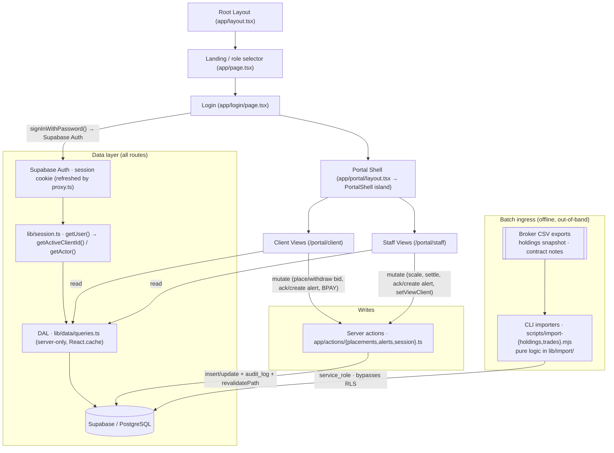

# High-Level Design (HLD) - Vitti Capital Platform

## 1. Project Overview & Objectives
The Vitti Capital Platform is a structured, production-ready Next.js application ported from a single-file HTML prototype (`vitti-capital-platform.html`). It serves as a mock broker dashboard and client desk for high-net-worth (wholesale) clients.

The objectives of the platform are:
- **High Fidelity UI:** Mirroring the aesthetic language of the original mock-up, including custom typography (Fraunces, Hanken Grotesk, IBM Plex Mono), HSL colors (navy, green, paper, etc.), custom option expiry urgency rails, and moneyness bars.
- **Simulated Real-World Functions:** Stateful operations for bidding on open capital raises, scaling allocations, acknowledging system/custom notifications, monitoring option expiration, and viewing transactional audit logs.
- **Real Broker Data:** holdings and P&L are no longer simulated. Two broker CSV exports — a holdings snapshot and a contract-note ledger — are imported by an offline pipeline (§3.1d) that derives realised P&L from the trade history and reports, rather than silently patches, anything it cannot substantiate.
- **Dual-role Workspaces:** Dynamic interfaces tailored to **Clients** (portfolio valuation, placing placement bids, options overview, AI assistant) and **Staff/Advisers** (adviser registry, scaling back raises, updating deal stages, auditing trails).

---

## 2. Architecture Layout

The migration from the in-memory prototype to a Supabase backend is **complete**: every portal route is now a Server Component that reads the data-access layer (DAL → Supabase), and all state changes go through **server actions** that write to Supabase and append to `audit_log`. The legacy Zustand store (`lib/db.ts` + `store/useDatabaseStore.ts`) is no longer on any read path — it survives only as a vestigial write in the login page (§3.1) and remains checked in as the reference implementation of the domain logic the schema and DAL were derived from.

```mermaid
graph TD
    Root["Root Layout (app/layout.tsx)"] --> Landing["Landing / role selector (app/page.tsx)"]
    Landing --> Login["Login (app/login/page.tsx)"]
    Login -->|"signInWithPassword() → Supabase Auth"| Auth["Supabase Auth · session cookie (refreshed by proxy.ts)"]
    Login --> E["Portal Shell (app/portal/layout.tsx → PortalShell island)"]

    E --> F["Client Views (/portal/client)"]
    E --> G["Staff Views (/portal/staff)"]

    subgraph "Data layer (all routes)"
        Auth --> Session["lib/session.ts · getUser() → getActiveClientId() / getActor()"]
        Session --> DAL["DAL · lib/data/queries.ts (server-only, React.cache)"]
        DAL --> Supa[("Supabase / PostgreSQL")]
    end

    subgraph "Writes"
        Actions["Server actions · app/actions/{placements,alerts,session}.ts"]
        Actions -->|"insert/update + audit_log + revalidatePath"| Supa
    end

    subgraph "Batch ingress (offline, out-of-band)"
        CSV[["Broker CSV exports<br/>holdings snapshot · contract notes"]]
        CSV --> Imp["CLI importers · scripts/import-{holdings,trades}.mjs<br/>pure logic in lib/import/"]
        Imp -->|"service_role · bypasses RLS"| Supa
    end

    F -->|"read"| DAL
    G -->|"read"| DAL
    F -->|"mutate (place/withdraw bid, ack/create alert, BPAY)"| Actions
    G -->|"mutate (scale, settle, ack/create alert, setViewClient)"| Actions
```

> **Two write paths, deliberately separate.** Server actions handle *transactional* change originated by a person in the app. The broker importers handle *bulk reconciliation* against an external system of record — they run offline, as `service_role`, and rebuild derived tables wholesale. Real client holdings enter the platform only through the second path; nothing in the UI writes `positions` or `trades`.

> Every interactive route follows a **server page → client island** split: the Server Component resolves the active client (`getActiveClientId`), fetches from the DAL with `Promise.all`, and passes data as props to a `"use client"` island that keeps the interactivity and calls server actions (e.g. `positions/PositionsClient.tsx`, `placements/PlacementsClient.tsx`, `staff/placements/StaffPlacementsClient.tsx`). Pure-display routes (`insights/`) need no island.

---

## 3. High-Level Components

### 3.1 Reactive State Store (`store/useDatabaseStore.ts`) — legacy, off the data path
> Not the only Zustand store: `store/usePnlCalculatorStore.ts` is current and on the live path, holding the P&L Calculator's session state so it survives tab navigation. This section is only about the legacy one.

This store powered the original prototype. It is **no longer read or written by any portal route** — all reads go through the DAL (§3.1b) and all writes through server actions (§3.1c). Its one surviving caller is `app/login/page.tsx`, which still calls `setRole`/`setClientId` alongside the real `signIn` server action; this is a harmless leftover that can be deleted once verified. The store and `lib/db.ts` stay in the tree as the canonical reference implementation of the domain logic (mutation semantics, alert engine, financial helpers) that the SQL schema, DAL, and server actions were ported from. This section documents that legacy path:
- An initial database object (`INITIAL_DATABASE`) is loaded from `lib/db.ts`. At store-init the alerts engine (`scanAlerts`) and audit seeder (`seedAudits`) run once to populate `db.alerts` and `db.audit`.
- The database is managed globally using a **Zustand** store (`useDatabaseStore`), which also tracks session context: `role` (`client | admin`), `clientId`, `viewClient` (the client a staff member is inspecting), and a derived `currentUserLabel` getter used to stamp audit entries.
- Mutators (`mutatePlaceBid`, `mutateWithdrawBid`, `mutateScaleBids`, `mutateUpdatePlacementStage`, `mutateAckAlert`, `mutateAddCustomAlert`, `mutateClientBpayPayment`) copy the database and return updated versions with mutations (e.g., bid increments, allocation scales, custom price alerts, BPAY payment flags).
- The state changes trigger reactively across all active pages via fine-grained slice selectors (e.g., client placements update immediately when a staff member scales allocations).

### 3.1a Production Persistence Model (`db/schema.sql` → Supabase)
The portable PostgreSQL schema (`db/schema.sql`) is now **applied to a live Supabase project** as the first ordered migration (`supabase/migrations/`), with demo data in `supabase/seed.sql`. It normalizes the flat prototype objects into integrity-constrained relations: a shared `securities` price master, per-client `client_accounts` for cash, an append-only month-partitioned `audit_log`, reference/content tables (signals, recommendations, sectors, news, investment ideas, research reports/notes), and a per-client login `email`. See the LLD for the full TypeScript-interface → SQL-table mapping and the deliberate divergences.

### 3.1b Data-Access Layer & Session Bridge (`lib/data`, `lib/session`)
Migrated routes never touch Zustand — they read Supabase through a server-only DAL:
- **DAL (`lib/data/queries.ts`):** one read function per entity (`getPositions`, `getPlacements`, `getSignals`, `getAuditLog`, …), each wrapped in `React.cache` for per-request deduping. It returns **denormalized, UI-ready shapes** — prices/names joined from `securities`, `dte` computed from `expiry_date` (anchored to a demo "today"), bids nested under placements.
- **Multi-account (LLD §8.12):** a client (person) can hold several **accounts**; holdings/cash/bids are account-scoped (`positions`/`option_holdings`/`bids` carry `account_id`). Client holdings reads are account-scoped (`getPositions(accountId)`), staff reads aggregate across a client's accounts (`getClientPositions(clientId)`), and `getActiveAccountId()` picks the active account (a topbar **account switcher** lets clients change it).
- **Compute (`lib/data/compute.ts`):** pure financial math (`posValue`, `posPL`, `portfolioValue`, `isITM`, `unlistedValue`) over DAL shapes; client-safe (type-only imports), so islands reuse it.
- **Supabase clients (`lib/supabase/`):** a browser client and an **async** server client (this Next.js version's `cookies()` is async); types generated into `database.types.ts`.
- **Session bridge (`lib/session.ts` + `app/actions/session.ts`):** now backed by **real Supabase Auth** (email + password). `signInWithPassword` verifies credentials; a root `proxy.ts` refreshes the session cookie on each request; server components read identity via `supabase.auth.getUser()` (`getActiveClientId`, `getActor`), with `role` coming from the user's `app_metadata.role`. The only cookie left is `vitti_view` (which client a staff member is inspecting — UI state).
- **Authorization (Stage 8):** enforced at two layers — **route protection** (`proxy.ts` + portal layout redirect unauthenticated → `/login`; `staff/layout.tsx` blocks non-admins from the staff area) and **Postgres RLS** (LLD §8.11): every DAL read and server-action write runs under the user session, so the database itself guarantees a client only ever touches their own rows while staff (`is_staff()`) see all. Still deferred: real TOTP MFA (the login's OTP screen is cosmetic).

### 3.1c Server Actions (`app/actions/`) — the write path
All mutations are `"use server"` functions that resolve the actor via `getActor()`, write directly to Supabase, insert an `audit_log` row, and call `revalidatePath("/portal", "layout")` so every open surface re-renders with fresh data. They replace the legacy Zustand `mutate*` functions one-for-one (see the LLD §8.8 mapping):
- **`placements.ts`** — `placeBid`, `withdrawBid`, `scaleBids`, `settlePlacement`, `notifyBpayPayment`. `settlePlacement` carries the settlement engine: it upserts the placement code as a tradable `security`, issues `positions` for each allotted bid, and inserts attaching `option_holdings` (parsing the option ratio from `opts`).
- **`alerts.ts`** — `ackAlert`, `addCustomAlert` (upserts the watchlist row + inserts a triggered `price` alert).
- **`session.ts`** — `signInWithPassword`, `setViewClient`, `setActiveAccount`, `signOut` (cookie/session writes).
- **`accounts.ts`** — `createAccount` (client self-service), `requestAccountMerge` (client → pending request), `decideAccountMerge` (staff approve/reject; approval runs the merge — see LLD §8.13).

### 3.1d Broker Data Pipeline (`lib/import/`, `scripts/import-*.mjs`) — the batch ingress

Real client holdings come from two broker CSV exports that answer different questions, and are therefore modelled as two sources rather than merged into one:

| Export | Answers | Owns |
|---|---|---|
| **Holdings snapshot** | "what is held right now" — units, average cost, **market price** | `clients`, `accounts`, `securities`, `positions` |
| **Trade ledger** (contract notes) | "how we got here" — BUY/SELL, units, net value | `trades`, and the derived `realized_pnl` |

Neither can do the other's job: a snapshot cannot express what was made on units already sold, and a ledger that starts mid-history cannot value what is still held. Keeping both, each owning its own tables, means neither has to lie.

- **All logic is pure and shared.** Parsing, ticker normalization, the cost-basis reducer and reconciliation live in `lib/import/` with no I/O, no `server-only`, and no dependencies — so the same code is unit-tested, runs in the CLIs today, and could back a staff upload UI tomorrow without a rewrite.
- **Idempotent by construction.** The snapshot import is a full replace scoped to the accounts in the file; the ledger upserts on `(cnote, raw_security, side)`. Re-running any export converges to the same rows.

### 3.1e In-Memory PNL Calculator (`/portal/staff/pnl-calculator`)
A dedicated admin utility that parses broker trade ledger files (`.xlsx`, `.xls`, `.csv`, `.xlsm`, `.xlsb`) and Placement Tracker workbooks entirely in-memory with **zero database persistence**:
- **Zero-Storage Execution:** Processes trade files without writing to PostgreSQL or Supabase storage buckets. Client-side `ArrayBuffer` parsing executes in 5ms directly in browser memory, avoiding server action payload limits.
- **Trade Ledger Upload — one file at a time:** a trade file is uploaded on its own and a new upload replaces it, shown as a badge with its trade count and a `✕` to clear. Accumulating several files was removed: the summary, the placement-merge hints and the account filter all had to agree about whose trades were in play, and with several loaded they drifted — a second upload left the placement merge showing the first file's enrichment. Placement Trackers remain multi-file.
- **SheetJS (`xlsx`) Universal Dual-Engine Parser Fallback:** Combines ExcelJS with SheetJS (`XLSX.read`) fallback to seamlessly parse legacy `.xls` (Excel 97-2003 BIFF8 binary format), `.xlsx`, `.csv`, `.xlsm`, `.xlsb`, and HTML tables exported as `.xls` by desktop broker platforms (e.g., IRESS).
- **Dynamic Header Row Detection & Truncated Header Support:** Scans the first 15 rows of any worksheet/matrix to locate the exact header row by keyword match density, handling title rows, leading blank rows, and truncated broker header strings (e.g. `Contract Dat`, `Considera`, `Other Cha`).
- **Settlement Filtering, Trade Type Fallback & Ticker Aggregation:** Evaluates strictly `SETTLED` trades and auto-detects `SELL` trades using negative unit numbers (`rawUnits < 0`) when column types are missing. Aggregates derivative & option tickers (`EOSXX`, `ENVO`, `NVOO`) into 3-character ordinary parent codes (`EOS`, `ENV`, `NVO`). Tickers are sorted in **ascending alphabetical order** across UI tables and file exports.
- **Client Account Filter Bar (`external_ref`):** Staff can filter parsed ledger trades by broker account number (e.g. `Account #1103199`), dynamically re-aggregating `buyQty`, `sellQty`, `buyPrice`, `sellPrice`, and `totalPnl`. Automatically resets to `"All Accounts"` on new file upload so all new file trades are immediately visible.
- **9 Filter Tabs:** `All Tickers`, `Equity`, `Options`, `Unlisted Options`, `Open`, `Matched P&L`, `Profit Only`, `Loss Only`, `Unmatched` — with colour-coded table badges (green Matched, amber Unmatched, purple Option, slate Equity, blue Enriched). Option lines carry no `Unmatched` badge and are excluded from that tab and its count, since their legs are not expected to balance. Rows merged from the DB or priced by model carry no badge at all — their note lives in the **Comments** column (`Open`, `Partial Buy`, `Partial Exit`, `Unlisted Options`), with an ⓘ hover card on unlisted rows showing the full Black-Scholes breakdown.
- **Private Link 1-Click OAuth SSO & Fallback API Engine:** Authenticates private Google Drive and Microsoft 365 (SharePoint / OneDrive) spreadsheet links via 1-Click SSO popup auth buttons or manual Bearer Token inputs. Uses Google Drive API v3 (`/drive/v3/files/FILE_ID/export`) and Microsoft Graph API Shares endpoints (`/v1.0/shares/u!{base64Url}/driveItem/content`).
- **Multi-File Placement Tracker Integration & File Removal:** Staff can upload multiple Placement Tracker `.xlsx` files simultaneously or paste direct URLs. Uploaded placement files display as interactive badges with an individual `✕` remove button and `Clear All` control, dynamically re-merging allocation maps when files are added or removed.
- **Account-Scoped Database Portfolio Holdings Sync (`fetchDatabaseHoldingsAction`):** Fetches live database portfolio market values strictly scoped to the target account(s) (`external_ref`), auto-filling `sellQty` and `sellPrice` for open positions (`sellQty = 0`), transforming open position total loss into exact cent-to-cent unrealized portfolio value without cross-account data leakage. **Partial exits** (`0 < sellQty < buyQty`) are handled additively — the still-held parcel's market value is added on top of the realised sale rather than replacing it — and are flagged in a **Comments** column as `Partial Exit`; fully open positions are noted `Open`. **Holdings the trade file never mentions now get a row of their own** rather than being dropped — free placement options have no contract note, so nothing in the ledger ever created a line for them. Their buy side comes from the snapshot's cost base (zero for a free option, the real cost otherwise), and they are tagged `DB Holding` so a figure sourced from the snapshot is never mistaken for a reconciled trade.

- **Exports are named after the client:** `pnl-<account number>-<account name>-<date>.xlsx` (e.g. `pnl-114716-Sri-Guru-Nanak-PTY-LTD-2026-08-05.xlsx`), scoped to whichever account filter is in force. A date-only name said nothing about whose figures were inside and collided whenever two clients were exported on the same day.

- **Identifying whose placement allocation to use:** a placement sheet lists *every* client who took part, so picking the right rows is the whole job. The client is identified from the uploaded trade file's **`Account` column**, resolved through the database to the account holder's name, with the file name used only as a fallback and an explicit staff choice always winning. Relying on the file name alone was fragile — a file named after nobody in the sheets left tickers unfilled even though its account number identified the holder unambiguously.

- **Standing Placement Tracker links:** the tracker URL(s) can be configured permanently (`PLACEMENT_TRACKER_URL`, several links allowed) so the desk never pastes them again — the calculator loads them automatically, once per session, right **after** a trade file is loaded rather than on page open (a cold-cache parse would otherwise starve that upload's own server actions). While they fetch and merge, the results view is replaced by a single loader instead of showing a half-enriched table. Read server-side only and never sent to the browser, because for a link-shared sheet the URL is the credential. Loaded once per session rather than per page view, and **cached server-side for 10 minutes**, because the real workbooks are 12.5 MB and 9.3 MB across 177 sheets. They are read with **SheetJS rather than ExcelJS** and one at a time: ExcelJS needed 1.6 GB of heap for a single workbook, past the 1 GB default of a serverless function, so a deployed build silently showed only the smaller tracker. The lighter reader needs ~113 MB and halves the time, with output verified identical across 200 tickers and 900 allocations.

- **Calculator session state:** the calculator's working set (uploaded trade files, the placement tracker, merges, account filter, filter tab) is held in a module-scope store so a long session **survives navigating to another portal tab** instead of resetting. It is memory only — never written to browser storage — which preserves the tool's zero-persistence contract, and it is cleared on sign-out because sign-out is a client-side navigation that would not otherwise tear it down.

- **Unlisted placement options (Black-Scholes):** the Placement Tracker's Overview grant column — headed **Add-Ons** in the 2026 workbook and **Options** in the 2025 one — grants free options (`1:3 @$0.14 Unlisted Expiry 31/12/27`), sometimes several in one cell (a base tranche plus a `Piggyback` at a different strike and expiry). Both spellings are read, and the column is found by content if a future rename escapes both: matching only the newer heading is what made every 2025 grant read as absent, and nothing in the UI could distinguish that from a year with no options in it. Each unlisted grant gets its own P&L row — quantity is `floor(basis × ratio)` where the basis is the **shares held** for a base tranche and the **base tranche's option count** for a piggyback (it is earned by exercising the base grant, not by holding stock), cost is zero, and value is a Black-Scholes call price with fixed desk assumptions (vol 50%, rate 5%, div 0%). Spot is sourced live from `yahoo-finance2`, then from the **ASX's own market-data feed** for anything Yahoo cannot quote, and only then from the last holdings snapshot — the source is carried through and shown, so a live price and a stale snapshot are never confused. Because they do not trade, the number is a **model estimate, not a mark**, and is labelled as such in the table, the hover card and the exports. Listed grants are skipped — they already arrive through the broker ledger.
  - **Grants with no expiry written down** — most of the 2025 column reads just `1:2@0.1 Unlisted` — are dated **settlement + 2 years** by desk convention rather than discarded. Dropping them reported a real entitlement as nothing at all, which is the worse error; an estimated term is carried openly instead, flagged `assumed` in the row, the hover card and the exports. Where even the settlement date is blank there is nothing to count from and the grant is still skipped, so filling that column in the tracker is what recovers those rows.
- **Interactive Inline Editing & Dynamic Exports:** Staff can edit any row inline or enter custom market prices. Generates color-coded Excel (`.xlsx`) via ExcelJS server actions and CSV files in ascending ticker order for instant download.

### 3.2 Unified Shell Wrapper (`app/portal/layout.tsx` → `PortalShell.tsx`)
The portal layout is now a **Server Component** (`layout.tsx`): it reads the session and fetches badge data (client, clients, alerts, placements) from the DAL, computes the `pendingAllocCount`, and passes everything as props to the `"use client"` **`PortalShell.tsx`** island, which owns the interactive chrome (nav, alerts drawer, sign-out via the `signOut` / `ackAlert` server actions). The shell coordinates a single role-aware navigation config (`navItems.client` / `navItems.admin`) rendered across multiple surfaces:
- **Global Header (Topbar):** Live broker-feed status pill, illustrative search bar, active-user avatar, and the alerts toggle (with unread badge).
- **Desktop Sidebar:** Persistent left panel navigation showing all routes, the workspace label, the signed-in user card, and sign-out.
- **Mobile Bottom Bar:** Fixed bottom tab bar showing the primary (`tab: true`) routes.
- **"More" Overflow Menu:** A mobile modal exposing the secondary routes that don't fit the bottom bar.
- **Alerts Slide-out Drawer:** Pull-out notification interface for acknowledging critical ITM, expiry, exercise-window, and custom price warnings. Staff see firm-wide alerts; clients see only their own.
- **Badges:** The nav computes live badge counts — unread alerts, and (admin only) the count of closed-deal bids still awaiting allocation (`pendingAlloc`).

### 3.3 Responsive Web Layout
The portal layout is fully responsive natively using CSS media queries (Tailwind `md` breakpoint, 768px) — there is no device-frame emulator. On desktop viewports it renders the left navigation sidebar. On mobile or tablet devices it automatically hides the sidebar and renders a fixed bottom navigation bar plus the "More" overflow menu (matching standard mobile app layouts), adjusting page padding (`pb-16 md:pb-0`) so content is never covered by the bottom bar.

---

## 4. Key Architectural Flows

> **Migration note:** these lifecycles now execute as **server actions** (`app/actions/*`, §3.1c) that write to Supabase and insert `audit_log` rows, then `revalidatePath` the portal. The state transitions and audit semantics match the original Zustand `mutate*` implementation (retained as reference in `lib/db.ts`).

### 4.1 Bidding and Allocation Lifecycle
1. **Bid Placement:** Client visits `/portal/client/placements`, uses the bidding workspace to calculate costs, and submits a bid → `placeBid` server action inserts/updates the `bids` row and writes a `Placed bid` audit entry.
2. **Book Close:** Deals are seeded in the `closed` stage; staff work the closed book from `/portal/staff/placements`. (The open→closed transition is part of the data model but not yet wired to a UI control.)
3. **Allocation Scaling:** On a closed deal, staff picks a scaling policy and hits "Publish allocations" → `scaleBids` writes each `bids[i].alloc` and logs `Updated allocations`.
4. **Deal Settlement:** Staff hits "Confirm Settlement" → `settlePlacement` transitions the deal to `settled`, upserts the placement code as a `security`, and converts allotted bids into `positions` (plus attaching `option_holdings`), logging a `Change deal stage` entry.
5. **Confirmation:** Client logs in, sees their dashboard performance updated, and views the placement status as "Allotment confirmed".

### 4.2 Expiry Alert Lifecycle
1. **Options Scan:** The alert engine (originally `scanAlerts`) evaluates options; the resulting `alerts` rows are materialized in Supabase (seeded), and `getAlerts` reads them (scoped per-client for clients, firm-wide for staff).
2. **Alert Triggering:** If an option is within 30 days of expiry, or is in the money (ITM) and unlisted, a warning row is present.
3. **Desk Notice:** The `PortalShell` slide-out drawer (and the alerts pages) render the alerts, unacknowledged first.
4. **Acknowledgement:** Clicking "Ack" calls the `ackAlert` server action, which sets `acknowledged`/`acknowledged_at`/`acknowledged_by` and revalidates the portal, moving it down the priority list.

### 4.3 Broker Reconciliation Lifecycle (holdings + realised P&L)
1. **Snapshot import:** `scripts/import-holdings.mjs` parses the holdings export, upserts every `securities` code (linking derivatives to their ordinary via `parent_code`), creates a client + account per broker account number, and **fully replaces** `positions` for those accounts. Market Price lands in `securities.last_price` — currently the platform's only price source.
2. **Ledger import:** `scripts/import-trades.mjs` upserts contract notes into `trades` by note number. Non-settled rows (`CANCELLED` / `REVERSAL` / `REVERSED`) are stored for the audit trail but never reach P&L.
3. **Replay:** the reducer walks each account's settled ledger chronologically, grouped by **parent** ticker so a placement bought as `EOSXX` and sold as `EOS` nets as the one round trip it was. Cost basis is weighted average; because the broker's `Value` column is already net of brokerage and GST, realised P&L is fee-inclusive without extra arithmetic. Results are written to `realized_pnl`.
4. **Reconciliation:** the importer reports what it could not establish — sales with no matching purchase, and ledger open-units that disagree with the snapshot. Where an orphaned sale's unit count exactly matches an unsold buy under **another ticker** it proposes a **ticker change** with the buy value to adopt (the real `JBY → BKB` case); ambiguous or option-to-ordinary matches are never auto-proposed.
5. **Surfacing:** `/portal/staff/clients/[id]` → **Order history** renders the ledger grouped by company under its realised result, with a diverging bar chart ranking companies and every unbacked figure flagged. The flags travel into the CSV export too, so a provisional number never reaches a spreadsheet without its caveat. (See LLD §8.14–8.15.)

### 4.4 Account Lifecycle (create + approved merge)
1. **Open account:** A client visits `/portal/client/accounts` and creates a new account (`createAccount`) — it appears immediately in their switcher (empty, s708 "verification pending").
2. **Request merge:** The client requests merging one account into another (`requestAccountMerge`) → a `pending` `account_merge_requests` row; **no data moves yet**.
3. **Desk review:** Staff see the request at `/portal/staff/merge-requests` (with a nav badge) and **Approve** or **Reject** (`decideAccountMerge`).
4. **Execution (on approve):** the source account's cash, positions (weighted-average on shared securities), options and bids move into the target; the source account is deleted; the request is marked `approved`. Rejection just records the decision. Every step is audited. (See LLD §8.13.)
