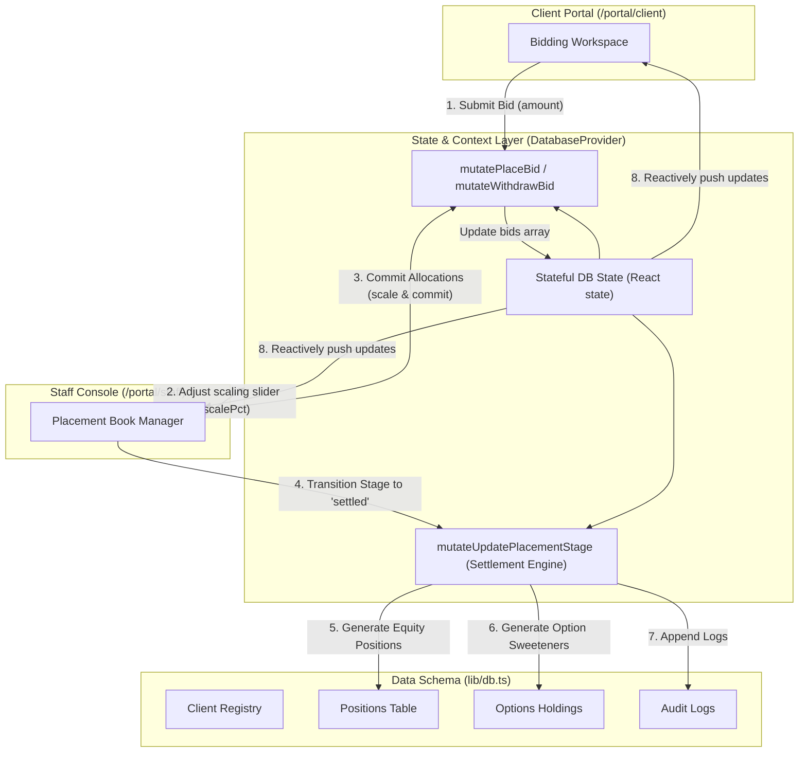

# Low-Level Design (LLD) - Vitti Capital Platform

## 1. Data Schema & Core Interfaces (`lib/db.ts`)
The mock database uses TypeScript interfaces representing the broker registry, positions, deals, and logs:

```typescript
export interface Client {
  id: string;
  name: string;
  av: string;      // Initials/Avatar abbreviation
  type: string;    // e.g. "Individual · wholesale"
  s708: string;    // s708 certificate expiry date string
}

export interface Position {
  c: string;       // Client ID foreign key
  code: string;    // Stock code (e.g., BHP)
  name: string;
  qty: number;
  cost: number;
  last: number;
  sector: string;
}

export interface OptionHolding {
  id: string;
  c: string;       // Client ID foreign key
  code: string;
  name: string;
  listed: boolean;
  type: "Call" | "Put";
  qty: number;
  strike: number;
  under: number;
  dte: number;     // Days to expiry
  source: string;  // How it was obtained
  status: "open" | "pending" | "expired";
}

export interface Placement {
  id: string;
  code: string;
  name: string;
  type: string;    // Placement / Pre-IPO / SPP
  price: number;   // Subscription price
  last: number | null;
  disc: number | null;
  raise: number;   // Raising amount in millions
  min: number;     // Minimum bid
  opts: string;    // Option attachments string (e.g. "1 free option (1:2)")
  stage: "open" | "closed" | "upcoming" | "settled";
  closeDate: Date;
  allocDate: Date;
  settleDate: Date;
  allotDate: Date;
  bids: Bid[];     // List of bids
}
```

---

## 2. Stateful Mutation & Context Data Flow

The following data flow chart illustrates how client actions and staff console updates propagate through the state lifecycle context reactively, mutating data states cleanly:



---

## 3. Stateful Database Mutation Functions
Mutations in `lib/db.ts` are pure functions that accept the database instance, create deep copies, apply adjustments, log transactions in the audit logs, and return a new `Database` state.

### 3.1 Placing and Withdrawing Bids
- `mutatePlaceBid`: Adds or updates a user's bid size.
- `mutateWithdrawBid`: Removes a user's bid.

### 3.2 Settlement Hook (`mutateUpdatePlacementStage`)
When a deal stage updates to `"settled"`:
1. It iterates through all bids.
2. If `alloc > 0`, it computes shares: `qty = Math.round(alloc / price)`.
3. It pushes the new `Position` into `db.positions`.
4. If options are attached (e.g., `opts !== "None"`), it computes attaching option count (matching ratios like `1:2` or `1:1`) and pushes a new `OptionHolding` into `db.options` with a `status: "open"` and a 1-year expiration date.

---

## 4. UI Component Engineering

### 4.1 Donut Chart Component (`app/portal/client/positions/page.tsx`)
Rendered inside the portfolio analysis page using functional SVG markup:
- Renders segmented arcs using SVG `<circle>` and `strokeDasharray` properties.
- **Offset Math:** Segment offsets must be precalculated side-effect free during render to comply with React's immutability guidelines:
```typescript
const segsWithOffsets = segs.map((s, idx) => {
  const frac = total ? s.v / total : 0;
  const len = frac * C;
  // Functional reduction sums all prior segment lengths
  const offset = segs.slice(0, idx).reduce((sum, prev) => {
    const prevFrac = total ? prev.v / total : 0;
    return sum + prevFrac * C;
  }, 0);
  return { ...s, len, offset };
});
```

### 4.2 Expiry Urgency Rail (`app/portal/staff/clients/[id]/page.tsx`)
A custom rail visualizing options time-to-expiry using conditional LED segments:
- Draws tick marks corresponding to `[30, 14, 7, 3, 1]` days.
- If `dte` is less than or equal to a threshold, the tick lights up.
- Uses classes `.lit-red` (dangerous window: $\le 3$ days) and `.lit-amber` (warning window: $\le 14$ days).

---

## 5. State Synchronization & Optimization

### 4.1 Login Query Bails
In Next.js, static routes that use `useSearchParams()` must be wrapped in a React `<Suspense>` block. In `app/login/page.tsx`, we structured it by splitting the page:
- `LoginContent`: Logic containing credentials inputs, 2FA forms, and `useSearchParams()` checks.
- `LoginPage` (Export Default): Suspense wrapper ensuring that bailing to CSR doesn't crash builds.

### 4.2 Interactive Bids Scaling Slider (`portal/staff/placements/page.tsx`)
The adviser scaling dashboard features an interactive scaling handle.
- State: `scalePct` (0% to 100%) and individual bid text boxes.
- When the slider drags, it sets the scale percentage and updates all calculated allocation states: `alloc = bid.amount * (scalePct / 100)`.
- Staff can commit allocations, instantly updating the global reactive DB context.

### 4.3 Contextual Ask Vitti AI Chat (`portal/client/askvitti/page.tsx`)
- Resets messages state on client switches using render-phase verification:
```typescript
if (clientId !== prevClientId) {
  setPrevClientId(clientId);
  setMessages([ /* Initial seeded messages */ ]);
}
```
- Custom queries are processed by mapping keywords against portfolio valuations (`portfolioValue(db, clientId)`) and options exposure tables (`clientOptions(db, clientId)`) for high-fidelity responses.

### 4.4 Responsive Viewport Adaptations
To ensure native responsiveness on real mobile and tablet devices, the unified portal shell uses conditional styling and markup:
- **Sidebar Aside:** Styled with `hidden md:flex flex-col` to hide the left sidebar layout completely on viewports smaller than `768px` (`md` breakpoint) and display it on larger screens.
- **Bottom Navigation Bar:** Renders bottom nav bar using fixed positioning (`fixed bottom-0 left-0 right-0 z-20`) to anchor the tab bar at the bottom of the device viewport on real mobile and tablet browsers.
- **Main Shell Wrapper:** Uses responsive padding classes (`pb-16 md:pb-0 relative`) on viewports under the `md` breakpoint, ensuring that main page content doesn't get covered by the overlay bottom navigation.
