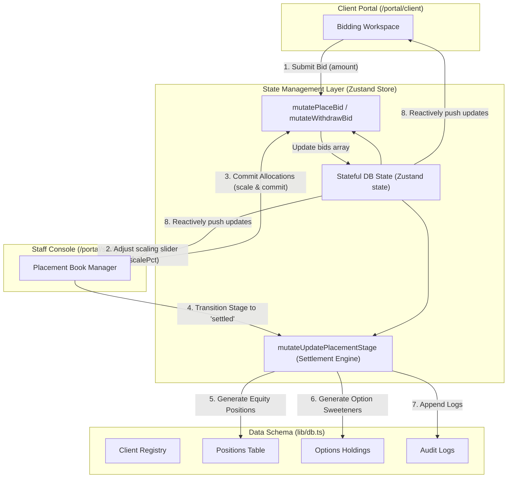

# Low-Level Design (LLD) - Vitti Capital Platform

## 1. Data Schema & Core Interfaces (`lib/db.ts`)
The mock database uses TypeScript interfaces representing the broker registry, positions, deals, logs, and the research/content surfaces. The whole shape is aggregated by the top-level `Database` interface and seeded by `INITIAL_DATABASE`.

### 1.1 Holdings & Deal Entities

```typescript
export interface Client {
  id: string;
  name: string;
  av: string;      // Initials/Avatar abbreviation
  type: string;    // e.g. "Individual · wholesale"
  s708: string;    // s708 certificate expiry date string
}

export interface Position {
  c: string;       // Client ID foreign key
  code: string;    // Stock code (e.g., BHP)
  name: string;
  qty: number;
  cost: number;    // Average cost per share
  last: number;    // Last traded price
  sector: string;
}

export interface OptionHolding {
  id: string;
  c: string;       // Client ID foreign key
  code: string;
  name: string;
  listed: boolean;
  type: "Call" | "Put";
  qty: number;
  strike: number;
  under: number;   // Underlying price
  dte: number;     // Days to expiry (may be negative once expired)
  source: string;  // How it was obtained
  status: "open" | "pending" | "expired";
}

export interface Bid {
  c: string;            // Client ID foreign key
  amount: number;       // Bid (application) amount in dollars
  alloc: number | null; // Allocated amount; null until scaled by staff
  _paid?: boolean;      // BPAY payment notified by client
}

export interface Placement {
  id: string;
  code: string;
  name: string;
  type: string;    // Placement / Pre-IPO / SPP / Rights
  price: number;   // Subscription price
  last: number | null;
  disc: number | null;
  raise: number;   // Raising amount in millions
  min: number;     // Minimum bid
  opts: string;    // Option attachments string (e.g. "1 free option (1:2)")
  stage: "open" | "closed" | "upcoming" | "settled";
  closeDate: Date;
  allocDate: Date;
  settleDate: Date;
  allotDate: Date;
  bids: Bid[];     // List of bids
}
```

### 1.2 Market, Research & Content Entities

```typescript
export interface IndexData {
  code: string; name: string; last: number;
  chg: number;          // % change
  dp?: number;          // display decimal places (default 1)
}

export interface Signal {
  action: "Add" | "Hold" | "Trim" | "Take profit" | "Watch";
  headline: string; detail: string; target: number | null;
}

export interface Sector {
  name: string; mom: number; drivers: string; benef: string[]; // beneficiary codes
}

export interface News {
  time: string; src: string; head: string; impact: string;
  dir: "up" | "dn"; use: string;   // adviser "how to use this" note
}

export interface Goal {            // goal-based discovery on /invest
  k: string; label: string; icon: string; themes: string[]; blurb: string;
}

export interface InvestmentIdea {
  code: string; name: string; theme: string;
  risk: "Low" | "Medium" | "High"; horizon: string;
  conv: number;                    // conviction rating 1–3
  last: number | null; entryLo: number | null; entryHi: number | null;
  target: number | null; hook: string; thesis: string;
  deal?: string;                   // optional Placement id link (live deal)
}

export interface WatchItem {
  code: string; name: string; last: number | null; chg: number;
  alert: number | null;            // price threshold
  dir?: "above" | "below"; unl?: boolean; // unlisted
}

export interface Alert {
  id: string; client: string | null; optId: string | null;
  kind: "expiry" | "itm" | "window" | "price";
  sev: "red" | "amber" | "green";
  title: string; sub: string; ts: Date; ack: boolean;
}

export interface AuditEntry {
  ts: Date; user: string; role: string; action: string; detail: string;
}

export interface ResearchNote  { title: string; time: string; body: string; }
export interface ResearchReport { title: string; kind: string; date: Date; pp: number; }
```

### 1.3 Aggregate Root

```typescript
export interface Database {
  clients: Record<string, Client>;
  positions: Position[];
  options: OptionHolding[];
  placements: Placement[];
  indices: IndexData[];
  note: ResearchNote;
  recos: { code: string; name: string; rating: string; tp: number | null; move: string; sect: string }[];
  reports: ResearchReport[];
  signals: Record<string, Signal>;
  sectors: Sector[];
  news: News[];
  themes: string[];
  goals: Goal[];
  ideas: InvestmentIdea[];
  watch: Record<string, WatchItem[]>;   // keyed by client id
  alerts: Alert[];
  audit: AuditEntry[];
}
```

> **Time base:** `TODAY = new Date(2026, 5, 12)` is the fixed "now" the seed data and the alerts engine are anchored to; `addDays(d, n)` derives the relative deal dates.

---

## 2. Stateful Mutation & Store Data Flow (reference implementation)

> **Status:** the runtime write path is now server actions over Supabase (§8.8); the Zustand flow below is retained as the reference implementation whose semantics those actions preserve.

The following data flow chart illustrates how client actions and staff console updates propagate through the state lifecycle store reactively, mutating data states cleanly:


```mermaid
flowchart TD
    subgraph ClientPortal ["Client Portal (/portal/client)"]
        Workspace["Bidding Workspace"]
    end

    subgraph StaffConsole ["Staff Console (/portal/staff)"]
        Book["Placement Book Manager"]
    end

    subgraph Store ["State Management Layer (Zustand Store)"]
        DBState["Stateful DB State (Zustand state)"]
        MutateBid["mutatePlaceBid / mutateWithdrawBid"]
        Settle["mutateUpdatePlacementStage (Settlement Engine)"]
    end

    subgraph Schema ["Data Schema (lib/db.ts)"]
        Clients["Client Registry"]
        Positions["Positions Table"]
        Options["Options Holdings"]
        Audits["Audit Logs"]
    end

    %% Client Actions
    Workspace -->|"1. Submit Bid (amount)"| MutateBid
    MutateBid -->|"Update bids array"| DBState

    %% Staff Actions
    Book -->|"2. Adjust scaling slider (scalePct)"| Store
    Book -->|"3. Commit Allocations (scale & commit)"| MutateBid
    Book -->|"4. Transition Stage to 'settled'"| Settle

    %% Database mutations
    DBState --> MutateBid
    DBState --> Settle

    %% Settlement updates
    Settle -->|"5. Generate Equity Positions"| Positions
    Settle -->|"6. Generate Option Sweeteners"| Options
    Settle -->|"7. Append Logs"| Audits

    %% State propagation
    DBState -->|"8. Reactively push updates"| Workspace
    DBState -->|"8. Reactively push updates"| Book
```

---

## 3. Stateful Database Mutation Functions (reference implementation)
> **Status:** superseded at runtime by the server actions in §8.8, which map one-for-one to the functions below. Kept here as the canonical spec of each mutation's semantics and audit output.

Mutations in `lib/db.ts` are pure functions that accept the database instance, create shallow/deep copies as needed, apply adjustments, append an `AuditEntry` to the front of `db.audit`, and return a new `Database` state. Each is wrapped by a thin action in `useDatabaseStore` that injects `clientId`/`currentUserLabel` (see §6).

### 3.1 Placing and Withdrawing Bids
- `mutatePlaceBid(db, placementId, clientId, amount, user)`: Adds a new bid or updates the existing bid's `amount` for that client on that deal. Logs a `Placed bid` entry.
- `mutateWithdrawBid(db, placementId, clientId, user)`: Removes the client's bid from the deal. Logs a `Withdrew bid` entry.

### 3.2 Allocation Scaling (`mutateScaleBids`)
- `mutateScaleBids(db, placementId, clientAllocations, user)`: Applies a `Record<clientId, number | null>` of allocations onto each matching bid's `alloc` field, leaving untouched bids as-is. Logs an `Updated allocations` entry. Drives the staff scaling slider (§5.2).

### 3.3 Settlement Hook (`mutateUpdatePlacementStage`)
`mutateUpdatePlacementStage(db, placementId, stage, user)` always updates the deal `stage` and logs a `Change deal stage` entry. Additionally, on the transition **into** `"settled"` (from a non-settled stage) it runs the settlement engine over every bid:
1. It iterates through all bids; for `alloc > 0` it computes shares `qty = Math.round(alloc / price)`.
2. It pushes a new `Position` into `db.positions` (cost = subscription `price`, `last = p.last ?? p.price`, `sector` defaults to `"Materials"`).
3. If options are attached (`opts !== "None"`), it parses the ratio from the `opts` string — `(1:1) → 1.0`, `(1:2) → 0.5`, `(1:3) → 1/3` (default `0.5`) — computes `optQty = Math.round(qty * ratio)`, and pushes a new `OptionHolding` with `status: "open"`, `strike = price * 1.5` (a 50% premium), `dte: 365` (1-year expiry), and `code = p.code + "O"`. (Note the MRD deal is special-cased as an **unlisted** attaching option.)

### 3.4 Alerts & Payments
- `mutateAckAlert(db, alertId, user)`: Flags an alert `ack: true` (no audit entry).
- `mutateAddCustomAlert(db, clientId, code, threshold, direction, user)`: Creates a `price` alert, upserts the matching `WatchItem` (adding the security to the client watchlist if absent), and logs a `Created alert` entry.
- `mutateClientBpayPayment(db, placementId, clientId, user)`: Flags the client's bid `_paid: true` and logs a `Notified payment` entry (amount taken from the bid's `alloc`).

---

## 3A. Alert Engine & Derived Helpers (`lib/db.ts`)

### 3A.1 `scanAlerts(db, baseTime = TODAY)`
Pure generator (re-run at store init) that scans every `open` option and emits `Alert` objects:
- **Expiry escalation:** for `0 ≤ dte ≤ 30`, severity is `red` when `dte ≤ 3` else `amber`; the displayed window snaps to the nearest of `[30, 14, 7, 3, 1]`.
- **In-the-money:** any ITM option emits a `green` `itm` alert showing intrinsic value.
- **Exercise window:** an **unlisted, ITM** option with `dte ≤ 14` emits a `red` `window` alert ("not auto-exercised").
- Two seeded custom **`price`** alerts (MRD / FMG) are appended, then the list is sorted: unacknowledged first, then by severity (`red → amber → green`), then newest first.

### 3A.2 `seedAudits()`
Returns the initial five-entry `AuditEntry[]` (staff sign-in, client bid, note upload, client sign-in, system alert) anchored to `2026-06-12 09:41`.

### 3A.3 Financial helpers
`clientPositions` / `clientOptions` (filter by client), `posValue` / `posCost` / `posPL`, `cashOf` (hardcoded per-client cash), `portfolioValue` (positions + cash), `unlistedValue` (intrinsic of open unlisted options), `dailyPL` (per-code factor model), `totalPL`, and the options math `moneyness` / `isITM` / `intrinsic`.

---

## 4. UI Component Engineering

### 4.1 Donut Chart Component (`app/portal/client/positions/page.tsx`)
Rendered inside the portfolio analysis page using functional SVG markup:
- Renders segmented arcs using SVG `<circle>` and `strokeDasharray` properties.
- **Offset Math:** Segment offsets must be precalculated side-effect free during render to comply with React's immutability guidelines:
```typescript
const segsWithOffsets = segs.map((s, idx) => {
  const frac = total ? s.v / total : 0;
  const len = frac * C;
  // Functional reduction sums all prior segment lengths
  const offset = segs.slice(0, idx).reduce((sum, prev) => {
    const prevFrac = total ? prev.v / total : 0;
    return sum + prevFrac * C;
  }, 0);
  return { ...s, len, offset };
});
```

### 4.2 Expiry Urgency Rail (`app/portal/staff/clients/[id]/page.tsx`)
A custom rail visualizing options time-to-expiry using conditional LED segments:
- Draws tick marks corresponding to `[30, 14, 7, 3, 1]` days.
- If `dte` is less than or equal to a threshold, the tick lights up.
- Uses classes `.lit-red` (dangerous window: $\le 3$ days) and `.lit-amber` (warning window: $\le 14$ days).

---

## 5. State Synchronization & Optimization

### 5.1 Login Query Bails
In Next.js, static routes that use `useSearchParams()` must be wrapped in a React `<Suspense>` block. In `app/login/page.tsx`, we structured it by splitting the page:
- `LoginContent`: Logic containing credentials inputs, 2FA forms, and `useSearchParams()` checks.
- `LoginPage` (Export Default): Suspense wrapper ensuring that bailing to CSR doesn't crash builds.

### 5.2 Interactive Bids Scaling Slider (`portal/staff/placements/page.tsx`)
The adviser scaling dashboard features an interactive scaling handle.
- State: `scalePct` (0% to 100%) and individual bid text boxes.
- When the slider drags, it sets the scale percentage and updates all calculated allocation states: `alloc = bid.amount * (scalePct / 100)`.
- Staff can commit allocations, instantly updating the global reactive Zustand store.

### 5.3 Contextual Ask Vitti AI Chat (`portal/client/askvitti/page.tsx`)
- Resets messages state on client switches using render-phase verification:
```typescript
if (clientId !== prevClientId) {
  setPrevClientId(clientId);
  setMessages([ /* Initial seeded messages */ ]);
}
```
- Custom queries are processed by mapping keywords against portfolio valuations (`portfolioValue(db, clientId)`) and options exposure tables (`clientOptions(db, clientId)`) for high-fidelity responses.

### 5.4 Responsive Viewport Adaptations
To ensure native responsiveness on real mobile and tablet devices, the unified portal shell uses conditional styling and markup:
- **Sidebar Aside:** Styled with `hidden md:flex flex-col` to hide the left sidebar layout completely on viewports smaller than `768px` (`md` breakpoint) and display it on larger screens.
- **Bottom Navigation Bar:** Renders bottom nav bar using fixed positioning (`fixed bottom-0 left-0 right-0 z-20`) to anchor the tab bar at the bottom of the device viewport on real mobile and tablet browsers.
- **Main Shell Wrapper:** Uses responsive padding classes (`pb-16 md:pb-0 relative`) on viewports under the `md` breakpoint, ensuring that main page content doesn't get covered by the overlay bottom navigation.

---

## 6. Zustand Store Contract (`store/useDatabaseStore.ts`) — legacy, off the data path
> **Status:** no longer read or written by any portal route (its one surviving caller is `app/login/page.tsx`, kept in sync harmlessly alongside the real `signIn` action). Documented for reference; the runtime equivalents are the DAL (§8.3) for reads, server actions (§8.8) for writes, and the cookie session (§8.5) for session context.
>
> **Not the only Zustand store.** `store/usePnlCalculatorStore.ts` is current and on the live path — it holds the P&L Calculator's session state so it survives tab navigation. Nothing below applies to it.

The store wraps `INITIAL_DATABASE` and exposes both the data and the session context, plus one action per mutation:

| State | Type | Purpose |
|-------|------|---------|
| `db` | `Database` | The live in-memory database (alerts + audit seeded at init). |
| `role` | `"client" \| "admin"` | Active workspace. |
| `clientId` | `string` | The logged-in client (default `"C1"`). |
| `viewClient` | `string` | The client a staff member is currently inspecting. |
| `currentUserLabel` | getter | `"S. Goyal (staff)"` for admin, else the client's name — stamped onto audit entries. |

**Actions** (each injects `clientId` / `currentUserLabel` into the matching `mutate*`): `setRole` (also logs a `Signed in` audit entry), `setClientId`, `setViewClient`, `placeBid`, `withdrawBid`, `scaleBids`, `updatePlacementStage`, `ackAlert`, `addCustomAlert`, `notifyBpayPayment`.

---

## 7. Production SQL Schema (`db/schema.sql`)
The repository ships a portable PostgreSQL schema (Supabase / Neon / Aurora) that re-expresses the flat prototype objects as an integrity-constrained relational model. It is now **applied to a live Supabase project** (as the first ordered migration under `supabase/migrations/`, seeded by `supabase/seed.sql`) and is the persistence layer every route reads and every server action writes (§8). The interface→table mapping below still documents the deliberate divergences from the prototype shape.

### 7.1 Interface → Table Mapping

| `lib/db.ts` (in-memory) | `db/schema.sql` (relational) | Notes |
|-------------------------|------------------------------|-------|
| `Client` | `clients` | `av → initials`, `type → account_type`, `s708 → s708_expiry` (date). Adds `email` (UNIQUE) — login key, resolves which client signs in (natural key for future auth). |
| *(hardcoded `cashOf()`)* | `client_accounts` | Cash is a real per-client row with `currency`, not a hardcoded map. |
| `Position` | `positions` | `name`/`sector`/`last` **not** stored — joined from `securities`. Unique `(client_id, security_code)`. |
| `OptionHolding` | `option_holdings` | `dte` is **computed** from `expiry_date` at read time; `under` comes from `securities` via `underlying_code`. |
| `Placement` + `Bid` | `placements` + `bids` | `disc → discount_pct`, `raise → raise_millions`, `min → min_bid`, `_paid → paid`. One bid per client per deal. |
| `IndexData` | `market_indices` | `dp → decimal_places`, `chg` = % change. |
| `Signal` / `Sector` / `News` | `signals` / `sectors` / `news` | `mom → momentum`, `benef → beneficiaries[]`, `use → use_note`. |
| `recos` | `recommendations` | `tp → target_price`; `name`/`sect` **not** stored — joined from `securities`. One reco per covered security. |
| `note` (`ResearchNote`) | `research_notes` | `time → published`; promoted from a single object to a table of dated notes. |
| `InvestmentIdea` | `investment_ideas` | `conv → conviction (1–3 CHECK)`, `deal → placement_id` FK. `last` not stored — joined from `securities`. |
| `WatchItem` | `watchlist_items` | Threshold/direction columns; unlisted allowed (no FK). |
| `Alert` | `alerts` | `kind`/`severity`/`direction` are enums; partial index on unacknowledged. |
| `AuditEntry` | `audit_log` | **Append-only, month-partitioned**; UPDATE/DELETE blocked by trigger. |
| `ResearchReport` | `research_reports` | `pp → pages`. |
| `Goal` / `themes` | *(not persisted)* | Static UI discovery config (icons, labels, blurbs on `/invest`) — kept in app code, not the DB. See §7.2. |
| *(prototype `Position.last`, `OptionHolding.under`)* | `securities` | Prices live **once** in the shared master table, not per holding. |
| *(no prototype equivalent)* | `trades` | Added later: the broker contract-note ledger, the only source of **realised** P&L. The prototype had no transaction history at all — it modelled holdings as a standing snapshot. See §8.14. |
| *(no prototype equivalent)* | `realized_pnl` | Derived rollup per `(account, parent ticker)`, rebuilt from `trades`. Not a source table. |
| *(no prototype equivalent)* | `pnl_recompute_queue` | Operational: accounts whose stored P&L is owed. Belongs to no client — staff-only RLS. See §8.21. |
| *(no prototype equivalent)* | `placement_tracker_cache` | Operational: the parsed Placement Tracker workbooks, keyed by a **hash** of the source URL. A materialisation, not a source. See §8.21. |

### 7.2 Deliberate Divergences
- **Price normalization:** the prototype duplicates `last`/`under` onto each holding for convenience; the schema stores them once in `securities` (cache-friendly, single source of truth).
- **Computed `dte`:** stored as a number in the prototype, derived from `expiry_date - current_date` in SQL so it can never go stale.
- **Cash:** a hardcoded lookup in TS becomes a first-class `client_accounts` row (multi-account / multi-currency ready).
- **Audit immutability:** an in-memory array in TS becomes an append-only, time-partitioned compliance table with a trigger that rejects mutation.
- **Enums & integrity:** free-form strings (`type`, `kind`, `sev`, `dir`, `action`…) are promoted to Postgres enums and FK/UNIQUE/CHECK constraints. The `placement_type` enum also adds `'Rights'`, present in the data model but not enumerated in the TS union.
- **Content persisted vs. UI config:** adviser-authored content in the `Database` aggregate is persisted — `recos → recommendations` and `note → research_notes` join the existing `signals`/`news`/`research_reports` content tables. In contrast, `goals` and `themes` are **not** persisted: they are static discovery scaffolding for the `/invest` page (fixed categories, icons, labels, blurbs) and remain in app code, since they are presentation config rather than mutable data.
- **Production hardening (checklist, not DDL):** Row-Level Security per client, read-replica + Redis caching of shared market data, a connection pooler for serverless Next.js, and automated audit-partition rotation with cold-archive to S3.

---

## 8. Supabase Data Layer (runtime)

The schema above is now wired into the running app for migrated routes. This section documents the runtime layer that reads it.

### 8.1 Next.js version specifics (this codebase)
This is not a stock Next.js — two conventions differ from older docs and drive the code below (verified against `node_modules/next/dist/docs/`):
- **`cookies()` is async** — must be `await cookies()`. The server Supabase client factory is therefore `async`.
- **Middleware is "Proxy"** — session-refresh middleware lives in a root `proxy.ts` (`export function proxy`), not `middleware.ts`. It **now exists** (Stage 7): it wraps the request in a `@supabase/ssr` server client, calls `getUser()` to refresh the auth cookie, and returns the response carrying the refreshed `Set-Cookie` headers. Its `matcher` excludes `_next/static`, `_next/image`, and image assets. Runs on the Node runtime (Next 16 default for Proxy).

### 8.2 Supabase clients (`lib/supabase/`)
- `client.ts` — `createBrowserClient<Database>` for Client Components.
- `server.ts` — `createServerClient<Database>` with `getAll`/`setAll` over the awaited `cookieStore`; `setAll` is wrapped in try/catch (Server Components can't set cookies — the future proxy refreshes the session).
- `database.types.ts` — generated via `supabase gen types typescript --linked`; regenerate after any migration.

### 8.3 Data-access layer (`lib/data/queries.ts`)
Server-only (`import "server-only"`). One `React.cache`-wrapped read function per entity. It returns **denormalized, UI-ready types** (defined in the same file) rather than raw rows:
- Identity uses real UUIDs (`clients.id`, `placements.id`); legacy refs (`C1`, `P1`) are exposed as `.ref`.
- `securities` is loaded once into a `Map` and joined in JS to reconstruct `Position.last/name/sector`, `OptionRow.under`, `RecoRow.name/sector`, `IdeaRow.last`, `WatchRow.last`.
- `OptionRow.dte` is computed from `expiry_date` relative to a `DEMO_TODAY` anchor (2026-06-12, matching the prototype); swap for `new Date()` in production.
- Dates are returned as ISO strings (serializable across the RSC boundary; formatted in the UI).
- `getPlacements` nests `bids` per placement; `getAlerts` reads the (engine-populated) `alerts` table.
- **Row limits (§8.22):** any read that can exceed a thousand rows goes through `pagedSelect` (`lib/data/paged.ts`) — `getClientTrades`, `getClientRealized`, `getClientStoredPnl` today. PostgREST truncates silently, so this is a correctness requirement rather than a scalability nicety.
- **Broker additions (§8.14):** `Security` carries `parent`/`securityClass`; `AccountRow` carries `externalRef`/`adviserCode`/`adviserName`/`status`; `getSecurityMap` is exported (the holdings module reuses it); `getClientTrades(clientId)` returns the contract-note ledger newest-first, including non-settled rows. `getAccounts` orders by `ref` with `nullsFirst: false` then `label`, because imported accounts have no legacy `ref`.

### 8.4 Compute helpers (`lib/data/compute.ts`)
Pure functions over DAL shapes — `posValue`, `posCost`, `posPL`, `portfolioValue`, `totalPL`, `moneyness`, `isITM`, `intrinsic`, `unlistedValue`. Only type-only imports from `queries.ts`, so they are erased at compile time and safe to import into Client Components (islands reuse them).

Also here, and **deliberately not in `lib/data/holdings.ts`**: the `RealizedSummary` / `RealizedRow` types and `rollUpRealized(rows)`. `holdings.ts` is `server-only`, but `ClientDetailClient` must re-aggregate realised rows every time the account filter changes — importing them from a `server-only` module breaks the client build. Splitting the pure roll-up out is what keeps that boundary intact.

### 8.5 Session bridge (`lib/session.ts`, `app/actions/session.ts`) — real Supabase Auth
As of Stage 7 the session is backed by **real Supabase Auth** (email + password); identity is a verified token, not a user-writable cookie.
- **Read (`lib/session.ts`):** all reads go through a `React.cache`-wrapped `getAuth()` that calls `supabase.auth.getUser()`. `role` comes from `user.app_metadata.role` (`'admin' | 'client'`). `getActiveClientId()` resolves the client row by matching `user.email` to `clients.email` (staff → the `vitti_view` cookie's client, else the first seeded client). `getSession()` returns the same `{ role, clientId, viewClient }` shape for back-compat (now `null` when unauthenticated). `getActor()` stamps audit writes — staff act as `"S. Goyal (staff)"`, a client under their `display_name`.
- **Write (`app/actions/session.ts`, `"use server"`):** `signInWithPassword(email, password)` calls `supabase.auth.signInWithPassword` (the `@supabase/ssr` server client sets the session cookies) and returns `{ ok, role }` / `{ ok: false, error }`. `signOut()` calls `supabase.auth.signOut()` and clears `vitti_view`. `setViewClient(id)` (staff only — guarded by `getActor().role`) writes the `vitti_view` cookie.
- **`viewClient` cookie (`vitti_view`):** the only session data still in a cookie — it is UI state (which client a staff member is inspecting), not identity.
- **Roles:** stamped into `app_metadata.role` when the auth user is created (see §8.10). Only staff are seeded now — `goyal.s@vitti.capital` / `demo1234`. Note the asymmetry: a **client** is an `auth.users` row **plus** a `public.clients` row linked by email, whereas an **admin** is an `auth.users` row *only* — there is no staff table, because an admin holds no portfolio. That is why `getActor()` returns a hardcoded `"S. Goyal (staff)"`; a second admin would need a real name source before the audit log stays truthful.
- **Route protection (Stage 8):** the root `proxy.ts` redirects unauthenticated `/portal/*` requests to `/login`; the portal layout re-checks (`getSession()` → `redirect`) as defense-in-depth; and `app/portal/staff/layout.tsx` bounces non-`admin` users out of the staff area. The pre-login "first client" fallback is now effectively dead for the portal (kept as a defensive default).
- **Deferred:** real TOTP MFA — the login OTP screen is still cosmetic (`supabase.auth.mfa.*` is the next step).

### 8.6 Static discovery config (`lib/data/discovery.ts`)
`GOALS` and `THEMES` for the `/invest` page — the deliberately-not-persisted UI scaffolding (see §7.2). Client-safe constants, imported directly by `InvestClient`.

### 8.7 Migration pattern: server page → client island (now applied to every route)
Every route is a thin **Server Component** `page.tsx` that resolves the active client (`getActiveClientId`), fetches via the DAL with `Promise.all`, and — for interactive pages — passes the data as props to a `"use client"` island that keeps state/handlers and invokes server actions:

| Route | Island | Notable UI / actions |
|-------|--------|----------------------|
| `client/` (dashboard) | `DashboardClient.tsx` | portfolio overview, drawer `ackAlert` |
| `client/markets/` | `AlertButton.tsx` | `addCustomAlert` |
| `client/positions/` | `PositionsClient.tsx` | tabs, donut, trade modal |
| `client/options/` | `OptionsClient.tsx` | moneyness/expiry views |
| `client/placements/` | `PlacementsClient.tsx` | bidding workspace → `placeBid`/`withdrawBid`/`notifyBpayPayment` |
| `client/watchlist/` | `WatchlistClient.tsx` | `addCustomAlert` |
| `client/alerts/` | `AlertsClient.tsx` | `ackAlert`/`addCustomAlert` |
| `client/askvitti/` | `AskVittiClient.tsx` | contextual AI chat over DAL shapes |
| `client/insights/` | *(none — pure display)* | single Server Component |
| `staff/` (overview) | `StaffOverviewClient.tsx` | book totals, register, `setViewClient` |
| `staff/clients/` | `ClientsTable.tsx` | row navigation |
| `staff/clients/[id]/` | `ClientDetailClient.tsx` | per-client desk, expiry rail |
| `staff/options/` | `StaffOptionsClient.tsx` | firm-wide options |
| `staff/placements/` | `StaffPlacementsClient.tsx` | `scaleBids`/`settlePlacement` |
| `staff/alerts/` | `StaffAlertsClient.tsx` | `ackAlert`/`addCustomAlert` |
| `staff/audit/` | `ExportButton.tsx` | audit table + CSV export |

- The **portal layout** (`app/portal/layout.tsx`) follows the same split: a Server Component fetches shell/badge data and hands it to the `PortalShell.tsx` island (§ HLD 3.2).
- All routes render as **dynamic** (`ƒ`) because the DAL reads `cookies()`.

### 8.8 Server actions (the write path) — `app/actions/`
`"use server"` functions that replace the legacy Zustand `mutate*` one-for-one. Each resolves `getActor()`, writes to Supabase, inserts an `audit_log` row, then `revalidatePath("/portal", "layout")`.

| Server action (`app/actions/`) | Replaces (`lib/db.ts`) | Behaviour |
|---------------------------------|------------------------|-----------|
| `placeBid(placementId, amount)` | `mutatePlaceBid` | upsert the client's `bids` row; log `Placed bid`. |
| `withdrawBid(placementId)` | `mutateWithdrawBid` | delete the client's bid; log `Withdrew bid`. |
| `scaleBids(placementId, allocations)` | `mutateScaleBids` | write each `bids.alloc`; log `Updated allocations`. |
| `settlePlacement(placementId)` | `mutateUpdatePlacementStage` (settle branch) | upsert placement code as a `security`, insert `positions` (`qty = round(alloc/price)`) and attaching `option_holdings` (ratio parsed from `opts`: `(1:1)→1`, `(1:3)→⅓`, else `0.5`; `strike = price×1.5`; 1-yr expiry; `listed = code≠"MRD"`); set stage `settled`; log `Change deal stage`. |
| `notifyBpayPayment(placementId)` | `mutateClientBpayPayment` | set `bids.paid = true`; log `Notified payment`. |
| `ackAlert(alertId)` | `mutateAckAlert` | set `acknowledged`/`acknowledged_at`/`acknowledged_by`. |
| `addCustomAlert(clientId, code, threshold, direction)` | `mutateAddCustomAlert` | upsert `watchlist_items` threshold + insert a `price` `alerts` row; log `Created alert`. |

> These are the runtime equivalents of §3 (`mutate*`); that section now documents the **reference** implementation the actions were ported from.

### 8.9 Legacy gotcha — deterministic alert timestamps
`scanAlerts`/`mkAlert` in `lib/db.ts` previously used `Math.random()` for alert timestamps. Because the Zustand store initializes on both the server render and client hydration of the (still-legacy) portal shell, the random sort order differed between the two, throwing a React hydration mismatch. Timestamps are now derived deterministically from the alert sequence.

### 8.10 Auth-user seeding (`scripts/seed-auth-users.mjs`)
Because the app is on a **hosted** Supabase project, auth users are created out-of-band by an idempotent Node script (not a SQL seed). It uses the Supabase **admin** client (`@supabase/supabase-js` with the service-role key) to `createUser`/`updateUserById`, stamping `app_metadata.role` and setting `email_confirm: true` and the password `demo1234`.

**Only staff are seeded** (`goyal.s@vitti.capital`, role `admin`). The four demo client logins were removed once real clients started arriving from the broker import (§8.14), which creates them **without an email** — so there is nothing to authenticate against until one is attached. This does not affect the admin workspace: `is_staff()` gives staff every account. To enable a client login, set that client's `clients.email` and add them to `USERS` with role `client`; the email **must** match `clients.email` so `getActiveClientId()` can resolve the row from the authenticated identity.
- **Env:** `NEXT_PUBLIC_SUPABASE_URL` + `SUPABASE_SERVICE_ROLE_KEY` (server-only; a placeholder line is in `.env.local`, filled from Supabase dashboard → Project Settings → API).
- **Run:** `node --env-file=.env.local scripts/seed-auth-users.mjs` (safe to re-run — it updates existing users).

### 8.11 Row-Level Security (`supabase/migrations/…_enable_rls.sql`)
DB-level enforcement of "a client sees/writes only their own rows; staff see/write everything; shared reference data is readable by any signed-in user." Because the DAL and server actions use the **anon + user-session** server client (`lib/supabase/server.ts`), every read and write is subject to RLS. The `service_role` (seed script) bypasses it.
- **Two helper functions** carry the interim email-based identity model, so the cut-over to `auth.uid()` linkage later touches only these:
  - `is_staff()` → `auth.jwt()->'app_metadata'->>'role' = 'admin'`.
  - `current_client_id()` → `clients.id` where `email = auth.jwt()->>'email'`; **`SECURITY DEFINER`** so it bypasses RLS on `clients` and avoids policy recursion.
- **Per-table policies:**
  - *Shared reference* (`securities`, `market_indices`, `placements`, `signals`, `sectors`, `news`, `investment_ideas`, `recommendations`, `research_reports`, `research_notes`): `SELECT` to all authenticated; **staff-only writes** on `securities`/`placements` (the two the settlement engine upserts).
  - *Per-client* (`clients`, `client_accounts`, `positions`, `option_holdings`, `bids`, `watchlist_items`, `alerts`, `audit_log`): `is_staff() OR <owner>`, where `<owner>` is `client_id = current_client_id()` (or `email` for `clients`). `bids`/`watchlist_items`/`alerts` allow the owner full CRUD; `positions`/`option_holdings` are **insert-staff-only** (issued by settlement on the client's behalf); `audit_log` is insert-only (the append-only trigger blocks UPDATE/DELETE).
- **Effect:** a spoofed cookie or a forgotten `.eq("client_id", …)` filter can no longer leak another client's rows — the database refuses. It also closes the old pre-login data-exposure (unauthenticated = `anon` role = no policy = deny).
  > **Note (multi-account, §8.12):** `client_accounts` was replaced by `accounts`; its RLS policy moved to that table (`is_staff() OR client_id = current_client_id()`). Holdings policies are **unchanged** — see below.

### 8.12 Multi-account model (`…_multi_account.sql`)
A client (person/login) can hold **multiple investment accounts** (Personal, SMSF, Family Trust…). One account is viewed at a time.
- **Schema:** new **`accounts`** table (`id`, `ref`, `client_id`→clients, `label`, `account_type`, `s708_expiry`, `cash_balance`, `currency`) replaces the 1:1 `client_accounts` and absorbs `account_type`/`s708_expiry` (dropped from `clients`) + cash. `positions`/`option_holdings`/`bids` gain an **`account_id`** FK; uniqueness moves to the account grain (`UNIQUE(account_id, security_code)`, `UNIQUE(placement_id, account_id)`).
- **Deliberate denormalization:** holdings **keep `client_id`** (owning person, immutable) alongside `account_id`. So **RLS stays client-level and unchanged** — a client owns all their accounts, so "own rows" is already correct; the account is a *view filter*, not a security boundary. Staff "group by client" also keeps working.
- **Session:** `getActiveAccountId()` (`lib/session.ts`) resolves the active client → honours the `vitti_account` cookie *only if the account belongs to them* → else their first account by `ref`. `setActiveAccount(id)` (`app/actions/session.ts`, verifies ownership) is the switcher's write path.
- **Switcher UI:** the portal layout passes the client's accounts + active id to `PortalShell`, which renders an **account switcher in the topbar** (client role, multi-account only; single-account shows a static pill). Selecting an account calls `setActiveAccount` (revalidates `/portal`) then `router.refresh()`, so every page re-renders scoped to the chosen account.
- **DAL:** `getAccounts(clientId?)` / `getAccount(id)` (new `AccountRow` carries `accountType`/`s708`/`cash`); `getPositions(accountId)` / `getOptions(accountId)` are **account-scoped** (client portal); `getClientPositions(clientId)` / `getClientOptions(clientId)` aggregate **across a client's accounts** (staff views). `ClientRow` slimmed to the person; `BidRow`/`Position`/`OptionRow` gain `accountId`.
- **Server actions:** `placeBid`/`withdrawBid`/`notifyBpayPayment` act on the **active account's** bid; `settlePlacement` stamps issued `positions`/`option_holdings` with the **bid's `account_id`**.
- **UI:** client holdings pages resolve `getActiveAccountId()` and the topbar switcher lets a client change account; staff overview/register aggregate across accounts (register shows an "N accounts" summary + earliest s708); the **staff client-detail view has a per-account filter** ("All accounts" + one pill per account) scoping holdings/options/bids/cash, with alerts staying person-level. **Still deferred:** `scaleBids` keyed per-account (today keyed per client — fine while a client bids once per deal), and `account_id` `NOT NULL` hardening.

### 8.13 Account lifecycle — self-service create + approved merge (`…_account_lifecycle.sql`)
Clients can **open** accounts themselves and **request** merging two of their accounts (staff must approve the merge).
- **Schema:** `merge_status` enum + **`account_merge_requests`** (`client_id`, `source_account_id`/`target_account_id` → accounts `ON DELETE SET NULL`, `source_label`/`target_label` snapshots, `note`, `status`, `requested_at`, `decided_by`/`decided_at`, `CHECK(source ≠ target)`).
- **RLS:** `accounts` gains `accounts_insert_own` (`WITH CHECK client_id = current_client_id()`) so clients can create (the staff-only `accounts_write` from §8.12 still authorizes update/delete during a merge). `account_merge_requests`: client insert/select own; staff select + update (decide).
- **Server actions (`app/actions/accounts.ts`):**
  - `createAccount(label, accountType)` — client; inserts an empty account (`cash 0`, `s708 null` = verification pending, `ref null`). `ACCOUNT_TYPES` lives in `lib/data/discovery.ts` (client-safe — a `"use server"` file can only export async fns).
  - `requestAccountMerge(sourceId, targetId, note?)` — client; verifies both accounts are theirs and distinct, blocks duplicate pending pairs, inserts a `pending` request.
  - `decideAccountMerge(requestId, approve)` — **staff-only guard**. Reject → mark `rejected`. Approve → **execute the merge** then mark `approved`: cash added to target; positions combined on shared securities (weighted-average cost) else reassigned; options reassigned; bids combined per placement (sum amount/alloc, OR paid) else reassigned; **source account deleted**. Runs as sequential writes — *not atomic*; documented, a Postgres RPC is the production hardening.
- **DAL:** `MergeRequestRow` + `getMergeRequests(status?)` (client name joined in JS; RLS scopes clients to their own).
- **UI:** client **`/portal/client/accounts`** (`AccountsClient`) — accounts table + create form + request-merge form + request history. Staff **`/portal/staff/merge-requests`** (`MergeRequestsClient`) — pending queue with Approve/Reject + decided history; a **`pendingMerge`** nav badge (count from `getMergeRequests("pending")` in the layout).
- **Default-account safety:** client-created accounts have `ref null`, so they sort after seeded `A#` and never hijack the default active account; a merged-away (deleted) active account falls back via `getActiveAccountId`'s membership check.

### 8.14 Broker data pipeline (`…_trade_ledger.sql`, `lib/import/`, `scripts/import-*.mjs`)
Real client holdings and realised P&L, imported from two broker CSV exports. See HLD §3.1d for why they stay two sources rather than one.

**Schema.**
- `securities` gains **`parent_code`** (self-FK), `security_class`, `description`. ASX ordinary codes are exactly 3 characters and may contain digits (`ADN`, `AT4`, `PC2`, `88E`); derivatives extend that root (`EOSXX`, `ADNOD`, `PC2ZZ`, `AT4OE`). Every raw code keeps **its own row** — `ADN` trades at $0.006 and `ADNOD` at $0.002, so summing their *units* is meaningless — and `parent_code` links them. Roll up with `COALESCE(parent_code, code)`; group by `code` for instrument detail.
- `clients`/`accounts` gain **`external_ref`** (the broker account number, e.g. `114716`). `ref` stays the legacy demo id, so the two identifier spaces never collide. `accounts` also gains `adviser_code`/`adviser_name`/`status`.
- **`trades`** — one row per contract-note line: `cnote`, `raw_security` + `security_code` + `parent_code`, `instrument`, `side` (`trade_side` enum), `trade_date`, `units`, `avg_price`, the money columns, `status`, `source_file`. `UNIQUE (cnote, raw_security, side)` is the idempotency key (one note can span several lines). `units > 0` is enforced **only for `SETTLED`** (`trades_settled_units_positive`) because `CANCELLED` rows export as `0` and a `REVERSAL` exports as the negative of the line it undoes — both are kept verbatim for the audit trail.
- **`realized_pnl`** — derived rollup at `(account_id, parent_code)`: units bought/sold/open, `cost_total`, `proceeds`, `cost_of_sold`, `open_cost`, `realized_pl`, `fees`, date range, plus two honesty flags (`has_partial`, `short_history`). Never hand-edited; `run-trades.ts` owns it.
- **RLS** mirrors `positions` exactly: a client reads own rows via `client_id = current_client_id()`, staff read all, all writes staff-only. The importers run as `service_role` and bypass it.

**`lib/import/` — pure, dependency-free, shared by Next and the CLIs.** No `server-only`, no `@/` aliases (plain Node resolves neither). Node 24 strips types natively, so these modules import each other with an explicit `.ts` extension — hence `allowImportingTsExtensions` in `tsconfig.json`.
- `csv.ts` — RFC 4180 reader (~40 lines). The broker quotes the fields that contain commas (joint account names, addresses), so a real parser beats a dependency. Strips the BOM Excel writes; trims headers, since the broker pads several (`"Holding Qty "`).
- `normalize.ts` — `parentCode()` takes the **first three characters**, never a literal `XX` strip: `LDX` is Lumos Diagnostics, not `LD` + `X`. `parseTradeDate()` is **day-first** (`04/02/26` is 4 February) — reading it month-first silently reorders the ledger and corrupts every weighted-average cost, so day-first is asserted and tested rather than inferred. `num()` handles separators, currency signs and accounting negatives.
  - **`isExchangeQualified()` / `EXCHANGE_QUALIFIED`** carve out foreign listings — `RKLB:NAS`, `BRAI:NAS`. Every rule above slices to three characters, which is an **ASX** convention: `BRAI` is a whole NASDAQ ticker, so slicing would invent the parent `BRA` and silently merge unrelated instruments under it. Such a code is therefore its own parent and never a derivative. The pattern is deliberately permissive about the exchange part (only `:NAS` appears today) — hard-coding it would mean the next market the desk touches fails the same way this one did, as an unreadable code with the holding dropped. `lib/pnl-calculator.ts` imports this same predicate for `getParentTicker` and `isOptionCode`, because two copies of "what is an ASX code" would drift and the importer and the engine disagreeing about what a security *is* surfaces as an unexplainable P&L difference. (`isOptionCode` matters even where no bug has fired yet: the "an `O` after the third character" tell would read `SONO:NAS` as an option on `SON`.)
- `trade-formats.ts` — **the second dialect.** The importer was written against the fuller export whose columns say what they mean; the scheduled mail carries `ContractNotesListing`, with the same data under different names and different encodings. Rather than teach `parseTradeCsv` two grammars, this normalises the second into the first — one mapping, in one file, readable against a sample row. Each translation is a decision and each is written down: `B`/`S` → `BUY`/`SELL`; **units are made positive** (the sign restates the side that `Type` already gives, and left alone it trips the settled-units CHECK and would make a sale reduce units sold); `Nett` → `Value` (verified as consideration ± brokerage ± GST, exactly the fee-inclusive cash flow the reducer needs); `Other Charges` → `0` rather than blank, because `Nett` already includes them and blank reads as *unknown*; and **status `S` → `SETTLED` with every other code passed through unchanged** — mapping `V` to `CANCELLED` would put a specific claim nobody made into the audit trail, while an unmapped code is already excluded from P&L by not being `SETTLED`, which is the whole requirement. There is no company name in this export and none is invented (`Account Name` is the *holder*, not the security); names arrive through the snapshot. `parseTradeCsv` checks `requireHeaders` only when the file is already canonical — re-deriving headers from rewritten rows could only confirm the normaliser's own work.
- `trades.ts` — the ledger parser and **the reducer**. Groups by parent code and replays settled trades chronologically (`cnote` as tiebreak, so same-day order is deterministic). Because the broker's `Value` is already the net cash flow (BUY adds fees, SELL deducts them), realised P&L is fee-inclusive with no extra arithmetic. `has_partial` is set **only** when a sale partly closes a parcel accumulated at two or more prices — the single case where WAC is an approximation; a partial sale from a single-price parcel, or any full close, is exact and is not flagged.
- `holdings.ts` — snapshot parser plus `extractAccounts` / `extractSecurities`. The latter backfills a synthetic ordinary for any parent seen only as a derivative, because `parent_code` is a real FK and `EOS` must exist before `EOSXX` can point at it.
- `reconcile.ts` — the worklist. `reconcile()` proposes a **ticker change** when an orphaned sale's unit count exactly matches an unsold buy under another ticker, same account, dated before the sale (the real `JBY 4,681 → BKB 4,681` rename). Two candidates produce **no** suggestion — ambiguity is not a guess — and options are reported but never auto-matched, since a unit match between an option and an ordinary means exercise or conversion, not a rename, and carries tax treatment this module has no business inferring. `findDrift()` compares ledger open-units against `positions`.

**The importers themselves (`lib/import/run-*.ts`).** Originally these were the CLI scripts: top-level statements that read argv, wrote to stdout and called `process.exit`. That is workable for one caller and impossible for a second, and there is now a second — the morning ingest (§8.20) runs the very same imports unattended. Two rules make them callable from anywhere:
- **Nothing prints.** Every number a caller might want to show — parsed counts, money totals, rows written, stale rows removed, the reconciliation and drift lists — is returned in the result object. The CLI renders it; the ingest logs it into `ingest_attachments`.
- **Nothing exits.** A refusal is an `ImportError` carrying a `code` (`NO_ROWS`, `UNKNOWN_ACCOUNTS`, `UNRECOGNISED_FILE`) and the offending values, so an unattended caller can distinguish "tell the operator" from "quarantine the attachment and alert the desk" without parsing an error message.

Both also return **`touched: { accountIds, accountRefs }`** — the recompute scope for everything downstream, since only those accounts' P&L can have moved. `run-holdings.ts` populates `accountRefs` even on a dry run (they come from the parse; only the ids need the database), which is precisely what lets the ingest test a file's account **coverage** before a single position is deleted.

`runner.ts` holds what they share: `AdminDb` (a deliberately un-generic `SupabaseClient`, so the CLI's untyped client, the app's typed one and a test fake all satisfy it), `upsertChunked`, `selectAll` (§8.22), `ImportError`, and **`detectCsvKind`** — which identifies a file by its **header set**, never its filename, because the broker renames and reorders freely while the columns we read are the shape itself. It matches the holdings snapshot and **both** trade dialects. A file matching neither export returns `"unknown"` — which is also the right answer for the broker's empty-day report, whose search-criteria block carries no data section at all; guessing which importer to run would let a mistyped attachment full-replace every position in the database.

**CLIs (`scripts/`).** Now thin renderers. `_import-common.mjs` holds argv parsing, file reads, console formatting and `die()` (which renders an `ImportError`'s `details` rather than a bare message); a `--dry-run` deliberately never constructs the admin client, so it is the one command that can be handed to someone without the service-role key.
- `run-holdings.ts` — securities are upserted in **two passes** (all rows parent-less, then the links) because `parent_code` is a self-FK. Then clients → accounts → a **full replace** of `positions` scoped to the accounts in the file: anything the broker no longer reports has been sold and must disappear. Accounts absent from the file are untouched. Market Price lands in `securities.last_price` — currently the platform's only price source, so valuations are as stale as the last import.
- `run-trades.ts` — resolves accounts, creates stubs for ledger-only codes (a fully exited holding is absent from the snapshot, but `trades.security_code` is a real FK), upserts the notes, then **drops and rebuilds** `realized_pnl` by replaying each affected account's *whole stored ledger* — read through `selectAll`, since 1,000 of 3,996 trades replays into a complete-looking, entirely wrong cost basis (§8.22) — rather than just this file's rows, so a partial export still yields correct cumulative figures. Finishes with the reconciliation and drift reports.
  - **Accounts the ledger alone knows about are created.** The snapshot normally creates accounts, but it only reports what is *currently held*: a client who has sold everything has no snapshot rows and a full trade history, and twelve such accounts appeared in the first real file. This was a hard refusal on the grounds that guessing an owner is never right — the reasoning still holds, but it is no longer a guess: `ParsedTrade.accountName` carries the ledger's own `Account Name`, exactly as the snapshot does, so the account is created from what the broker wrote.
  - **The broker's suspense account is not a client.** `ERRORS - VITT - …` is excluded, matched on the **name** rather than the shape of the reference: `ERRVITT` is non-numeric but so is `PLACEVITT`, a real account that does appear in the snapshot, and a rule based on the reference would have skipped both.
  - **One unresolvable account no longer costs the file.** Anything still unmatched has its rows dropped and is returned in `written.skippedAccounts`, which the ingest writes into `ingest_attachments.error` so a skipped account is a visible decision rather than a log line nobody reads at 10am. `UNKNOWN_ACCOUNTS` is thrown only when *nothing* in the file is importable; before this, one unknown reference rejected 4,026 trades across 12 accounts.
- Both accept . , .

**Known gap.** A ledger that starts mid-history contains sales of units it never saw bought. Those set `short_history`, their proceeds are booked against **zero cost**, and the figure is overstated until an earlier export or an opening balance is loaded. The reducer refuses to invent a cost basis; the flag is how it says so.

### 8.15 Order history & realised P&L UI (`/portal/staff/clients/[id]`)
An **Order history** tab beside Holdings on the staff client-detail island. There is deliberately **no firm-wide holdings route** — an earlier `/portal/staff/holdings` page duplicated what this page already shows and was removed.

- **DAL:** `getClientTrades(clientId)` (§8.3) and `getClientRealized(clientId)` (`lib/data/holdings.ts`), the latter left at **account grain** so the island can apply the same account filter as the rest of the page — otherwise the chart and the table would disagree. `rollUpRealized` (§8.4) collapses it per company.
- **The table IS the export.** One `PnlSummaryRow[]` drives the on-screen table, the CSV and the `.xlsx`. Same columns, same order, same Grand Total, same amber/green row colouring. They cannot disagree because there is nothing to keep in sync: three renderings, one array. Per-contract-note detail is deliberately not shown; the ledger lives in `trades` and the desk reconciles at company grain.
  - **Where that array now comes from (§8.18).** It used to be assembled here by `buildPnlSummary` from `trades` + `positions` on every request. It is now **read** from `pnl_summary` and mapped by `storedToSummaryRows`, because the full calculation also merges the Placement Trackers and prices free options off a live spot — neither of which a page render can reproduce, and both of which must be reproducible *later*. `buildPnlSummary` and the derivation it encodes remain in `lib/export/order-history.ts`; the row shape, the override layer, the exports and the chart are untouched.
- **Totals:** Bought / Sold / Brokerage+GST in the KPI strip are summed client-side from the visible **settled** rows. Realised P&L is **not** `Sold − Bought` — most of what was bought is still held, so those two are not comparable; it comes from the replayed cost basis.
- **Chart (`RealizedPnlChart.tsx`):** hand-written SVG, no charting dependency. A **diverging column chart of realised P&L by month** — columns because time reads left-to-right, diverging from a zero baseline because the sign is half the story. Months with no sales are still drawn: skipping them would compress the gaps and make the desk look busier than it was.
  - **Dates on the money.** `realized_pnl` is a per-ticker rollup and has no dates, so it cannot answer "how much did we make in March". `attributeSells()` (§8.4) replays the visible ledger through `replayLedger()` — **the same walk the importer uses** — to attribute each realised dollar to the sale that produced it, then `realizedByMonth()` buckets them. One implementation of the cost-basis maths, so the chart and the stored totals cannot drift.
  - **Colour.** The design system's `--color-gain`/`--color-loss`; validated against the white surface that pair passes lightness, chroma and contrast but lands at **ΔE 7.2 under deuteranopia** — inside the 6–8 floor band, legal only alongside secondary encoding. Two are present and neither is decorative: **column direction** (gains above the baseline, losses below) and the zero line drawn heavier than the gridlines. A reader who cannot separate the hues still reads the chart correctly.
  - Columns carry a 4px rounded data-end and a square baseline end; a non-zero month always gets a ≥ 2px stub, since sub-pixel columns read as a rendering fault rather than "very small". Month labels thin to every other one when the slots get tight — the labels are thinned, never the bars.
- **Provisional figures:** a month containing a sale that drew on no cost basis is **hatched**, and its tooltip marks the offending company with a caret. Those "profits" are really just proceeds; a solid column would present them as fact.
- **Money is never rounded to whole dollars.** Contract-note amounts are settled cash; `$3,634.80` must not read as `$3,635`. Every figure on this page, in the chart and in the CSV renders to 2 decimals. Zero-cost-base rows render no percentage at all — neither `Infinity%` nor a placeholder.
- **P&L summary (`lib/export/order-history.ts`):** one row per company — `Row Labels` (ticker), `Company`, `Buy Qty`, `Sell Qty`, `Buy Price`, `Sell Price / Current Price`, `PnL`, `Open Positions`, `Type` — plus a **Grand Total** row summing the three money columns. Quantities are deliberately **not** totalled: units of different companies are not the same thing, so their sum would be meaningless. `Buy Qty`/`Sell Qty` come from the ledger, so a holding acquired before the export window reports zero — which is honest only because the `Type` column says `Open - no ledger history` beside it. Honours the account filter, so the file always matches the screen.
  - **Each money half from its one trustworthy source.** `Buy Price` = cost of sold *(ledger)* + cost base of held *(snapshot)*; `Sell / Current` = proceeds *(ledger)* + market value of held *(snapshot)*; `PnL` is the difference, which is exactly realised + unrealised. Because the ledger only ever supplies the sold side and the snapshot only the held side, there is nothing to double-count and no sensitivity to the two disagreeing about how many units remain open.
  - **`Type` is computed from unit counts** and never smoothed into a tidy label: `Partial exit` (bought > sold, and the snapshot agrees units remain), `Full exit` (bought = sold, nothing held), `Open` (never sold). Everything else is a `CHECK - …`: sold more than bought (the ledger starts mid-history), partial exit but nothing held (a lapse/conversion the ledger never recorded — the real `ACWXX` case), full exit but still holding, or a holding with no snapshot price to value it against.
  - **Money is written bare** — 2dp, no `$`, no thousands separator — so the cells stay numeric and the Grand Total actually sums. Verified by a test that the total equals the sum of the body rows rather than being computed independently.
  - **Two formats, because CSV is plain text and cannot carry a fill.** The CSV (`lib/export/order-history.ts`, pure and client-safe) is the data-interchange copy — RFC 4180 quoting plus a UTF-8 BOM so Excel reads it as UTF-8 rather than the local codepage. A second button emits a real **`.xlsx`** (`lib/export/xlsx.ts`, ExcelJS): amber fill = position still open, green = fully exited, red bold font = flagged, `#,##0.00` on the money columns, frozen header, and an autofilter that stops one row short so the Grand Total can never be sorted into the middle. Both formats render the same `PnlSummaryRow[]`, so the two files always agree.
  - **ExcelJS is confined to a server action** (`app/actions/exports.ts`). At ~1 MB it has no business in the client bundle for a button most users never press; the action returns base64 and the island turns it into a Blob. `lib/export/xlsx.ts` is deliberately kept out of the action file so the workbook can be generated and **read back** in a test — asserting on the input object would prove nothing, the point is that the fills, formats and total survive serialisation. A build check confirms `exceljs` appears in no client chunk.
  - The action passes the **rows the client is displaying** rather than an id to refetch, so the file cannot drift from the screen. That is safe: it formats data the caller already had, reads nothing, and is gated on an authenticated session.
- **Tests:** `npm test` → `node --test "lib/**/*.test.ts" "store/**/*.test.ts"`, 270 tests, no framework and no dev-dependency. They cover day-first dates, parent codes, the reducer's flag semantics, reconciliation's refusal to guess, the CSV's grain separation and escaping, the P&L Calculator's partial-merge arithmetic, Black-Scholes (a textbook reference value plus the degenerate inputs that must collapse to intrinsic rather than `NaN`), the add-on spec parser against every shape the real workbooks contain (both column spellings, the `Unisted` typo, expiry-less cells dated off settlement, and a duplicated grant column that must not double the entitlement), and the calculator store's `useState`-compatible setters. The database-facing suites run against `lib/test-support/fake-db.ts` (§8.20) rather than a live project.

### 8.16 Desk P&L overrides (`…_pnl_overrides.sql`, `app/actions/pnl-overrides.ts`)
The summary row is computed, so when a source is incomplete no amount of re-importing fixes it — the data simply is not in the export. Staff can correct the four **inputs** of a row from an inline editor behind an **Edit** button.

- **Why a separate table and not `realized_pnl`.** That table is the closest fit by grain and columns, but `run-trades.ts` **drops and rebuilds it on every import** — a correction written there would vanish silently at the next run. Two further reasons: `Buy Price` is not one column anywhere (it is ledger `cost_of_sold` + snapshot cost base, spanning two tables), and an override can exist for a company that has no `realized_pnl` row at all. Separating "what the sources say" from "what a human corrected" is what lets an import refresh everything while the correction survives on top.
- **Schema:** `pnl_overrides` at `(account_id, parent_code)`. All four value columns are **nullable**, and null means *fall through to the computed value* — so an override is a patch over the derivation, not a replacement, and clearing a field puts it back on the ledger. A `CHECK` forbids a row that overrides nothing; the action deletes instead. `note` + `updated_by` are required by convention: a figure that disagrees with its source must not be anonymous. RLS mirrors `positions` — staff write, client reads own.
- **P&L is never stored.** It stays `sell − buy`, recomputed from whichever values are in force, so a hand-edited row cannot display a total its own columns contradict. `classify()` also runs on the corrected quantities, which is precisely how a `CHECK - sold more than bought` row becomes a clean `Full exit` once the missing buy is supplied.
- **Nothing edited travels silently.** `buildPnlSummary` returns `edited`, a per-field `overridden` map, and the original `computed` values. The table dot-underlines each hand-set cell with the computed figure in its tooltip; the `Type` column gains `(edited)`, so both exports carry the fact too. Every save writes an `audit_log` row naming the fields and the note.
- **The chart stays in step.** An override is a company-level figure with no date, so `realizedByMonth` takes a `deltaByTicker` map and spreads each correction across that company's sale months **pro-rata by units sold** — where the corrected cost would have landed had it been in the ledger. A company with no sales gets no chart impact: correcting an unsold position moves *unrealised* P&L, which has no place on a realised chart.
- **Account scope:** an override is stored per account, so the editor refuses to save while the filter is on "All accounts" rather than guessing which one to attach it to.

### 8.17 In-Memory PNL Calculator Module & Actions (`lib/pnl-calculator.ts`, `app/actions/pnl-calculator.ts`)
### 8.17 In-Memory PNL Calculator Architecture (`lib/pnl-calculator.ts` & `PnlCalculatorClient.tsx`)

The In-Memory PNL Calculator is a state-of-the-art admin utility designed for zero-persisted, instant P&L analytics across client trade ledgers, Placement Tracker spreadsheets, and live database portfolio market values.

- **Data Models (`lib/pnl-calculator.ts`):**
  - `ParsedTradeRow`: `{ cnote, account, type ("BUY"|"SELL"), ticker, company, contractDate, units, avgPrice, consideration, value, status }`
  - `PnlSummaryItem`: `{ ticker, parentTicker, instrument, company, buyQty, sellQty, buyPrice, sellPrice, totalBuyValue, totalSellValue, pnlCalculated, isMatched, isOption, hasOptionCode, isEdited, isEnriched, isDbMarketValued, isDbOpenValued, isPartialExit, isPartialBuy, isUnlistedOption, unlistedOption, comment, openQty, tradeCount, clientAllocations, buyYears, tradeYears, placementYearUnresolved, placementYearNote, placementAddOns }`. Note `buyPrice` / `sellPrice` are **value sums**, not per-unit prices — which is why the merges add them rather than averaging. `buyYears` / `tradeYears` are the Contract Date years the placement merge matches a tracker year against.
  - `PlacementClientAllocation`: `{ clientName, advisor, askingBid, allocationDollar, roundShares, actualDollar, tranche1Dollar, tranche1Shares, tranche2Dollar, tranche2Shares, sellerFee }`
  - `PlacementTickerInfo`: `{ ticker, company, issuePrice, leadManager, totalShares, totalActualDollar, clientAllocations, addOns, issueDate, issueYear, candidates }`. `candidates` is set ONLY when the loaded workbooks place the ticker in more than one year; the top-level totals then describe the first candidate alone and must not be used to fill a row.
  - `PlacementYearCandidate`: `{ sheetName, issueYear, issueDate, totalShares, totalActualDollar, clientAllocations, addOns }` — ONE placement (one tab, one Overview row), kept apart from the ticker's others so two parcels can never be added together, or one placement's option grants applied to another's shares.
  - `PlacementAddOn`: `{ raw, tranche, note, piggyback, ratioOptions, ratioPerShares, strike, expiry, expiryAssumed, listed }` — one grant, parsed out of a single tranche of the Overview's grant cell. `expiryAssumed` marks a term derived from the settlement date rather than read off the sheet.
  - `UploadedPlacementFile`: `{ id, name, map: Map<string, PlacementTickerInfo>, tickerCount }`
  - `UploadedTradeFile`: `{ id, name, rawTrades: ParsedTradeRow[], tradeCount, accounts: string[] }`
  - `DbHoldingInfo`: `{ accountRef, ticker, parentTicker, companyName, qty, costBase, marketValue, unrealizedPnl }`
- **In-Memory Dual Parsing Engine (`parsePnlFileBuffer` & `parsePlacementTrackerBuffer`):**
  - Accepts ArrayBuffer/Buffer from `.xlsx`, `.xls` (BIFF8 binary format), `.csv`, `.xlsm`, `.xlsb`, and HTML table exports.
  - Combines `ExcelJS` with `SheetJS` (`XLSX.read(buffer, { type: "buffer" })`) fallback, enabling universal compatibility across legacy Excel 97-2003 formats and desktop broker exports (e.g., IRESS).
  - Dynamically detects table header rows by scanning the top 15 rows of any worksheet/matrix using keyword match density (`knownHeaderKeywords`), handling leading blank rows, title rows, and truncated broker header strings (`Contract Dat`, `Considera`, `Other Cha`).
  - Restricts trade calculations strictly to `Status === "SETTLED"` trades.
  - Auto-detects `SELL` trades using negative unit values (`rawUnits < 0`) when column trade type text is missing.
  - Aggregates derivative & option tickers (`EOSXX`, `ENVO`, `NVOO`) to 3-character ordinary parent tickers (`EOS`, `ENV`, `NVO`) via `getParentTicker`.
  - Sorts all ticker summary items in **ascending alphabetical order** (`a.ticker.localeCompare(b.ticker)`).
  - Calculates `buyPrice` (sum of buy values), `sellPrice` (sum of sell values), and `pnlCalculated` (`sellPrice - buyPrice`) for all tickers.
  - Computes `totalPnl` as the universal sum of all calculated ticker P&Ls.
- **Trade Ledger Upload — one file at a time (`PnlCalculatorClient.tsx`):**
  - Drag-and-drop or pick a single trade file; uploading another **replaces** it. `tradeFiles` remains an array (one element) so the aggregation, hint and filter paths are unchanged, but the accumulate flow is gone.
  - *Why it was removed:* the summary, the placement-merge hints and the account filter all had to agree about which client's trades were in play, and with several files loaded they drifted — a second upload left the placement merge still showing the first file's enrichment. Multi-file **Placement Trackers** are unaffected; several workbooks are normal there.
  - The active file renders as a badge with its trade count and a `✕` to clear it.
  - `selectedAccount` resets to `"all"` on upload so the new file's trades are immediately visible.
- **Private Link 1-Click OAuth Authentication & API Engine (`app/actions/pnl-calculator.ts`):**
  - `fetchPlacementTrackerUrlAction(url, googleAccessToken, microsoftAccessToken)`: Authenticates private Google Drive and Microsoft 365 (SharePoint / OneDrive) URLs.
  - Provides 1-Click SSO popup auth buttons (`handleGoogle1ClickLogin`, `handleMicrosoft1ClickLogin`) alongside manual token fallbacks.
  - Executes API fallbacks against Google Drive API v3 (`/drive/v3/files/FILE_ID/export`) and Microsoft Graph API Shares endpoints (`/v1.0/shares/u!{base64Url}/driveItem/content`).
- **Placement Tracker Auto-Merge Engine (`mergePlacementTrackerIntoSummary`):**
  - **Identifying the account holder (`resolvePlacementClientHints`)** — preference order, and the order *is* the point:
    1. An **explicit choice** by staff in the UI always wins.
    2. Names resolved from the trade file's **`Account` column** via `resolveAccountHoldersAction()` → `accounts.external_ref` → `clients.display_name`. The account number is data *inside* the file, so it identifies the client whatever the file is called. Matching is on the normalised ref, so `114716` and `114716.0` resolve alike.
    3. The **file name**, only as a last resort.
    - Why the order: a filename is a convention someone has to remember, and it is often simply wrong. Real case — `PKevadiya-….csv` belongs to **"Sri Guru Nanak Pty Ltd"** and matches **zero** placement-sheet names, leaving 4 tickers in `ambiguousTickers`; its account `114716` resolves to exactly one sheet name and cuts that to 1. On `Vijan.xlsx` the filename matches two different spellings of the same entity while the account resolves to one.
    - Note the placement sheets carry **no account-number column** (only `CLIENT NAME`, `ADVISOR/BROKER`, bids, shares), which is why the account number has to be resolved to a *name* through the database rather than matched directly.
    - Resolved holders are cached in the calculator store (`accountHolders`: ref → name) so they survive tab navigation, and are passed explicitly into `recalculateTradeFiles` because resolution and re-merge happen in the same tick, before store state has flushed.
    - Known accounts win **outright** rather than being combined with the file name — mixing the two risks pulling a second client's allocation into the merge. An account the database does not know is reported in the UI with the fallback spelled out.
  - `isClientMatch(clientName, hint)`: matches a placement sheet's `CLIENT NAME` against a hint using case-insensitive alphanumeric-only comparison (so `Mrs. Punam Balhra` and `Mrs Punam Balhra` match) plus word-token matching as a fallback. **Tolerant about how a name is written, strict about what it says** — a false positive fills one client's row from another's parcel, which is a wrong figure nobody can see is wrong, while a false negative is a visible unfilled row.
    - **Entity suffixes are canonicalised, never deleted** (`ENTITY_TOKEN_ALIASES`). The tracker is hand-typed and the database is not, so the same company arrives as `Psg Capital Investments Pty Ltd` and `PSG CAPITAL INVESTMENTS P/L`; as raw text neither contains the other and the client matched nothing. `pty ltd` / `pty limited` / `pty` / `p/l` collapse to one token, as do `inv|invest|investment|investments`, `holdings`, `nominees`, `services` and `superannuation|super`. Deleting the suffix instead would be simpler and wrong: `Smith Pty Ltd` would become a prefix of `Smith Super Fund`. A bare `ltd` / `limited` deliberately stays distinct from `pty ltd` — a public company is not a proprietary one.
    - **Canonicalise toward the SHORT form, and collapse two-word spellings.** `superannuation → super`, and an adjacent `super` + `fund` becomes `superfund` — the same trick as `pty` + `ltd` → `ptyltd`. The direction matters and the first attempt got it backwards: mapping `super → superannuation` lengthened one side only, so `PSG Super Fund` (`psg|superannuation|fund`) missed `Psg Superfund PTY LTD` (`psg|superfund|ptyltd`) — one real client, spelled as one word in the register and two in the tracker, needing a hand-written alias to state what its own spelling already said. It still does not reach `Psg Capital Investments PTY LTD`, which is the point.
    - **Connectors are dropped** (`CONNECTOR_WORDS`): a joint account is written `R Chawla & G Vijan`, `R Chawla and G Vijan` and `R Chawla G Vijan` in different places, and the connector says nothing about *who*. (`&` used to disappear as punctuation; once it was read as a word it briefly became a token the other spellings lacked.)
    - **What it deliberately will NOT do** is bridge names that differ in substance. The real workbooks carry `PSG Capital Pty Ltd`, `PSG Capital Ltd`, `PSG Investments`, `PSG Super`, `PSG Superfund Pty Ltd`, `RG Vijan Pty Ltd` and `RG Vijan Super Fund` — and the database holds **four separate clients** across those names. Whether `PSG Capital Ltd` is the investments company or its super fund is a fact about the desk's records, not something string distance can settle, and getting it wrong moves a parcel between two real clients. That case is answered by **`clients.placement_aliases`** (§8.23) — stated, not inferred.
  - **`isNonClientAllocationRow(name)`** drops the rows in the CLIENT NAME column that are not a client: the `Total …` family (prefix-matched, because it is written `Total`, `Totals`, `Total Confirmation`, `Total Allocation`) plus exact `sum` / `balance` / `allowance` / `unallocated` / `shortfall`. Both real workbooks end every tab with `Total Confirmation` and many carry an `Allowance` bucket, and reading them as participants cost two things: the sheet's `totalShares` counted its own total again (AT1 reported **727,274** against one real allocation of 363,637), and every sheet looked like it had one participant more than it does — which silently disabled the single-participant rule below.
  - Combines allocations across multiple Placement Tracker workbooks via **`combinePlacementMaps`** (in `lib/`, so it is testable).
    - It **deep-copies** each allocation and add-on. Copying only the array left the element objects shared with the caller's stored maps, so the `found.roundShares += …` merge step mutated the source. Because this runs on **every** re-merge — each trade upload, each account switch — a ticker present in both the 2025 and 2026 workbooks inflated on every pass: `166,667 → 233,334 → 300,001 → 366,668`, permanently corrupting the stored workbook. Repeated calls are now idempotent, which a test asserts explicitly.
    - **The unit is a PLACEMENT, not a ticker.** A stock placed twice gets two tabs — `KNI (a)` and `KNI (b)` — and two Overview rows, each with its own date, its own participant list and its own Options cell. `parsePlacementTrackerBuffer` used to `set()` per ticker, so whichever tab came second overwrote the first and that parcel vanished from every merge. Each tab is now its own `PlacementYearCandidate`, paired with the **nth Overview row** for that ticker (both are chronological).
    - **Allocations are never summed across workbooks.** They were, and a ticker in both the 2025 and the 2026 tracker came out with both parcels stacked on one row — a Buy Qty and a cost base the client never had, and a P&L wrong by a whole placement. What IS dropped is a placement **repeated** in a later workbook: an incoming entry identical to one already held (same year, date, size and participant list) is the same sheet carried forward, not a second parcel. Everything else survives as its own candidate.
    - A workbook whose year cannot be read is keyed by its **position** rather than lumped in with the others, so two undated files produce two candidates and get reported instead of one silently winning. The year comes from the Overview row's own date, else the sheet name (`2025 Overview`), else any year in the workbook's sheet names, else the file name / URL passed as `parsePlacementTrackerBuffer(buffer, sourceName)`.
  - **Which placement is the client's (`selectClientPlacements`).** The tracker is read the way a person reads it: find the client's name in a placement's participant list and take **that row** — its allocation and its Options cell alike. Everything else is a tie-break on top of that.
    - A placement with exactly ONE participant is used even when the name did not match (there is no one else it could be) — but only when the name matched **nowhere**. Per placement that fallback is actively wrong: `ABE (a)` naming a stranger and `ABE (b)` naming the client would hand this row both parcels. A placement with several participants and no match is `ambiguous` and never filled.
    - **That fallback is the calculator's, and `soleParticipantFallback: false` turns it off for the recompute.** It rests on an assumption that only holds on the calculator page: a human uploaded ONE client's ledger and is watching the result, so a lone name in the sheet is almost certainly them spelled differently. The unattended recompute runs every client against one tracker and its hint came from the database, so there "the only name here is not this client" is *evidence* — filling would store a stranger's parcel on a client's row, indistinguishable afterwards from a real figure. It takes an unfilled, reported row instead, and `clients.placement_aliases` (§8.23) is how a genuine spelling difference gets bridged. This became load-bearing the moment `isNonClientAllocationRow` started dropping `Total Confirmation`: sheets that used to look like they had two participants correctly have one, which is exactly when the fallback fires.
    - **`ambiguous` is only *reported* when it cost something** (`needsPlacementFill`): a blank buy side, a blank buy value, or a short buy side. A row the contract notes already complete would not have been filled by a perfect match either — the client bought on-market in a stock that was also placed to other people, and a sheet full of strangers is the truth about it, not a fault. Reporting those buried the real gaps: one account listed **24 tickers "left unfilled" of which every single one was already complete**, and its neighbour listed 9 of which exactly one was real. The condition mirrors the fill branches line for line, so the report can never name a row the merge would have left alone anyway.
    - **The year is a tie-break, and only when the client's placements span more than one.** Then the ledger's **Contract Date** must name one: BUY years first, since a placement is a purchase; a row with no recorded buys (free or unnoted parcels never produce a contract note) falls back to every trade year, the sale being the only date on offer. Trade years are collected in `aggregateTradesToSummary` onto `buyYears` / `tradeYears` via `parseTrackerDate`, which reads the Contract Date however the broker formatted it.
    - **Quantities are the harder evidence, and settle what dates cannot** (`narrowToReconcilingParcels`). The units the ledger cannot account for must equal what the placement delivered: a blank buy side means the parcels should add up to the units **sold**; a short buy side means they should add up to the **shortfall** (`sellQty - buyQty`), the recorded buys being one of the parcels already arriving as a contract note. Exactly one combination fitting is the answer; none or several is not evidence.
    - That is also what separates two placements in the SAME year, which no date can: `KNI (a)` 60,000 and `KNI (b)` 40,000, ledger showing 60,000 bought and 100,000 sold → only tab (b) is applied, because adding both would count tab (a) twice. With a blank buy side both parcels are added, which is the case the matching must not narrow.
    - **Nothing fits → nothing is filled**: neither dates nor quantities identifying a placement sends the row to blank-and-red rather than to a guess.
  - **Reporting period (`filterTradesByDateRange` / `filterPlacementsByDateRange`).** An OPTIONAL inclusive `from`/`to` window on the ledger's **Contract Date**, held in the calculator store (`dateFrom` / `dateTo`, both `""` by default) so a period the desk just set survives a portal-tab navigation. Both ends blank is the lifetime P&L the tool has always produced; one end blank leaves that side unbounded.
    - **A real `.xlsx` date cell is a `Date`, and `parseStr` renders it ISO** (`isoFromDateValue`). It used to fall through to `String(date)` — `"Sun Jun 21 2026 10:00:00 GMT+0530 (India Standard Time)"` — which nothing downstream could read back, so a 36-trade ledger reported *36* trades with no readable Contract Date and every reporting period came out empty while the lifetime view looked perfectly fine. Which end to read the `Date` from matters too: a serial date is a calendar day with no timezone, but readers disagree — some hand over UTC midnight, others apply the machine's offset — so exact UTC midnight is read with UTC parts and anything else with LOCAL parts, because that is what the offset was applied to. Either mistake moves the date a day, enough to drop a trade out of a period. `parseTrackerDate` also knows the `String(new Date())` shape as a backstop.
    - Comparison is on the **ISO string**, not on `Date` objects: the ledger writes day-first `04-02-2026`, the `<input type="date">` emits `2026-02-04`, and string comparison on ISO is exact where a timezone-bearing `Date` is a coin toss either side of midnight. The same reason the label renders through `toLocaleDateString(..., { timeZone: "UTC" })` — west of Greenwich a bare `YYYY-MM-DD` prints as the day before.
    - A trade whose Contract Date cannot be read is **excluded** while a window is set and **counted**: keeping it would put money from outside the period into a figure claiming to cover the period, and dropping it silently would look like the file simply held less. The count is stated under the filter bar, alongside how many trades fell in and out.
    - `tradesInScope()` in the client applies the account filter and the window together, in one place, so no re-aggregation path can apply only half of it. All three entry points (account switch, placement re-merge, trade-file recalculation) go through it, and changing either date re-runs the whole pipeline via `reapplyPlacementMerges` — re-aggregate, re-merge placements, re-sync DB holdings, re-price options.
    - **Placements are held to the same window for the OPTION rows** (`filterPlacementsByDateRange`): a period's unlisted options are the ones its own placements granted. The end of the window is unarguable — SKK issued 3 July cannot have granted anything to a period ending 30 June, and it was doing exactly that. The start is a desk decision with a known cost: a placement settles days before its shares are traded, so a February-only window earns nothing from a placement dated 28 Jan; when a grant is expected and missing, widening `from` past the placement's date is the fix. Only what can be *proved* outside is dropped — a placement dated to a YEAR alone survives a window its year overlaps, which is what saves the rows whose date cell is unusable (`0 Jan 1900` appears in the real Overview) but whose sheet names the year.
    - The window still reaches the options through the trades as well: an entitlement needs `buyQty > 0`, and that Buy Qty is aggregated from in-window trades only, so a parcel bought outside the period earns nothing even when its placement falls inside it.
    - The **allocation** merge sees every placement for the same reason and one more: a parcel bought in 2025 and sold inside a 2026 window is exactly the row whose cost base must come from the 2025 placement, and hiding it would leave the buy side blank and overstate the period's P&L by the whole cost.
    - **While a period is set, the DB holdings snapshot may only invent a row for an underlying the period's own trades touched** (`mergeDbHoldingsIntoSummary(..., { createMissingRowsFor: tradedParentTickers(inWindowTrades) })`, a set of 3-char parent codes; omitted entirely in the lifetime view). The snapshot is "as of today" and carries no date to test against a window, so passing every holding through put positions the client merely holds now inside periods whose ledger shows no trade in them — PLS turning up in a window it never traded in. Refusing all of them, the first fix, went too far the other way: the rows that exist ONLY in the snapshot went with them, because a free attaching option is never bought and so no contract note ever creates a row for it — **GEDO and LITOC disappeared from every windowed view**, and they are the norm rather than the exception (106 of 108 option positions in the database carry `avg_cost = 0`). Anchoring to the in-window parents is the middle ground: GED traded inside the period vouches for the GEDO held against it, a period that never touched GED gets neither, and the dateless snapshot is placed by the ledger's dates instead of its own. Rows built from in-window trades are valued off the snapshot either way, which is the only price an open parcel has; it is only the orphan-row pass that is gated. The rule is stated in the UI notice.
    - The period is carried into the download name (`pnl-114716-2026-01-01_to_2026-06-30.xlsx`). Stamped with today's date alone, a six-month P&L is indistinguishable from a lifetime one, and that difference is the whole figure.
  - **Grants belong to a placement, not to a ticker (`unlistedAddOnsFor`).** ACM was placed in June 2025 with `1:2@0.1 Unlisted` attached and again in January 2026 with an **empty** Add-Ons cell. The client took the 2026 parcel (ACMXX bought 04-02-2026), and because add-ons were held per TICKER — "the first workbook that has them" — the 2025 grant was applied to the 2026 shares and minted 23,333 options out of a placement the client was never in. The merge now records the grants of the row the client was matched in on `PnlSummaryItem.placementAddOns`, and `buildUnlistedOptionRows` / `collectUnlistedOptionTickers` read that. An **empty array is a real answer** — "that placement grants nothing" — and is deliberately distinct from `undefined`, which means the merge never identified a placement and the year-based fallback applies. It is set even when nothing was filled: a client whose parcel the ledger already records in full still earns that placement's options.
  - **Unresolved rows go blank and red, never zero.** The row is flagged `placementYearUnresolved` with a one-line `placementYearNote` ("Placed in 2025 and 2026; trade dates 2024. Nothing was filled — resolve the year in the tracker or the trade file."), and `isBuySideUnknown()` — unresolved AND no ledger buys — drives the presentation everywhere:
    - the table paints the row red, renders Buy Qty / Buy Price / P&L as `—` with the note on hover, and tags Comments `Check Placement Year` in red;
    - `exportStatus()` returns `Buy Side Unknown` **ahead of** `isMatched`, which would otherwise read "Matched" off 0 buys against 0 buys;
    - the `.xlsx` writes empty cells on a red fill with the note as a cell comment, and the CSV writes empty fields with the note in Comments;
    - `sumPnl()` and both exports' Grand Totals **skip the row entirely**. Its `pnlCalculated` is `sellPrice` alone — the whole sale booked as profit because nothing is recorded against it — and summing a figure the table refuses to display would put it straight back into the number everyone reads. The UI notice says how many rows were left out and why.
  - Directly adds matched client's **`Round Shares`** to `buyQty` and **`ACTUAL $`** to `buyPrice` / `totalBuyValue` for tickers present in summary table.
  - **Blank buy side** (`buyQty = 0` / `buyPrice = 0`): *fills* from the allocation.
  - **Short buy side** (`0 < buyQty < sellQty`): *adds* the allocation on top of the recorded buys — more units were sold than the ledger saw bought, so the placement is the missing parcel. The old `buyQty = 0` gate skipped these rows, leaving P&L **overstated** by the unrecorded parcel's whole cost. Tagged `isPartialBuy = true`. A row with `buyQty > sellQty` is an ordinary open position, not a short buy, and is left alone (so the existing "does not double a matched row" guarantee holds).
  - Recomputes `pnlCalculated = sellPrice - buyPrice`, `openQty = buyQty - sellQty`, `isMatched`, and tags rows with `isEnriched = true`; returns `partialBuyCount` alongside `mergedCount`.
  - `comment` is **derived** from `isPartialBuy` / `isPartialExit` / `isDbOpenValued` by `applyDerivedComment()`, not assigned in place, so the placement and DB merges are order-independent — a row short on both sides reads `Partial Buy · Partial Exit` whichever ran last. `Open` and `Partial Exit` are mutually exclusive by construction (a row either sold nothing or sold part), so the partial note wins.
- **Unlisted placement options (`lib/black-scholes.ts` + `buildUnlistedOptionRows`):** free options attached to a placement, read from the Overview sheet's grant column — headed **Add-Ons** in the 2026 tracker and **Options** in the 2025 one. They do not trade, so there is no market price to read; one option is valued by two rules and `unlistedOption.pricingMethod` records which:
  - **In the money (`spot > strike`) → intrinsic, `spot - strike`.** Desk policy, and it *cuts* the figure rather than flattering it: a call's Black-Scholes price is intrinsic value **plus** time value, and time value is the least defensible part of a number for an instrument with no market in which to realise it. `spot - strike` is what the holder could actually get by exercising. It also brings the P&L table into line with the Options tab, which has always carried unlisted grants at `qty × max(0, under - strike)` (`unlistedValue`, `lib/data/compute.ts`) — the two screens used to report different values for the same grant.
  - **Otherwise → Black-Scholes**, with the fixed desk assumptions. Out of the money there is no intrinsic value to fall back on, so the model is the only answer available.
  - `strike > 0` is required before the intrinsic branch is taken. A missing strike is a tracker data error, and `spot - 0` would report the whole share price as option value; `blackScholesCall` already returns 0 for a non-positive strike, and that refusal is left intact.
  - The model assumptions are stored on an intrinsic row too — they were in force, and keeping them is what lets the model price be reconstructed and compared against what was reported.
  - **`parsePlacementTrackerBuffer()` uses SheetJS, not ExcelJS**, with `sheetRows: 200` and styles off. ExcelJS materialises the whole workbook: on the real 2026 tracker (12.5 MB, 177 sheets) it needed **1,628 MB of heap** and the full load peaked at 2.1 GB RSS — past the **1 GB default of a Vercel function**, so in production the larger workbook threw while the smaller 2025 one squeezed through, and only one tracker ever appeared. SheetJS does the same job in **113 MB** and runs fine under a 512 MB heap cap; both files parse in 10.7s instead of 46.8s.
    - Equivalence was verified against the ExcelJS output on both real workbooks: **200 tickers, 900 allocations, zero numeric differences.** The only 5 diffs are in the display-only `advisor` field, where ExcelJS produced the literal string `"[object Object]"` (a cell object `extractCellValue` could not unwrap) and SheetJS returns the real cached value — an improvement, not a regression.
    - Raw cell values, not formatted text, so numbers keep full precision and formula cells yield their cached result. Row/cell access is 0-indexed where ExcelJS was 1-indexed; invisible downstream because columns are found by header text within the same scheme, never by fixed position.
    - SheetJS is lenient where ExcelJS threw, so an explicit **ZIP magic-byte check** (`PK\x03\x04`) preserves the actionable "not a valid .xlsx workbook (or link requires login)" error instead of degrading to a vague "no ticker sheets found".
  - `parseOverviewAddOns()` reads the Overview sheet with **SheetJS `raw: false`**, deliberately not ExcelJS. The column carries a date/time number format (blank rows really do render as `0:00`) and ExcelJS coerces the whole column to `Date`, turning `1:1 @ $0.028 Unlisted Exp 31/01/29` into `Invalid Date` — it silently lost 38 of the 42 real specs in the 2026 workbook. `raw: false` returns the displayed text, which is what a hand-typed column means.
  - **Nothing is located by position, because the tracker keeps moving.** The 2025 workbook heads the grant column **Options** and the 2026 one **Add-Ons**; matching only `Add-Ons` (the original code) meant every 2025 unlisted grant was read as absent — the column was never found, so the year contributed no option rows at all. Discovery is now layered:
    - `isAddOnHeader()` accepts `Add-Ons` plus any `…Options…` heading (`Options`, `Free Options`, `Attaching Options`). Being generous is free: a matched column only contributes cells that parse into a real grant, so an `Option Fee ($)` column of numbers yields nothing.
    - **Every** matching column on the header row is read, not just the first, and `mergeAddOnSpecs()` collapses identical tranches across them — a year in transition carrying both spellings side by side must not double the entitlement. Tranche numbers are reassigned `1..n` over the merged list.
    - **All** `*Overview*` sheets are read, not just the first, so `2025 Overview` and `2026 Overview` in one workbook both land.
    - If no header matches, `sniffAddOnColumns()` finds the column by its **contents** (cells that parse as grants), and if no sheet is named `Overview`, non-ticker-shaped sheets are tried. A third rename should cost a line of config, not a year of data.
    - A two-line header (`Counter` a row above `Add-Ons`) is handled by scanning the neighbouring rows for the ticker and date columns; without it the ticker silently fell back to column index 2.
  - `parseAddOnSpec()` tolerates every shape the real sheet contains: `1:1 @$0.04 Listed Exp 30/11/28`, `1:4 @ $ 0.035 Unlisted Exp 03/07/28`, `1:3@0.14 Unlisted Expiry 31/12/27`, `1:20 @$1.1 …`, `1:2@0.03 UnlistedExp 31/12/27` (no space). It requires a ratio **and** a strike, so `IPO`, `Entitlement Offer`, `Became TSK - Tusker Minerals` and the `0:00` time cells are rejected rather than half-parsed. Expiries are day-first `DD/MM/YY` → ISO, and an impossible date (`31/02`) is rejected instead of rolling into March.
    - **`Unlisted` contains `listed`, so the negative is tested first** — and the test is `/\bun\s*-?\s*l?isted/i`, not `/unlisted/i`, because the 2025 column contains the typo **`Unisted`**. Read as *listed*, that grant was dropped entirely (listed specs never become rows), so a spelling slip cost a real position. No trailing `\b`: `UnlistedExp 31/12/27` runs the word into the expiry.
  - **A missing expiry is assumed, not dropped.** Most 2025 cells are just `1:2@0.1 Unlisted` with no expiry, and the original "ratio + strike + expiry or nothing" rule discarded them — reporting a real entitlement as *nothing at all*, which is a worse error than a term that is out by a few months. When the row's date is known, expiry = **settlement date + `ASSUMED_UNLISTED_OPTION_TERM_YEARS` (2)**, per desk convention.
    - The anchor column is ranked, not guessed: `Settlement…` beats `Date Issued` / `Issue Date` / `Allotment` / bare `Date` on a sheet carrying both. An issue date is accepted as a stand-in because some tabs carry only that, and days either way on a two-year term are immaterial next to losing the grant.
    - `parseTrackerDate()` reads the column however it is formatted — `3/03/2025` (day-first), `3 Mar 2025`, `3-Mar-25`, `2025-03-03`, or a bare Excel serial (1899-12-30 epoch, bounded to ~1987-2119 so a stray number in the wrong column is not read as a date).
    - Every such grant is flagged **`expiryAssumed`**, which rides through to the row description (`exp 2027-03-03 (assumed)`), the exports, and an amber note in the hover card. A modelled term must never read as a stated one.
    - A **stated** expiry always wins and is never flagged. A stated-but-invalid expiry (`31/02`) is still rejected rather than quietly replaced by the assumption, which would bury the data error.
    - With **no** date to count from, the grant is still skipped — there is nothing to derive from, and inventing a date would fabricate a valuation. Filling the tracker's settlement column is what recovers those rows.
  - **`parseAddOnSpecs()` handles multi-tranche cells.** One cell can grant several options: `1:2 @ $ 0.60 Unlisted Exp 30/06/27 + 1:2 @ $ 1.00 Unlisted Piggyback Exp 30/06/28`. Segments are cut at each **ratio occurrence**, not on a separator, because the separator is whatever was typed (`+`, `&`, `and`, a line break). Each segment parses independently and keeps only its own `raw` text, so the audit trail is per tranche; a qualifier like `Piggyback` is captured in `note`. Identical tranches (same ratio + strike + expiry) collapse, so a cell that repeats itself does not double the entitlement. In the 2026 workbook this recovers 2 grants that the single-spec parser silently dropped (RCE and HIQ piggybacks): **28 unlisted grants, not 26**.
  - Only **unlisted** specs become rows: a listed option already trades under its own code and arrives through the broker ledger, so modelling it again would double-count it. Numbering counts only rows actually created, so a skipped listed tranche leaves no gap.
  - Quantity is `floor(basis × ratioOptions / ratioPerShares)` — floored because part options are not granted. Runs **after** the placement merge, since that is what finalises `buyQty`. What the ratio applies to depends on the tranche kind:
    - **base tranche** → the **shares** held (`1:2` on 10,000 shares = 5,000 options);
    - **piggyback** (`addOn.piggyback`, matched on the cell wording) → the **base tranche's option count** (`1:2` on 5,000 options = 2,500 options), because a piggyback is earned by *exercising* the base grant, not by holding stock. Running it off the share count would roughly double the entitlement.
    - All piggybacks in a cell key off the most recent non-piggyback tranche. A piggyback with **no** base tranche is not guessed at — no row is created and it is returned in `unresolvedPiggybacks` and surfaced in the UI notice. A base that legitimately computes to **0** options (too few shares) is distinguished from a missing base (`null`), so it zeroes its piggyback rather than being flagged.
    - `unlistedOption.basisQty` / `basisKind` record what was actually used, and the hover card names it (`on shares held` vs `on base options`).
  - Rows for a multi-tranche name are keyed `<PARENT>-UO`, `<PARENT>-UO2`, … so two grants on one underlying never collide, and each row's description carries its own ratio, strike, expiry and qualifier.
  - The options are free, so `buyQty = buyPrice = 0` and the whole modelled value is P&L: `sellPrice = blackScholesCall(...) × optionQty`, `pnlCalculated = sellPrice`.
  - Fixed desk assumptions (`UNLISTED_OPTION_ASSUMPTIONS`): **vol 50%, risk-free 5%, dividend yield 0%**. An unlisted option has no market to imply anything from, so a consistent policy beats a per-name guess.
  - Spot comes from `fetchSpotPricesAction()`, which tries three sources in order of authority:
    1. **`yahoo-finance2` v4** — one batched `quote()` call for `<TICKER>.AX`. Unknown symbols are omitted from the response rather than failing it.
    2. **ASX market-data API** — `asx.api.markitdigital.com/asx-research/1.0/companies/<CODE>/header` → `data.priceLast`. This is the feed behind asx.com.au's own company pages; the older `www.asx.com.au/asx/1/share/<CODE>` endpoint is **gone (404)**. No batch form exists, so it runs one concurrent request per code and only for what Yahoo could not answer. An unknown code answers **400**, which is why a non-OK response resolves to `null` instead of throwing — a delisted name must not cost the whole batch. Verified against Yahoo on 8 live codes (incl. numeric ones like `88E`, `AT4`): 8/8 priced, all agreeing exactly.
    3. **`securities.last_price`** — the last holdings snapshot, stale by construction.
  - `spotSource` (`yahoo` / `asx` / `database` / `unavailable`) rides along and is shown in the UI. `LIVE_SPOT_SOURCES` marks which of those are live quotes, so the "stale price" warning fires only for `database` — an ASX-sourced row is as good as a Yahoo one and is not flagged.
  - A name with no price from any source is still booked (the entitlement is real) but valued at **$0** and reported in `skipped`, never defaulted to a strike or cost base.
  - `SpotSource` is declared in `lib/pnl-calculator.ts` and re-exported by the action, so the pure module and the server action cannot drift.
  - `yearsToExpiry()` floors both ends to **UTC** midnight. Local getters on a UTC-midnight expiry shift it a day earlier west of Greenwich, and using the wall clock would make the same file price differently morning vs evening.
  - Degenerate inputs collapse to intrinsic value rather than `NaN` (expired, zero-vol, zero/NaN spot) — one `NaN` would poison the grand total.
  - Rows carry `instrument: "OPTION"` with `parentTicker` set, so they sort directly under their equity line. `buildUnlistedOptionRows` drops existing unlisted rows first, making a re-upload or price refresh idempotent rather than cumulative. `combinePlacementMaps` takes add-ons from the first workbook that has them rather than concatenating, so two workbooks listing the same placement do not double every tranche.
  - Every input is retained on `unlistedOption` for audit and surfaced in a hover card on the Ticker column's ⓘ button.
- **Database Portfolio Holdings Sync (`mergeDbHoldingsIntoSummary`):**
  - `fetchDatabaseHoldingsAction(accountRef)`: Queries `positions`, `accounts`, and `securities` in parallel. Strictly scopes database positions to target account number(s) (e.g., `["1103199"]`) to prevent cross-account position leakage.
  - **Fully open** (`sellQty = 0 || sellPrice = 0`): *fills* `sellQty` and `sellPrice` from the DB portfolio market value. Flagged `isDbOpenValued` and noted `Open` — nothing was sold, so the "sell side" is an open parcel marked to the snapshot, not realised cash.
  - **Partial exit** (`0 < sellQty < buyQty`, `buyQty > 0`): *adds* the still-held parcel on top of the realised sale — `sellQty += heldQty`, `sellPrice += marketValue`. Filling would discard the cash actually received; skipping (the pre-existing `sellQty = 0` gate) understated P&L by the whole remaining parcel. Legal because `buyPrice`/`sellPrice` are **value sums**, not per-unit prices, so no weighted average is involved. These rows are tagged `isPartialExit = true` and carry `comment = "Partial Exit"`, surfaced as a **Comments** column in the table and both exports.
  - Held qty is taken **verbatim** from the snapshot, never back-solved from `buyQty - sellQty`: a DB/file disagreement leaves the row `Unmatched` with a non-zero `openQty` rather than silently balancing it, and the gap is spelled out in the badge's tooltip.
  - **Orphan holdings get a row created for them.** The fill passes above can only annotate rows that already exist, and rows only exist for things that were *traded*. A **free placement option is never bought**, so no contract note exists and no row was ever built — which silently dropped the entire position from the P&L. (Real case: **106 of 108** option positions in the database carry `avg_cost = 0`; `GEDO` and `LITOC` are two. On account `1102011` this recovered **14 option rows worth $5,566.40** that previously vanished.) A second pass therefore creates a row per DB holding that no row matched:
    - Buy side is the snapshot's **own cost base** (`qty × avg_cost`), never zero. A free option really did cost nothing so its whole market value is gain, while a holding that was genuinely paid for keeps its cost and shows an honest unrealised gain instead of an inflated one — the 2 option positions with `avg_cost > 0` would otherwise report a profit that never happened.
    - Both legs are set from the held quantity, so the row reads as the open position it is. Flagged `isDbOnly`, and both the `comment` and `exportStatus()` say so **ahead of** `Matched` — the legs reconcile only because they were set from the same number, so "Matched" would imply a trade reconciliation that never happened.
    - **The wording answers "why are there no trades behind this row", not "which table did it come from".** It used to read `DB Holding`, which names the mechanism — the one thing a reader of a P&L does not need. An **option** now reads **`Listed Options`**: it reached the holdings snapshot at all, and a snapshot only carries coded instruments, so it is listed — which puts it squarely against the modelled `Unlisted Options` rows beside it, and that is the distinction that actually matters (a real holding versus a Black-Scholes estimate). An **equity** reads **`Open - no ledger history`**, the exact wording `buildPnlSummary` has always used for the same case (§8.15), so one fact has one name across both surfaces. `lib/export/stored-pnl.ts` mirrors both.
    - `dbHoldingMatchesRow()` is shared by the fill and create passes, so a holding merged into an existing row is never also given a duplicate row of its own. An option holding still cannot satisfy an equity row (`GEDO` never prices `GED`), so it gets its own line instead of being swallowed.
    - A holding with `qty = 0` and no market value creates nothing. A holding with units but no price (`last_price` null) still gets a row, valued at **$0** — the position is real even when it cannot be valued.
    - **`createMissingRowsFor` gates this pass while a reporting period is set** — only holdings whose 3-char parent is in the set of underlyings the in-window trades touched are recovered. See the reporting-period section above for why a flat refusal was wrong.
    - The return value carries `createdCount` alongside `mergedCount` / `partialExitCount`.
  - A sell-only row (`buyQty = 0`) is never a partial exit — there is no parcel to be partially out of.
  - Both paths tag matched rows `isDbMarketValued = true`; the return value carries `mergedCount` and `partialExitCount`.
- **Server Actions & Web Requests (`app/actions/pnl-calculator.ts`):**
  - `fetchDatabaseHoldingsAction(accountRef)`: Account-scoped server action returning `DbHoldingInfo[]` array.
  - `fetchPlacementTrackerUrlAction(url, googleAccessToken?, microsoftAccessToken?)`: URL action with OAuth token fallbacks returning lightweight `PlacementTickerInfo[]` array.
  - `loadConfiguredPlacementTrackersAction()`: loads the standing `PLACEMENT_TRACKER_URL` link(s) so the desk never re-pastes them. Accepts several links separated by commas/semicolons/newlines (one workbook per year), reported individually so one dead link costs only itself.
    - **`splitTrackerUrls()` (in `lib/`, tested) does the splitting, and a bare comma is not a separator.** A SharePoint copy-link URL contains `%2C` in its query string; if anything in the deploy chain decodes that to a literal comma — a hosting provider's env-var UI does — splitting on commas tears the URL in half. That shipped: the long 2026 link became a truncated URL plus the fragment `"Refreshin"`, so it failed while the short 2025 link worked, and production showed only one tracker. Splitting is on **whitespace**, or on a comma/semicolon **only when followed by another `http(s)://`**. Non-URL fragments go to `rejected` and are logged instead of being attempted.
    - **Surrounding quotes are stripped.** A `.env` file wants `KEY="value"` and dotenv removes the quotes, which trains people to include them — but a hosting provider's environment UI stores the value verbatim, so the quote becomes part of the URL. That also shipped: the deploy log read `ignored 1 entry … ""https://netorgft…" (325 chars)`, exactly one character longer than the real link. A quote is never legal in a URL, so removing it from either end is unambiguous. Verified against six plausible value shapes (bare, fully quoted, per-link quoted, `%2C`-decoded, newline-separated, quoted + newline) — all yield two clean URLs.
    - Each link's outcome is `console.log`/`console.error`ed with its **host and URL length but never the URL itself** (it may be the credential), which is what makes a deploy-only failure diagnosable from the platform's logs.
    - **Sequential, not concurrent.** Parsing is CPU-bound and single-threaded, so parallelism bought nothing while roughly doubling peak memory. One at a time.
    - `maxDuration = 60` is exported from the page so server actions called from it get more than the platform default (10s Hobby / 15s Pro). Cold-cache cost is ~6s of downloads plus ~10.7s of parsing; warm hits are ~0ms, so the ceiling is reached once per instance.
    - **Cached per URL for 10 minutes** in a module-level map. The parsed result is only ~0.23 MB of JSON against ~48s of parsing, so without a cache every session — every reload, every staff member — paid it again. A cache hit returns in **0 ms**. The TTL exists because the desk edits the tracker during the day; an unbounded cache would hide newly added placements.
    - If a refresh fails but a cached copy exists, the **stale copy is served** with a hint saying so, rather than losing the tracker outright.
    - The response reports `cached` and `ageSeconds` per tracker, and the UI says how many came from cache.
    - The URL is read server-side and **never returned** — not a `NEXT_PUBLIC_` variable, because for an "anyone with the link" sheet the URL *is* the credential and the client bundle would leak it. The UI labels each tracker by its downloaded filename.
    - Loaded **once per session**, guarded by `configuredTrackersAttempted` in the calculator **store**, not component state: the route remounts on every portal tab navigation, so a component-level flag would repeat the cost on every visit. The flag is read via `live()` and set *before* the first await, so React's development double-invoke cannot fire it twice.
    - **Triggered after the trade file is processed, never on mount.** Node is single-threaded, so a cold-cache parse blocks every other server action — a trade file uploaded during that window had `resolveAccountHoldersAction`, the DB-holdings sync and the spot-price fetch all queued behind ~48s of Excel parsing, surfacing as an upload stuck on "parsing…" or failing. A mount-only effect still picks the trackers up when returning to the tab with a trade file already loaded, which is a 0 ms no-op on a warm cache.
    - While the load is in flight (`isFetchingUrl`) the whole results view is replaced by a single loader. Rendering a half-enriched table and letting it jump once the placement merge lands is worse than showing nothing.
    - Files are tagged `configured: true`, and `handleReset` **keeps** them — they are firm configuration rather than the user's work, and dropping them would cost another 12 s parse to get back to the same place.
  - `exportPnlXlsxAction(summaryRows, scope?)`: Uses ExcelJS on the server to generate color-coded `.xlsx` buffer (base64 string) for download.
  - `exportPnlCsvAction(summaryRows, scope?)`: Generates RFC 4180 compliant `.csv` download string.
  - `resolveAccountHoldersAction(accountRefs)`: `accounts.external_ref` → `clients.display_name`, matched on the normalised ref. Feeds both the placement-merge hints and the export filename.
  - **No `Open Qty` column in the exports.** Both files end at `Comments` (11 columns). It was dropped as unneeded, which also removes the confusing negative it showed on a sold option that was never bought — a free placement grant yields `buyQty - sellQty < 0`, and there is no such thing as a negative open position. The `openQty` **field** is untouched and still drives `isMatched`, the Unmatched tooltip and the market-price edit input; only the exported column is gone.
  - **The `.xlsx` P&L column is coloured by SIGN alone** — green above zero, red below, plain at zero — on every row and on the Grand Total, which is set after the row-wide bold that would otherwise overwrite it. It used to be coloured only when a row was `isMatched` and greyed out otherwise, so most of the column read as disabled when the sign is the thing people scan for. That column also gets its own number format, `$#,##0.00;-$#,##0.00;$0.00`: a loss reads **-$1,234.56** rather than the accounting brackets the other money columns use, and zero prints `$0.00` rather than the `"-"` they use, which in a column of minus signs would read as a negative rather than as nothing.
  - **Export filenames (`buildPnlExportFilename`)** carry the account number, the holder's name *and* the reporting period — `pnl-114716-Sri-Guru-Nanak-PTY-LTD-2026-01-01_to_2026-06-30.xlsx`, or today's date when no period is set. A folder of `pnl-summary-calculated-<date>.xlsx` files says nothing about whose figures are inside and collides across clients on the same day; a period-scoped export stamped only with today's date is indistinguishable from a lifetime one.
    - **Several accounts each keep their number and name too**, with the names trimmed harder (20 characters) since there are up to three of them. If even that would run past ~120 characters — a Downloads path has to fit inside Windows' 260-character limit — the NAMES are dropped and the numbers kept: a number still identifies the account, where a truncated name identifies nothing. Beyond three accounts only the count is named.
    - Scoped to the account filter in force, so exporting one account does not label the file with every account in the upload.
    - Anything outside `[A-Za-z0-9]` collapses to a single dash (Windows rejects `\ / : * ? " < > |`, and a trailing dot would corrupt the extension), and each part is length-capped — the longest real account name yields 75 characters, well inside the 255-byte per-component limit.
    - 2–3 accounts keep the numbers but drop the names (concatenating several long entity names would blow past path limits); beyond three it becomes `pnl-<n>-accounts-<date>`. With no account information at all it falls back to the original `pnl-summary-calculated-<date>` shape rather than inventing one.
    - Built inside the action, not passed in from the browser, so the sanitising cannot be bypassed by the caller.
  - Configured `serverActions.bodySizeLimit: "25mb"` in `next.config.ts`.
- **Interactive UI Capabilities (`PnlCalculatorClient.tsx`):**
  - Client Account Filter Bar UI for filtering PnL summaries by `external_ref` / Account number.
  - Multi-File Placement Tracker upload (`multiple` selection) with active file list & individual `✕` remove button.
  - **One trade file at a time.** Uploading replaces the active file rather than appending. The multi-file flow was removed: the summary, the placement hints and the account filter all had to agree about which client's trades were in play and they drifted apart, so a second upload left the placement merge showing the first file's enrichment. Placement Trackers are still multi-file — several workbooks are a normal case there.
  - Every handler reads live store state via `usePnlCalculatorStore.getState()` rather than the render closure. All of them are async (file reads, a ~12s tracker fetch, DB round trips), and a value captured at render time is routinely stale by the time the callback resumes — which is how a trade file uploaded during the standing-tracker load ended up never merged with it.
  - Dedicated **Sync DB Market Value** action button with automated notifications.
  - Inline row editing with **Edit / Save / Cancel** controls.
  - 9 Filter Tabs (`All Tickers`, `Equity`, `Options`, `Unlisted Options`, `Open`, `Matched P&L`, `Profit Only`, `Loss Only`, `Unmatched`).
  - **Comments** column between `PnL Calculated` and `Action`, carrying the derived note (`Open`, `Open - no ledger history`, `Listed Options`, `Partial Buy`, `Partial Exit`, `Partial Buy · Partial Exit`, `Unlisted Options`). The two snapshot-only notes stand alone rather than reading `Open · …`, since each already implies an open position valued off the snapshot. Present in the `.xlsx` and `.csv` exports as a trailing `Comments` column. Notes that state a **fact** about the position (`NEUTRAL_COMMENTS`: `Open`, `Open - no ledger history`, `Listed Options`) are styled neutrally; the merge notes get amber, and `Unlisted Options` is deliberately left amber because that row's value is a model estimate and the colour is how the table says so.
  - Row badges: `Enriched` (placement merge), `Edited`, `Option`/`Equity`, `Matched`. DB-backfilled and modelled rows deliberately carry **no badge** — their note lives in the Comments column instead.
  - **Options are not "unmatched".** An option line's legs are not expected to balance (a 1:3 grant is never bought at all), so listed and unlisted option rows are excluded from the `Unmatched` badge, the `Unmatched` filter tab, its count, and the exported `Status` column (`exportStatus()` returns `Option` / `Unlisted Option` instead). `isMatched` itself is unchanged — only its reporting.
  - Unlisted-option rows get a ⓘ button in the Ticker column opening a **hover card** with the full valuation breakdown (add-on text, entitlement, spot + source, strike, expiry, years, per-option price, row P&L). It leads with **which rule** set the price, because that decides how the rest reads: on an intrinsic row the vol/rate/expiry lines are the assumptions that were *in force*, not the ones that produced the number plus a warning when the spot was stale or missing. An expiry derived from the settlement date reads `… · assumed` and adds its own amber note naming the term, so nobody reads a convention as a figure off the tracker. Positioned `fixed` from the pointer and clamped to the viewport, because the results table sits in an `overflow-x-auto` wrapper and a scroll container clips on both axes.
  - The `Unmatched` badge shows the word alone; the quantity gap moved into its tooltip (`… — 71,213 unsold` / `… sold without a recorded buy`), which is also where the direction of the gap is spelled out. The tooltip is now the only place the gap is surfaced, since the exports no longer carry an `Open Qty` column.
- **Session state (`store/usePnlCalculatorStore.ts`):** the calculator's working set is held in a **module-scope Zustand store**, not in the route component.
  - *Why:* a calculator session is long — several trade files, a placement tracker, an account filter, manual row edits. Navigating to another portal tab unmounts the route and with it every `useState`, so returning meant re-uploading and re-merging from scratch. A module-scope store is not re-evaluated on client-side navigation, so it survives.
  - *Persisted:* `tradeFiles`, `result`, `placementFiles`, `parsedPlacementMap`, `selectedAccount`, `placementClient`, `placementUrl`, `filterType`, `searchQuery`, `accountHolders`, `configuredTrackersAttempted`.
  - *Deliberately NOT persisted (stays local `useState`):* `file` / `selectedFiles` (pre-parse staging, nulled after parsing), `unlistedTip`, `editingTicker` / `editForm`, `isDragOver`, `placementMsg`, `expandedTickers`. A half-finished drag or a row mid-edit should not outlive the page.
  - **Memory only, by design.** The calculator's contract is that client trade data is parsed and discarded (`parsePnlFileAction`: "Zero database calls or storage"), so this state must not reach `localStorage` or `sessionStorage` either. A reload, a new tab or closing the browser clears it — that is the intended lifetime, not a gap. Persisting it would put client financial data at rest on a staff machine.
  - Setters mirror React's `Dispatch<SetStateAction<T>>`, so both `setX(value)` and `setX(prev => …)` work and the conversion from `useState` needed no call-site rewrites. The updater-function branch is covered by tests because a regression there would silently store the function itself.
  - `reset()` is called from **`PortalShell.handleSignOut`**. Sign-out is a client-side `router.push("/")`, not a full document load, so module scope is *not* torn down — without the explicit reset, the next person to sign in on that browser would inherit the previous staff member's parsed client P&L data.
  - `handleReset` (the table's Reset button) delegates to `reset()`. Listing slices individually was adequate while leaving the page cleared everything anyway; now that state persists, a partial reset would strand the old account filter, filter tab and account holder on a freshly uploaded file.
  - Initial state comes from a **factory**, not a shared object literal, so each `reset()` hands back fresh collections instead of re-seating the previous session's array instance.
  - ⚠️ **Undefined theme classes.** This file uses `bg-paper-1`, `border-paper-border`, `text-2xs` and `text-3xs` throughout, none of which exist in `app/globals.css` (`@theme` defines `--color-paper`, `--color-paper-2`, `--color-card`, `--color-line`). They resolve to nothing. Inside the table this is invisible — rows inherit `text-xs` and sit on a painted parent — but any new element rendered outside the table must use real tokens (`bg-card`, `border-line`, `text-[11px]`), as the valuation card does.
  - Fixed Grand Total row in table footer showing the overall summary across all tickers regardless of active tab view.

### 8.18 Stored P&L (`…_pnl_summary.sql`, `lib/pnl/`, `lib/data/pnl.ts`, `lib/export/stored-pnl.ts`)

The client-detail P&L table (§8.15) no longer derives its rows on each request; it renders what a recompute **stored**. See HLD §3.1g for why.

**Schema.**
- **`pnl_runs`** — one row per account per computation: `batch_id` (groups a single trigger's fan-out), `trigger` (`ingest` | `manual` | `backfill`), `computed_at`, `total_pnl`, `row_count`, `sources` jsonb (tracker ticker count + a tally of where each spot price came from), `warnings` text[], `engine_version`. This exists because the calculation is **not** a pure function of the database: a Black-Scholes option price depends on a live quote taken at a moment. Recording the inputs is what lets a figure shown on Tuesday still be explained on Friday.
- **`pnl_summary`** — the rendered rows, PK `(account_id, ticker)`. Grain is **ticker, not parent code**: an option line is a position in its own right (EOS and EOSO have different prices), and a free unlisted option has no parent trade at all. `parent_ticker` is kept for rollup. Carries the value sums (`buy_price` / `sell_price` are totals, keeping the calculator's naming so the stored row and the on-screen row cannot drift), every provenance flag (`is_db_only`, `is_partial_exit`, `is_unlisted_option`, `placement_year_unresolved`, `buy_side_unknown`, …), `unlisted_option` jsonb with the full Black-Scholes inputs, and `run_id`.
- **RLS** mirrors `positions`: client reads own, staff read all, writes staff-only. The recompute runs as `service_role`.
- **Overrides are NOT baked in.** `pnl_overrides` (§8.16) still applies at read time, so a correction keeps tracking the sources underneath it. Writing it into `pnl_summary` would make a patch permanent by accident.

**`lib/pnl/from-db.ts` — the adapter, and the reason there is no second engine.**
`dbTradesToParsedRows` reshapes stored `trades` into the calculator's own `ParsedTradeRow`; everything downstream is `lib/pnl-calculator.ts`. Three details are load-bearing:
- **Only `SETTLED` rows survive.** This is the easy one to miss and the expensive one to get wrong. The *file* parser drops non-settled contract notes while reading the sheet, so `aggregateTradesToSummary` has never had to check status and does not. The database, by design, keeps `CANCELLED` / `REVERSAL` / `REVERSED` for the audit trail — and a `REVERSAL` is stored as the **negative** of the line it undoes. Passing those through would let a cancelled trade move the P&L.
- **Numerics are coerced at the boundary.** PostgREST returns `numeric` as a *string* whenever precision could be lost; left alone, every downstream sum becomes string concatenation.
- **`trade_date` passes through untouched.** It is already `YYYY-MM-DD`, the first form the engine's date parser recognises. Re-rendering it day-first would reintroduce the exact ambiguity the ledger import resolved on the way in.

`loadDbHoldings` supplies the open side, grouped by `getSummaryGroupKey` so an option keeps its own code while ordinaries roll up — valuing an option line at the underlying's share price would overstate it by orders of magnitude. A position with no quote falls back to **cost base**, marking it flat rather than writing it off to zero.

**`lib/pnl/recompute.ts` — one account.** `trades → aggregate → merge Placement Trackers → mark open positions to the snapshot → price unlisted options → persist`. Notes:
- Always the **lifetime** view. `pnl_summary` is keyed `(account, ticker)` with nowhere to record which period a row belongs to, so a stored figure means exactly one thing; windowed views stay ad-hoc on the calculator page where the desk can see the dates it picked.
- `mergeDbHoldingsIntoSummary` is called with **no** `createMissingRowsFor`, which lets any holding invent a row. Correct precisely *because* it is the lifetime view — a free attaching option is never bought, so no contract note names it and it exists only in the snapshot.
- The persist is a **replace** scoped to the account: a ticker that has dropped out of both sources must leave the stored P&L too, or the client's page keeps showing a position they no longer hold.
- Rows with an unknown buy side are excluded from the total and counted into `warnings`.

**`lib/pnl/batch.ts` + `providers.ts` — many accounts.** The expensive inputs are **injected**, never fetched by `recomputeAccountPnl` itself: the Placement Trackers cost ~17s to download and parse and spot prices are a network round trip. `batch.ts` resolves all three once and wraps the spot fetcher in a per-batch memo (`memoiseSpots`, which returns only the tickers each caller asked for so one account never sees another's valuation), so fifty clients holding the same option cost one quote — and are all valued at the *same* quote, which per-account fetching would not guarantee. A fixed pool of 4 rather than `Promise.all` over everything, since the recompute is chatty with the database. One account's failure is collected, not thrown: a single bad account must not cost every other client their morning refresh.

**The third shared input: `SecurityCatalogue` (`loadSecurityCatalogue`).** `securities` is the same table for every account and both loaders read it **whole** — they look codes up rather than filter by them — so left to themselves a 43-account morning read that table **86 times**. That, not the arithmetic, is what made one account cost ~5.8s and kept a run from finishing inside its 40s budget: a real 05:30 run recomputed 24 of 43 and left 19 queued. `batch.ts` now resolves the catalogue once and passes it down; `loadCalculatorTrades` and `loadDbHoldings` take it as an optional argument and still read their own when it is omitted, which is what keeps the backfill CLI and `suggest:aliases` working unchanged. `recompute.test.ts` pins the **count** rather than the rows, because both arrangements return identical data and no other assertion in that file could see the difference.

**House accounts are not clients (`isNonClientAccount`).** `ERRORS - VITT - …` (suspense) and `PLACEMENT - VITTI CAPITAL …` (the account placements pass through on their way out to clients) arrive as ordinary accounts — `run-holdings.ts` creates a client for every Account Number in the snapshot, without looking at the name, and the `ERRORS` guard in `run-trades.ts` only runs for refs the snapshot has *not* already created. Their P&L computes fine; what does not apply is the unfilled-placement warning. A tracker lists the **clients** in a placement, so it will never name either of these, and the house account holds parcels with no matching contract note — one profile reported **134 tickers** "left unfilled". Worse, the warning's documented remedy is an alias, and an alias here would store a real client's parcel against the house account. So the warning and its `unfilledPlacements` tally are suppressed for them, and *only* those: nothing about the merge changes, and the row still reads blank. Matched on the **name**, following the same reasoning `run-trades.ts` states — `ERRVITT` and `PLACEVITT` are both non-numeric, so no rule based on the reference's shape can tell them apart.

Two refusals, both added after the first real scheduled run:
- **`loadCachedPlacements` READS the cache; it does not parse.** `null` — an empty cache — is a meaningful answer the caller must respect, and `recomputeAccounts` returns immediately with `skippedReason` and every account left `deferred`. Falling through would store rows with no placement buy sides and no unlisted-option lines, which are indistinguishable from correct ones once written. See §8.21.
- **A `deadline` (epoch ms) stops the batch rather than rushing it.** An account not yet started is pushed to `deferred`; an account already running is always allowed to finish, because abandoning one mid-write is how a half-replaced `pnl_summary` happens. `BatchResult` carries `deferred`, `placementTickers` and `placementsParsedAt` so the caller can report both what was done and how fresh the inputs were.

The queue is updated from the **outcome**, not optimistically: successes are cleared (`clearRecomputes`), failures gain an attempt and a stored reason (`noteRecomputeFailures`), and a `dryRun` touches neither.

**`lib/export/stored-pnl.ts` — back to one array.** `storedToSummaryRows` maps stored rows into the existing `PnlSummaryRow`, so the on-screen table, the CSV and the `.xlsx` remain three renderings of one array (§8.15). It re-states the calculator's `exportStatus` precedence rather than importing it, because the flags arrive already flattened. Two decisions worth naming:
- **An option line never inherits the underlying's override.** Overrides are keyed by ordinary code, stored rows by ticker; applying an `EOS` correction to a separate `EOSO` position would change a figure nobody edited.
- **`grandTotal` skips `excludedFromTotal` rows.** A row whose cost is *unknown* rather than zero contributes nothing — not even its real proceeds, since proceeds against a blank cost read as pure profit. Supplying the buy side by hand puts the row straight back in, which is the whole point of the override.

**Reads + triggers.** `lib/data/pnl.ts` (`getClientStoredPnl`, `getClientLatestPnlRuns`) keeps rows at account grain so the island applies the same account filter as everything else, and pages its reads (§8.22). `app/actions/pnl.ts` exposes **Recalculate** (one client), **Preview CSV** (dry run, §below), **Refresh trackers** (the ~17s parse, §8.21) and **Rebuild all P&L** (every account, for the first fill or after an engine change); all are staff-gated *before* the service-role client is ever constructed, and all are audited. The tab shows a "calculated at" stamp and the run's warnings — a stored figure is only as good as its age.

**Verifying the engine (`dryRun`, `previewClientPnlCsv`, `scripts/diff-pnl-csv.mjs`).** A recompute is a wholesale *replace* of an account's `pnl_summary`, so "run it and see" is precisely what cannot be done while the previous figures still matter. `recomputeAccountPnl({ dryRun: true })` computes and returns without persisting — and writes no `pnl_runs` row either, since a run nothing can point at is noise in the audit trail. The **Preview CSV** button calls it and renders the result through the **calculator's own** exporter, which needs no mapping at all: the dry run returns `PnlSummaryItem[]`, exactly what that exporter takes. Identical columns on both sides means a plain diff answers the question, with no column mapping to get wrong and no way for the comparison itself to hide a discrepancy. `npm run diff:pnl -- a.csv b.csv` reads either export format, matches on ticker, ignores the Grand Total line, tolerates a cent, and exits non-zero on a difference — then prints the five things that legitimately differ (different ledgers, account scope, placement client hint, live spot drift, overrides/period) so a data difference is not mistaken for an engine bug.

### 8.19 Morning mail ingest (`…_mail_ingest.sql`, `lib/ingest/`, `app/api/ingest/morning/route.ts`)

**Schema.** `ingest_runs` (one per cron invocation: watermark, counts, `status` of `ok`/`partial`/`failed`, notes, `pnl_batch_id`) and `ingest_attachments` (one per attachment ever seen: Graph ids, sender, subject, filename, `sha256`, `kind`, `outcome`, `account_refs`, error). Staff-only RLS both ways — unlike positions these rows belong to no client, and a subject line is internal operational detail. Idempotency is `UNIQUE (message_id, attachment_id)`; `sha256` is recorded for the audit trail but deliberately **not** unique, since the broker legitimately resends an identical file and both importers are idempotent.

**`graph-mail.ts`.** Reuses `getMicrosoftAccessToken` from `lib/remote-sheets.ts` — same app registration, same in-process token cache; a second copy would double the token requests and let the two drift about which registration is in use. Config is all env (`BROKER_MAILBOX`, `BROKER_SENDER_ALLOWLIST`, `BROKER_MAIL_FOLDER`, `BROKER_SUBJECT_PATTERN`) and an empty allowlist is a hard refusal — ingesting from any sender would let anyone who can mail the address write to the database. A 404 on the message list is called out as the **distribution-list symptom** in the error text, because that is otherwise a long afternoon. Attachments are returned **oldest first**: processing this morning's mail before last Friday's would apply an older full-replace snapshot on top of a newer one.

- **`listMessages()` degrades the query until Exchange accepts it.** Exchange rejects a `$filter` it considers too expensive with **HTTP 400 `InefficientFilter`** ("the restriction or sort order is too complex"), and which queries qualify depends on the mailbox's size and indexes rather than anything visible from here — so a single hand-tuned query is a guess that works on one mailbox and fails on the next. Three attempts, each cheaper: sender + `hasAttachments` + watermark with `$orderby`; then without the sort (combining a sort with a navigation-property filter on `from/emailAddress/address` is the usual trigger); then without the sender clause, leaving only the indexed `receivedDateTime` and `hasAttachments`. Only an `InefficientFilter` is retried — a 403 or 404 will not improve by asking for less, and retrying would hide the real cause. A successful degraded attempt is `console.warn`ed with the advice that `BROKER_MAIL_FOLDER` avoids it.
- **The allowlist is re-applied in memory, unconditionally.** Because attempt 3 drops it server-side, the `$filter` is a **bandwidth optimisation and never the security boundary**. Enforcing it in exactly one place, on every path, is what stops "the query degraded" from quietly becoming "we now import attachments from anyone who can mail this address." Subject has always been matched locally for the same reason. Ordering is likewise not lost: `$orderby` only decided *which* messages `$top` returned, and the watermark already narrows that to a handful.
- **`checkMailboxAccess()` walks the same ladder**, so the health check reports what the ingest will actually manage rather than what an easier query could. It adds a **`subject-filter`** step reporting how many recent messages match `BROKER_SUBJECT_PATTERN` (and warning when the rest would be skipped), so the pattern can be written against what actually arrives rather than what someone remembers.

**`morning.ts` — the orchestration.**
- Order is enforced by partitioning on `detectCsvKind` before the loop: holdings first, because the snapshot creates the accounts a ledger references.
- **`alreadySettled`, not `alreadySeen`.** Only two outcomes are final: `imported` (the work is done) and `unrecognised` (a file's columns do not change between runs). `failed` and `quarantined` are explicitly **not** — their causes are usually what a later run fixes, and treating them as done manufactures a permanent skip out of a temporary problem. That is the recorded history, not a hypothetical: three trade files failed on unknown accounts, and once `run-trades.ts` was taught to create those accounts the fix could not take effect, because the files had been marked seen.
- **Content-hash dedupe on top of id dedupe.** The broker re-sends the same full-history export every morning — three byte-identical 4,026-row `ContractNotesListing` files sat in one mailbox. The importers tolerate that, but tolerating is not free: one measured **10.8s**, so two extra copies spend half a 60s budget reaching a state the database is already in. An attachment whose `sha256` matches one already imported (in a previous run *or* earlier in this one) is recorded `duplicate` and skipped. This is why the hash is stored at all.
- **The recompute is queued before it is attempted.** `enqueueRecompute` writes every touched account into `pnl_recompute_queue` first; then `pendingRecomputes` returns **everything owed**, not just today's, so an account deferred yesterday does not wait behind the accident of which accounts today's file mentions. Enqueueing after a successful recompute would lose exactly the case the queue exists for — which is the case that actually happened.
- **A time budget, not a hope.** `DEFAULT_BUDGET_MS` is 40s (override with `INGEST_BUDGET_MS`; `IngestDeps.budgetMs` forces the path in tests), sized for the 60s ceiling this runs against, and the import must finish inside it whatever else does not. The deadline is passed to `recomputeAccounts`, which defers rather than half-finishes; deferred work is reported in the notes and makes the run `partial`.
- **The coverage guardrail.** A holdings file is parsed with `dryRun: true` first — which is why `run-holdings.ts` populates `touched.accountRefs` even on a dry run — and its account list compared against the accounts that currently hold positions. Below 90% the file is **quarantined** with the reason and the missing accounts stored, and nothing is written. An empty book skips the check: the first snapshot has nothing it could destroy.
- **The watermark advances only when nothing is outstanding** — status `ok`, every fresh attachment settled (`imported` / `unrecognised` / `duplicate`), and nothing left owed. The status check alone was not enough, and the gap was not hypothetical: a run that skipped three previously-failed files as "already processed" did no work, reported `ok`, and moved the watermark past them; they then fell outside the mail window entirely and could not be retried even after the bug that failed them was fixed. The **attachment table** is what guarantees correctness — the watermark is only an optimisation to avoid re-listing old mail — so when the two disagree, the watermark yields. Re-reading a message costs a Graph call; skipping one costs the day's data.
- One `recomputeAccounts` batch at the end, after every import has settled, rather than one per file.
- **Heavy dependencies are imported lazily** inside the run (`supabase/admin`, `graph-mail`, `pnl/batch`). Two reasons: nothing should load a ~1 MB spreadsheet library to discover it has no mail, and it keeps this module free of `server-only` so the orchestration is testable without a Next runtime — which is how the guardrail, the one thing standing between a truncated export and an emptied book, is covered by tests at all. The same `IngestDeps` seam injects a fake mailbox and a fake recompute.

**The routes.** Both share `authorisedCronRequest` (`lib/ingest/cron-auth.ts`): `CRON_SECRET` as a bearer, compared with `timingSafeEqual` after a separate length check (which would itself leak the length). There is no user here and the work behind the endpoint writes across every client's rows, so the secret is the whole security boundary; an unset `CRON_SECRET` denies everything rather than defaulting open.
- **`/api/ingest/morning`** — `maxDuration = 60`, which is the host's own ceiling on this plan rather than a choice; the route does not ask for more than it can be given. The run's internal budget (`INGEST_BUDGET_MS`, 40s) sits under it so the import always completes and the recompute defers, and the tracker parse — the step that used to eat a third of the request — no longer happens here at all (§8.21). A non-ok run returns **HTTP 500** so the platform's cron monitoring reports a failure rather than a quiet success with sad JSON inside. `POST` is aliased to `GET` for hand-triggered catch-up runs.
- **`/api/ingest/health`** — `checkMailboxAccess()` walks the same path (config → token → mailbox → folder → filtered message count) and stops before downloading an attachment. It exists because the alternatives are both bad: wait for the 9am cron and read the failure afterwards, or trigger a real ingest and have it *apply files* while you were only testing credentials. Steps are reported individually since the five failure modes are fixed in five different consoles, and the two that look identical from a message list — no mailbox vs no permission — are separated by probing the mailbox's own inbox resource first (404 names the distribution-list case, 403 the consent/policy one). Returns **503**, not 500: nothing in the app is broken, a dependency is unreachable. An `ok: true` with zero matching messages is a real answer — readable mailbox, wrong sender allowlist.

**Scheduling (`…_ingest_cron.sql`).** Supabase `pg_cron` + `pg_net`, not the host's scheduler: Vercel's Hobby plan allows one cron a day, and one fixed UTC time cannot cover a 9am Sydney mail across daylight saving (9:00 AEST = 23:00 UTC the previous day; 9:00 AEDT = 22:00). Two entries at 00:00 and 01:00 UTC land at 10:00/11:00 in whichever offset is in force. The second is a free retry rather than a fallback, because attachment dedupe plus idempotent importers mean a run with nothing new costs almost nothing. Weekday numbering is UTC and that is correct rather than off-by-one: 00:00 UTC Monday *is* 10:00 Monday in Sydney.

`<APP_URL>` and `<CRON_SECRET>` stay as placeholders in the committed file — a secret in git history is far harder to rotate than one pasted into a query. It does land in the job definition, readable by anyone who can read `cron.job`; that is the service-role trust boundary rather than a new exposure, but it is a reason not to reuse the secret elsewhere.

**The 60s ceiling, and what the first real run cost.** It was hit exactly: both files imported, then 13 of 43 accounts recomputed before the host killed the request — and because the kill landed before any `ingest_runs` row was written, the failure was **silent** (`cron.job_run_details` showed a successful POST while `ingest_runs` stayed empty). Nothing was corrupted, since the importers are idempotent and the watermark had not advanced. The measured breakdown:

```
  ~17s   downloading and parsing the Placement Tracker workbooks
  ~40s   13 accounts recomputed  (~3s each)
 -----
 ~150s   what 43 accounts actually needs
```

Two fixes, one per table in `…_recompute_queue_and_tracker_cache.sql` (§8.21): the 17s left the cron path entirely, and the remainder learned to survive a ceiling rather than be lost to it. A third followed once the trackers were cached and the per-account cost was what remained — see the `SecurityCatalogue` in §8.18.

**Where it surfaces (`lib/data/ingest.ts`).** `ingest_runs` existed from the start and nothing rendered it, so "did this morning's mail land?" was a SQL question. That is the wrong place for it, because the pipeline's worst failure is a **silent** one: a run killed at the 60s ceiling writes no row at all, so the evidence is an *absence* — and nobody goes looking for an absence they cannot see.

- **`getOperationsRegister`** merges `audit_log` and `ingest_runs` into one chronology (`RegisterEntry`, `system: true` for the machine's rows; keys are prefixed because the two tables are keyed `bigint` and `uuid` respectively). A run's `notes` become the entry's detail — they already narrate what it read, recomputed and left owed, so nothing new had to be written to make it legible. `limit` bounds the **merged** result, not each source.
- Deliberately **not a page of its own**. The audit log is already the register of what happened and when, and the overview already renders the head of it, so one read lights up both surfaces and adds no navigation. The audit table sets `title` on the detail cell, because the part that matters — how many accounts a run left owed — is the *last* note and therefore the first thing truncation eats.
- **`getQueuedAccountIds`** backs a `Recompute pending` pill on the client profile, next to the "Calculated" stamp. Without it a figure the morning never reached looks identical to one it confirmed — both simply carry an older stamp, which reads as "nothing has changed since" when it means "this morning's contract notes are imported but not yet in this number". Scoped by the same account filter as the rest of the page.
- Both are staff-only by RLS, and both read through the generated `Database` types. Those types had to be regenerated first: `ingest_runs` and `ingest_attachments` were missing from the checked-in file while *later* migrations' tables were present, so it was not simple staleness — and the regeneration confirmed it, adding exactly those two tables and touching nothing else. Regenerate with `npx supabase gen types typescript --linked`, and **redirect it from Git Bash, not PowerShell**: PowerShell 5.1's `>` writes **UTF-16LE**, which doubles the file, makes Git treat it as binary, and leaves `grep`/`awk` finding nothing in a file that looks fine in an editor.

### 8.20 Test doubles (`lib/test-support/fake-db.ts`)

The importers, the recompute and the ingest are mostly **database choreography** — which rows a full replace may delete, whether re-running a file double-counts it, whether a ticker dropped by both sources leaves the stored P&L. None of that is exercised by testing the pure functions underneath, and all of it is what breaks money.

`fakeDb` is an in-memory stand-in for the PostgREST builder: `select` / `insert` / `upsert` / `update` / `delete`, filtered by `.in()` / `.eq()`, with real `.order()` / `.limit()` / `.range()` — the range window included precisely so the 1,000-row cap of §8.22 can be *emulated* and the paging asserted rather than assumed — and resolved embeds (`securities(...)`, `clients(...)`, `accounts(...)`). It is **thenable rather than a Promise**, because the real builder is too — `db.from("securities").select("code")` is awaited with no filter at all. It mints surrogate ids on insert, since callers read `pnl_runs.id` straight back out. `any` is used throughout and the lint rule is disabled with a reason: the module emulates an untyped remote API, and narrowing would describe the fake rather than the thing it stands in for.

Tests run against this rather than a live project, so the suite is fast, hermetic, and safe on a laptop with production credentials in `.env.local`. It implements only what callers actually use — when something new is needed, add it there rather than reaching for a real database.

It also emulates the **1,000-row cap** (`MAX_ROWS`), applied whether or not a `.range()` was asked for, because that is what the real thing does. Without that, the paging in §8.22 would be untestable and the bug it fixes would be invisible in a green suite.

`fakeDb` also returns a **`reads` counter** — SELECTs served per table. Some properties are about how often a query runs rather than what it returns: a catalogue read once per batch and one read twice per account hand back identical rows, so no assertion about *data* can tell them apart, and the regression would be invisible in a green suite exactly like the paging bug above. Only top-level reads count — `.insert(…).select("id")` chains off the builder, not off `from`, so a write's returning clause is not a read.

### 8.21 Tracker cache & recompute queue (`…_recompute_queue_and_tracker_cache.sql`, `lib/pnl/{queue,tracker-cache,tracker-cache-store}.ts`)

Both tables exist because of one production run (§8.19). Both are operational — they belong to no client — so RLS is **staff-only for all operations**, and the service-role recompute bypasses it.

**`placement_tracker_cache` — the slow parse, paid once.**
- **Schema:** `url_hash` (PK) · `label` · `ticker_count` · `items jsonb` (the parsed `PlacementTickerInfo[]`, exactly as the merge consumes it) · `parsed_at` · `parse_ms`.
- **Why the in-process cache was not enough.** The calculator page caches the parse in module memory for 10 minutes, which serves a warm server well and a scheduled job not at all: **every cron invocation is a cold function**, so every one paid the full ~17s for a workbook nobody had edited. The parsed output is only ~0.23 MB of JSON, so it is stored and the cost becomes one row read.
- **The URL is hashed, not stored.** For an "anyone with the link" sheet the URL *is* the credential and this table is readable by every staff member; a hash keys the row without keeping the secret in it. (`refreshTrackerCache` keys on the workbook's **filename**, because the action deliberately never returns the URL at all — and a filename is stable per workbook.)
- **The split between the two modules is deliberate.** `tracker-cache.ts` carries `import "server-only"` because the refresh reaches into a `"use server"` module for the download-and-parse; `tracker-cache-store.ts` carries neither `server-only` nor `@/` aliases, matching `lib/import/*`, so anything that can reach the database — including the CLI-shaped code paths — can read the cache. `tracker-cache.ts` re-exports the store's API so callers see one module.
- **`cachedPlacementMap` merges through `combinePlacementMaps`**, the same function the calculator page uses, so a ticker appearing in two workbooks resolves identically rather than being summed across years. It reports the **oldest** `parsed_at` of its inputs: a merged map is only as fresh as its stalest part, and reporting the newest would flatter it.
- **`null` means refuse.** An empty cache returns `null` from `loadCachedPlacements`, and `recomputeAccounts` stores nothing (§8.18). `TRACKER_CACHE_STALE_MS` (24h) is the threshold at which the UI starts calling a parse stale.
- **The refresh is a human action.** `refreshPlacementTrackers` (`app/actions/pnl.ts`) → `refreshTrackerCache` → `loadConfiguredPlacementTrackersAction`, staff-gated and audited, surfaced as **Refresh trackers** beside Rebuild all P&L. A tracker that parsed 0 tickers is reported as failed rather than overwriting a good row with an empty one. This is the right cadence anyway — placements are issued occasionally, not daily — but it means **a placement issued since the last refresh is invisible**, which is why the age travels with the figures.

**`pnl_recompute_queue` — work a run could not finish.**
- **Schema:** `account_id` (PK, FK → accounts `ON DELETE CASCADE`) · `queued_at` · `reason` (`ingest` | `backfill` | `manual`) · `attempts` · `last_error`.
- `enqueueRecompute` is an idempotent upsert; `pendingRecomputes` returns everything **oldest first**, so nothing starves behind newer work; `clearRecomputes` deletes what succeeded; `noteRecomputeFailures` bumps `attempts` and stores a truncated reason. The attempt counter is the point — an account that fails every morning would otherwise sit in the queue looking like ordinary backlog forever, and a rising count with a stored reason is how it becomes someone's problem.
- **Ordering is load-bearing:** accounts are queued *before* the recompute is attempted. Enqueueing afterwards would lose exactly the case this exists for.

### 8.22 Reading every row (`lib/data/paged.ts`, `selectAll` in `lib/import/runner.ts`)

PostgREST caps a response at its `max-rows` setting — **1,000 on Supabase** — and says nothing about it: no error, no flag, just a short array. `.range()` does not lift the cap; it only moves the window. Anywhere a full set is assumed that is a silent correctness bug, and it was assumed in the places that decide money:

- **The client profile.** One real client holds **1,650 contract notes**. `getClientTrades` returned the first 1,000, so their Order History, the realised-P&L chart (which replays the *visible* ledger) and the Bought / Sold / Brokerage totals were all computed from a truncated file — complete-looking, and wrong.
- **The cost-basis replay.** `run-trades.ts` re-reads an account's whole stored ledger and walks it chronologically to attribute cost; handed the first 1,000 of **3,996** trades it produced a confident, entirely wrong `realized_pnl`.
- **The recompute's own loads.** `loadCalculatorTrades` and `loadDbHoldings` read trades, accounts, positions and securities — `securities` passed a thousand rows long ago. (Paging it correctly is not the same as reading it *often*: in a batch the catalogue is now resolved once and injected — see §8.18.)

Both helpers page until a **short page** arrives, which is the only reliable end-of-set signal (stopping on an empty page instead would cost a wasted round trip whenever the total is an exact multiple of the cap). There are deliberately **two copies**:

| Helper | Module | Why it cannot be the other one |
|---|---|---|
| `pagedSelect(db, table, columns, filter?)` | `lib/data/paged.ts` | `import "server-only"` — it is the DAL's. |
| `selectAll(db, table, columns, filter?)` | `lib/import/runner.ts` | must stay **free of `server-only`**, because the CLIs and the pure import modules load it. |

Both take the query builder as a callback so filters, ordering and embeds compose normally, and both use `any` for the builder with the lint rule disabled and a reason: typing it would describe the helper rather than the client it wraps. Any new query that can exceed a thousand rows must go through one of them — the failure mode is silence, so the rule cannot be "notice when it breaks".


### 8.23 Placement-name aliases (`…_client_placement_aliases.sql`, `clients.placement_aliases`)

The last mile of "which participant row is this client's" — and the one no algorithm may take.

**The problem, from the real workbooks.** `isClientMatch` (§8.17) normalises spelling, and that is as far as inference can honestly go. What remains looks like this:

| `clients.display_name` | what the tracker writes |
|---|---|
| `Psg Capital Investments PTY LTD` | `PSG Capital Pty Ltd` · `PSG Capital Ltd` · `PSG Capital` · `PSG Investments` |
| `Psg Superfund PTY LTD` | `PSG Super` · `PSG Super Fund` · `PSG Superfund Pty Ltd` |
| `R Chawla & G Vijan PTY LTD` | `R Chawla & G Vijan` · `R Chawla` |
| `Rg Vijan PTY LTD` | `RG Vijan Super Fund` · `RG Vijan Super` |

`PSG Capital Ltd` and `PSG Super` are one word apart and belong to **two different clients**. A matcher loose enough to bridge the first pair would bridge the second, and the cost is a placement parcel stored on the wrong client's P&L, where nothing downstream can tell it from a real figure.

**Schema.** `clients.placement_aliases text[] NOT NULL DEFAULT '{}'`. No new RLS — the column rides `clients`' existing policies (staff read/write all, a client reads their own), which is exactly the intent and one fewer policy to keep in step. Deliberately **not seeded by the migration**: a wrong guess committed to git is worse than an empty column that reports its gaps out loud, so the file ships the `UPDATE` statements as a comment instead.

**Read path.** `loadAccountHolders` (§8.18) returns `display_name` **plus** the aliases, all with equal weight, so `mergePlacementTrackerIntoSummary` matches on any of them. `resolveAccountHoldersAction` does the same for the calculator page via `AccountHolder.aliases` → the store's `accountAliases` → `resolvePlacementClientHints({ accountAliases })`. Both surfaces had to learn it together: one filling a row the other leaves blank is precisely the drift the shared engine exists to prevent.

Two properties worth stating:
- **Aliases only ADD candidates.** An account that resolved to a holder still resolves to that holder, so they cannot change which source (`override` → `account` → `filename`) won.
- **They are read live, per recompute.** Correcting an alias needs a **Recalculate** and nothing else — no tracker re-parse, because the workbooks have not changed.

**Finding them (`lib/pnl/alias-suggest.ts`, `npm run suggest:aliases`).** Filling a column by hand across 53 clients is a job nobody does, so the candidates are proposed — and, in the same spirit as `reconcile.ts` proposing a ticker change, **never applied**. The CLI is read-only and prints `UPDATE` statements for a person to read.

- **The evidence is quantities, not name distance.** An alias only matters where a buy side is missing, and exactly there the ledger says how many units are unaccounted for (`sellQty - buyQty`, or the whole sale when nothing was bought). If an unclaimed participant in that placement holds that number, the sheet has answered the question itself: `R Chawla & G Vijan` short **238,095** of RMI, and `RG Vijan Super Fund` allocated **238,095**.
- **The ledger view is deliberately pre-merge.** The CLI aggregates `trades` through `aggregateTradesToSummary` rather than reading `pnl_summary`, because the stored row already carries whatever the merge filled — its buy side answers a question about the merge, not about the contract notes.
- **Four refusals, each learned from the real register:**
  - a name that resolves to **any other client** is not a candidate (`PSG Super Fund` belongs to the superannuation entity, and offering it to the investments company is the exact mistake this exists to avoid);
  - a name proposed for **two clients** is flagged with the other client named, and excluded from the SQL — picking one would be a coin toss with someone's P&L;
  - a **quantity match with no name signal** is reported but never offered, because placement parcels are round numbers from a short list and collide by coincidence: `Placement - Vitti Capital PTY LTD` reconciles exactly with `PSG Capital Pty Ltd`'s CXO parcel and is plainly a different company;
  - a **totals row** is not a client. The parser drops `Total Confirmation` now, but a cache parsed before that change still carries it, and it reconciles with a shortfall often enough to look convincing.
- **Generic words are not names** (`GENERIC_TOKENS`). `Capital` alone proposed `PSG Capital Ltd` for `Placement - Vitti Capital PTY LTD`; the rule is that a token counts only if it survives dropping every firm-ish word, which leaves `Vijan`, `Psg` and `Chawla` and discards `Capital`, `Investments` and `Fund`.
- The emitted SQL **appends** (`placement_aliases || ARRAY[…]`, de-duplicated), so a name entered by hand survives a later run.

**Knowing there is work to do.** `RecomputeResult.unfilledPlacements` carries the count as a number rather than leaving it inside `warnings`, so **Rebuild all P&L** can report `N placement row(s) across M account(s) could not be matched` the moment it finishes. Without it the warnings sit one-per-run in `pnl_runs` and the question "who still needs an alias" costs opening every client profile — which is exactly the question the operator has at that moment, and exactly the one nobody would go and answer.


### 8.24 Centralized Mismatched Qty in P&L Workspace (`/portal/staff/mismatches`, `lib/data/pnl.ts`, `app/actions/pnl-overrides.ts`)

**Motivation.** In a firm managing dozens of wholesale accounts with multi-year placement activities, investigating quantity discrepancies by visiting each single client page individually created severe operational drag. The **Mismatched Qty** workspace provides a firm-wide control tower for identifying and fixing all unbalanced positions.

- **Data Fetching:**
  - `getAllStoredPnl()` (`lib/data/pnl.ts`): Reads all stored `pnl_summary` rows across all accounts using `pagedSelect` to bypass PostgREST limits.
  - `getAllPnlOverrides()` (`lib/data/holdings.ts`): Reads all manual override records from `pnl_overrides` using `pagedSelect`.
  - `getClients()` & `getAccounts()` (`lib/data/queries.ts`): Provides denormalized client names, initials, external broker account refs (`#114716`), and account type labels.
- **Discrepancy Categorization Rules:**
  - `buy_unknown`: `buySideUnknown === true || (buyQty === 0 && sellQty > 0)` (units sold without matching buy ledger entries).
  - `short_buy`: `buyQty < sellQty` (recorded buy volume is lower than sold volume, requiring placement allocation top-ups).
  - `short_sell`: `sellQty < buyQty && openQty === 0 && buyQty > 0` (excess buy units with no open holding).
  - `year_unresolved`: `placementYearUnresolved === true` (placement year conflicts flagged by the engine).
  - `unmatched`: `!isMatched && buyQty !== sellQty`.
- **In-Place Inline Override Editing (`MismatchRow.tsx`):**
  - Staff can click **Fix Qty** on any discrepancy row to trigger inline editing without leaving the page.
  - Edits are validated and saved via `savePnlOverride` (`app/actions/pnl-overrides.ts`), writing to the `pnl_overrides` table with `note` and `updated_by` audit fields.
  - Overrides are applied at read-time over `pnl_summary`, guaranteeing that desk corrections remain permanent across morning automated ingests.
  - A **Revert** action allows clearing an override back to computed values when ledger corrections are imported.


### 8.25 Unified Client Option Register & Universal Table Pagination (`app/components/TablePagination.tsx`, `/portal/staff/clients/[id]`)

- **Client Options Register (`/portal/staff/clients/[id]` Options tab):**
  - Unifies both **Listed Options** (exchange-traded option lines from holdings/trades) and **Unlisted Placement Options** (free grants with Black-Scholes carry valuations) directly from the client's P&L summary rows (`summaryRows.filter(isRowOption)`).
  - Segmented filter controls allow toggling between `All Options`, `Listed Options`, and `Unlisted Options` with live count badges and search query matching.
  - Single-line formatting (`whitespace-nowrap inline-block`) prevents awkward badge or ticker wrapping on hyphenated codes (`AVR-UO`).
- **Universal Table Pagination Component (`app/components/TablePagination.tsx`):**
  - Encapsulates clean client-side pagination with item range counters (`Showing 1–10 of 54 clients`).
  - Provides segmented pill rows-per-page selector (`10`, `25`, `50`, `100`, `All`).
  - Features smart ellipsis page jumping (`1`, `2`, `...`, `10`) and chevron navigation buttons with disabled boundary states.
  - Automatically hides when `totalItems === 0`.
  - Integrated across Overview Wholesale Client Register, Clients Register, Client Detail sub-route tabs (Holdings, Historical P&L, Options, Bids, Alerts), and the Mismatched Qty workspace.


