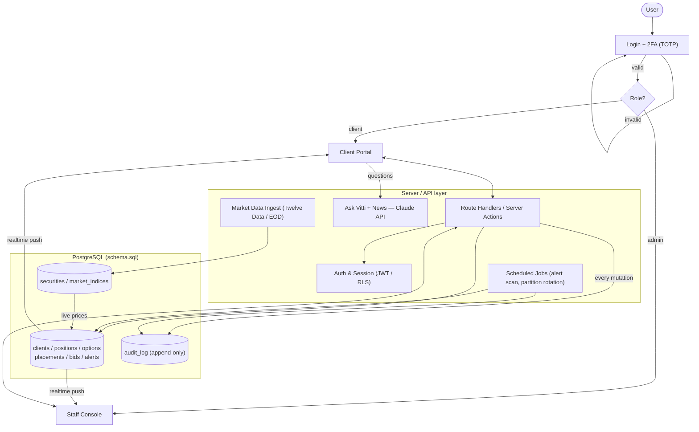
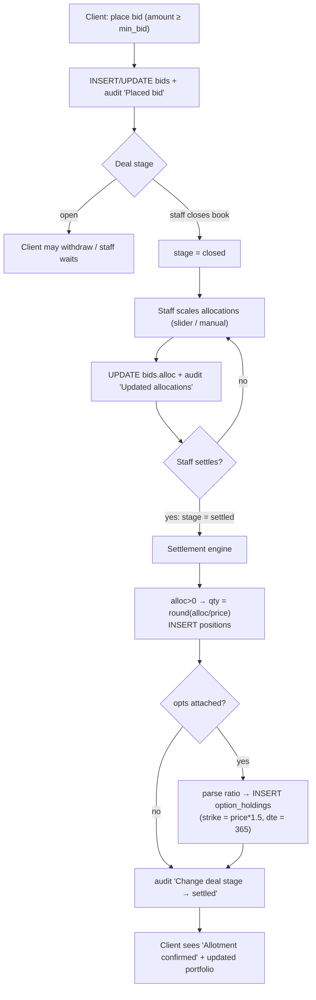
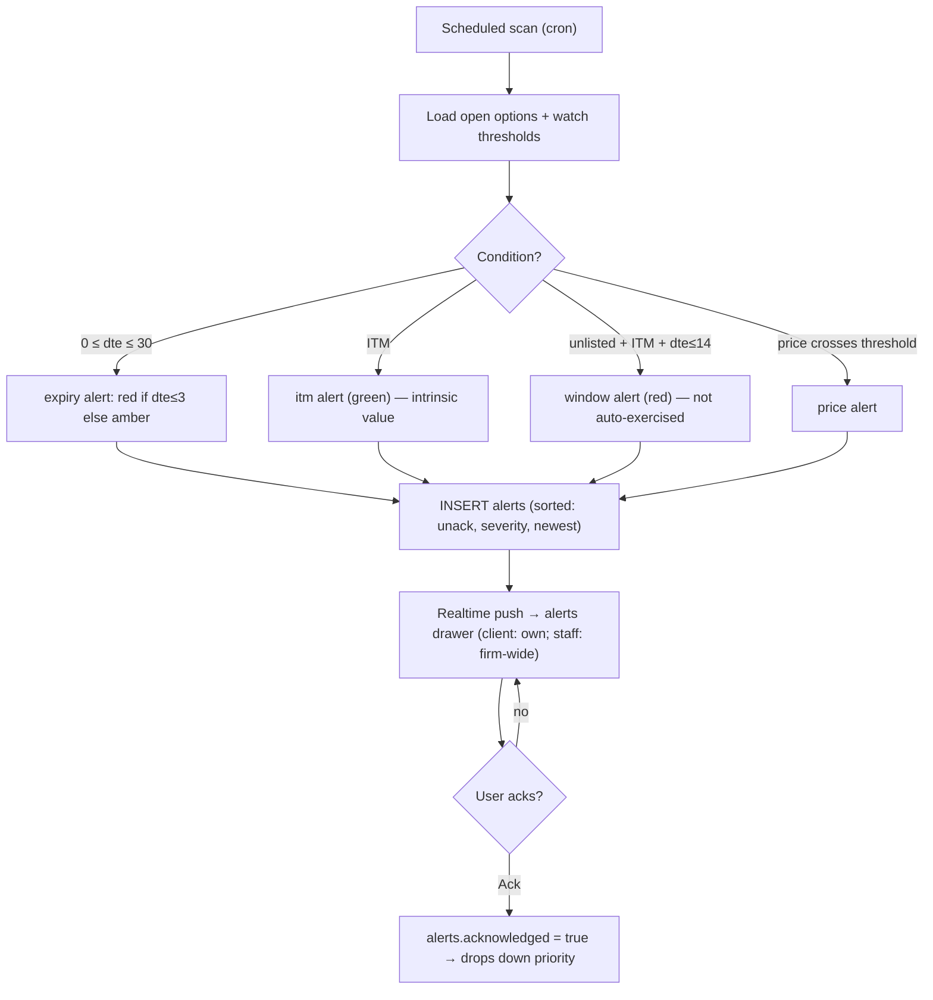

# Requirements — Vitti Capital Platform (Prototype → Production)

This document captures **what is needed to take the current high-fidelity prototype to a fully
functional production system**, and for each requirement records the **chosen provider/approach and
the rationale**. It complements the [HLD](HLD.md) (structure), the [LLD](LLD.md) (data & algorithms),
and the [production SQL schema](../db/schema.sql).

---

## 1. Where the project stands today

- Complete **Next.js 16 / React 19** frontend — all 17 routes built, styled, and interactive.
- **Persistence is live on Supabase.** The production **PostgreSQL schema** ([`db/schema.sql`](../db/schema.sql))
  is applied as the first ordered migration (`supabase/migrations/`, seeded by `supabase/seed.sql`).
  Every route is a Server Component reading a server-only data-access layer ([`lib/data/queries.ts`](../lib/data/queries.ts)),
  and all mutations go through **server actions** ([`app/actions/`](../app/actions/)) that write to Supabase
  and append to `audit_log`. State no longer resets on reload.
- The legacy **in-memory Zustand store** ([`store/useDatabaseStore.ts`](../store/useDatabaseStore.ts)) seeded
  from [`lib/db.ts`](../lib/db.ts) is off the data path — retained only as the reference implementation of the
  domain logic the schema/DAL/actions were ported from.
- **Still cosmetic / missing:** login is a prefilled OTP over an interim **cookie session** (no real auth,
  no 2FA, no RLS yet), and there is **no live market data and no AI/news backend** — prices, alerts, and Ask
  Vitti responses are seeded/keyword-based.

"Fully functional" is therefore the **prototype → production gap** described below. Persistence (F2), the
server-side bidding/settlement lifecycle (F3), and audit-log writes (F8) are now **done**; the remaining
gaps are real auth, live data, scheduled jobs, realtime push, and the AI/news backend.

---

## 2. Recommended stack (one line)

**Vercel (Next.js host) + Supabase (Postgres DB + Auth + Realtime + Cron) + Claude API (AI assistant +
news summarisation) + Twelve Data / EOD Historical Data (market prices) + Upstash Redis (shared-data
cache).**

Rationale: Supabase covers ~90% of the backend requirements (database, auth with TOTP 2FA, row-level
security, realtime push, and `pg_cron` scheduling) in one integrated platform whose native language is
the Postgres our schema already targets. Only the market-data feed and Claude sit outside it.

---

## 3. Functional requirements (the gaps)

| # | Area | Status | Production requirement |
|---|------|--------|------------------------|
| F1 | **Auth & sessions** | ⏳ Interim | *Now:* prefilled OTP + cookie session (`{role, clientId, viewClient}`). *Needed:* real identity, email + **TOTP 2FA**, server sessions, role claims (`client` / `admin`), route protection |
| F2 | **Persistence** | ✅ Done | `schema.sql` applied to Supabase; every read hits the DAL and every mutation hits the DB via server actions |
| F3 | **Bidding lifecycle** | ✅ Done (single-user) | Server actions (`placeBid`/`scaleBids`/`settlePlacement`) with server-side settlement engine. *Still needed:* transactional/concurrency-safe scaling under contention |
| F4 | **Market data** | ❌ Open | Seeded `securities.last_price` / `market_indices`. *Needed:* live (or delayed/EOD) feed on a schedule |
| F5 | **Alerts engine** | ⏳ Partial | `alerts` rows are materialized (seeded) and read via `getAlerts`; ack is a server action. *Needed:* scheduled server job that rescans options/prices and pushes to clients |
| F6 | **Ask Vitti AI** | ❌ Open | Keyword matching over DAL shapes. *Needed:* Claude API backend, grounded with the client's live portfolio context |
| F7 | **Live news** | ❌ Open | Static seed list. *Needed:* news source (news API **or** Claude web-search tool) + Claude to write the "how to use this" note |
| F8 | **Audit log** | ✅ Done | Every server action appends to the partitioned `audit_log` |
| F9 | **BPAY / payments** | ⏳ Interim | `notifyBpayPayment` sets the `paid` flag. *Needed:* manual staff reconciliation workflow; PSP integration later |

---

## 4. Provider decisions (how each requirement is sourced)

### 4.1 Market data (F4) — the hardest one
Securities are **ASX (Australian)**. Real-time ASX data is **exchange-licensed and expensive**.

| Provider | Free tier | ASX support | Notes |
|----------|-----------|-------------|-------|
| **Twelve Data** | Yes | ASX (delayed) | Good for prototype/demo |
| **EOD Historical Data** | Cheap paid | ASX end-of-day | Best value for EOD prices |
| **Finnhub** | Yes | Limited ASX | Also provides news |
| **Alpha Vantage** | Yes (rate-limited) | Weak ASX | Better for global equities |
| Licensed ASX vendor | No | Full real-time | Only for client-facing production with a data budget |

**Decision:** Use **delayed / EOD data** (Twelve Data or EOD Historical) for prototype and demo. A
scheduled job updates `securities.last_price` and `market_indices`. Move to a licensed real-time feed
only at production launch, when the exchange-licensing budget exists.

### 4.2 Auth + 2FA (F1)
**Decision: Supabase Auth** — email + **TOTP 2FA** built in, and it pairs naturally with Postgres
Row-Level Security. Alternatives considered: Clerk (fastest, paid), Auth.js/NextAuth (free, more manual).

### 4.3 Database (F2)
**Decision: Supabase Postgres** (Neon or AWS Aurora are drop-in alternatives — `schema.sql` runs on all
three). Keeps auth, realtime, and cron co-located with the data.

### 4.4 Real-time updates (F3, F5)
**Decision: Supabase Realtime** — DB changes push automatically to client and staff sessions (live
prices, alerts, and staff↔client bid/allocation sync). Alternatives: Pusher, Ably, raw WebSockets/SSE.

### 4.5 Scheduled jobs (F5, F8)
**Decision: Supabase `pg_cron`** (or Vercel Cron) — runs the alert scan periodically and creates the
monthly `audit_log` partition. Use **Inngest** if job orchestration grows complex.

### 4.6 AI assistant & news (F6, F7)
**Decision: Claude API.**
- **Ask Vitti (F6):** Claude with the client's portfolio (`portfolioValue`, `clientOptions`, etc.)
  injected as grounded context.
- **News (F7):** Claude alone has a knowledge cutoff, so it does **not** produce live news by itself.
  Source headlines from a **news API** (Finnhub/NewsAPI) *or* Claude's **web-search tool**, then use
  Claude to summarise and generate the adviser "how to use this" note.

### 4.7 Payments / BPAY (F9)
**Decision: manual staff reconciliation for now** — client marks a bid paid, staff confirms against the
bank statement (this is what the `paid` flag models). A PSP (Stripe / Zai / Monoova) is a later,
separate scope.

### 4.8 Hosting & caching
**Decision: Vercel** (natural Next.js host) + **Upstash Redis** for caching shared market data
(`securities` / `market_indices`) in a serverless-friendly way.

---

## 5. Non-functional requirements

- **API layer** — Next.js Route Handlers / Server Actions with a data-access layer replacing direct
  `lib/db.ts` reads.
- **Security** — Row-Level Security (clients see only their own rows; staff bypass), input validation
  (Zod), CSRF protection, rate limiting, secrets management.
- **Connection pooling** — PgBouncer / platform pooler for serverless.
- **Caching** — Redis / read replica for shared reference data.
- **Observability** — structured logging, error tracking (Sentry), health checks.
- **Testing** — unit tests for the money/settlement math, integration tests for mutations, E2E for the
  bid → settle → confirm flow. (The project currently has **zero** tests.)
- **CI/CD** — lint + build + test pipeline on every push; preview deploys.
- **Compliance** — s708 wholesale-certificate expiry enforcement, immutable audit trail (guaranteed by
  the append-only partitioned `audit_log`), data-retention policy.

---

## 6. Suggested build order

1. ✅ Stand up Supabase, apply [`db/schema.sql`](../db/schema.sql), add a data-access layer.
2. Real auth + TOTP 2FA + Row-Level Security. *(interim cookie session in place)*
3. ✅ Port the `mutate*` functions to server actions that write to the DB (audit on every write).
4. Market-data ingestion job + scheduled alert engine.
5. Realtime push, then the Claude AI + news backend.
6. Tests, observability, and deploy pipeline.

---

## 7. Behaviour flow charts

### 7.1 Top-level system behaviour (production target)

### 7.2 Bidding → allocation → settlement lifecycle

### 7.3 Alert engine lifecycle

