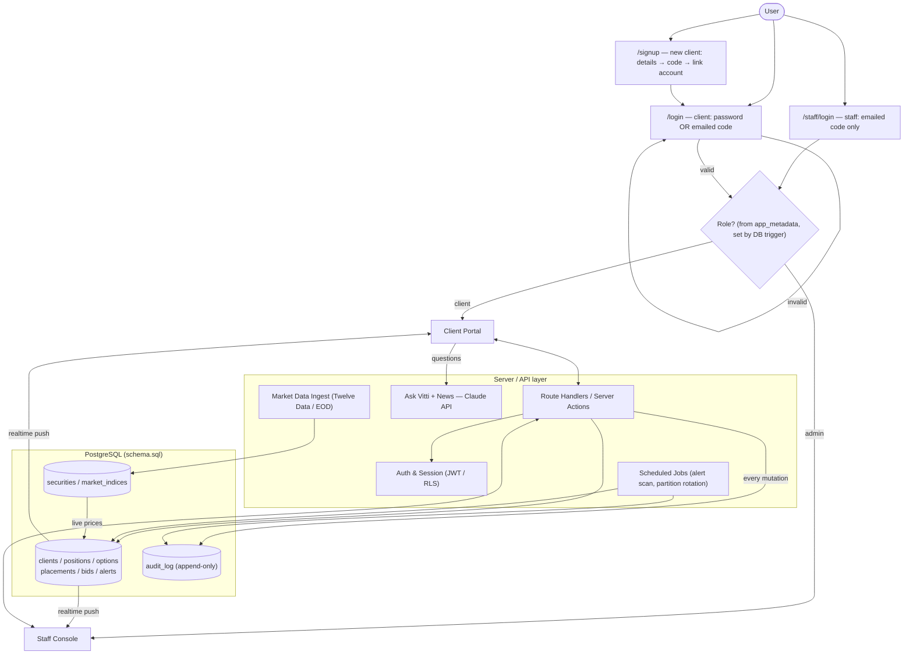
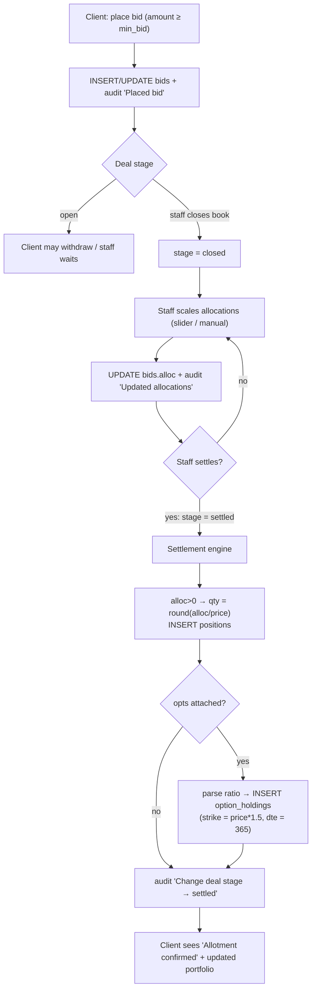
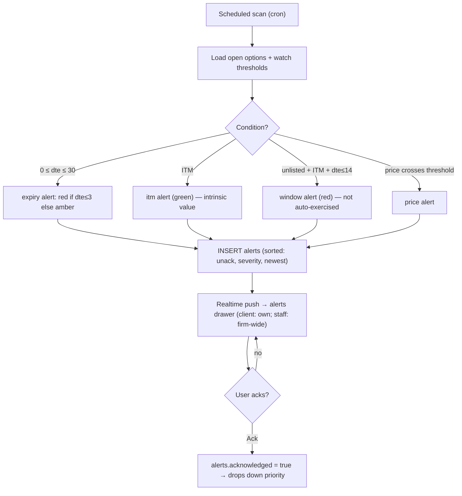

# Requirements — Vitti Capital Platform (Prototype → Production)

This document captures **what is needed to take the current high-fidelity prototype to a fully
functional production system**, and for each requirement records the **chosen provider/approach and
the rationale**. It complements the [HLD](HLD.md) (structure), the [LLD](LLD.md) (data & algorithms),
and the [production SQL schema](../db/schema.sql).

---

## 1. Where the project stands today

- Complete **Next.js 16 / React 19** frontend — all 17 routes built, styled, and interactive.
- **Persistence is live on Supabase.** The production **PostgreSQL schema** ([`db/schema.sql`](../db/schema.sql))
  is applied as the first ordered migration (`supabase/migrations/`, seeded by `supabase/seed.sql`).
  Every route is a Server Component reading a server-only data-access layer ([`lib/data/queries.ts`](../lib/data/queries.ts)),
  and all mutations go through **server actions** ([`app/actions/`](../app/actions/)) that write to Supabase
  and append to `audit_log`. State no longer resets on reload.
- The legacy **in-memory Zustand store** ([`store/useDatabaseStore.ts`](../store/useDatabaseStore.ts)) seeded
  from [`lib/db.ts`](../lib/db.ts) is off the data path — retained only as the reference implementation of the
  domain logic the schema/DAL/actions were ported from.
- **Auth is real, with two doors and two credentials.** **Clients** sign in at `/login` with a password
  (`signInWithPassword`) **or** a one-time code (`signInWithOtp` → `verifyOtp`); **staff** sign in at
  `/staff/login` with a code **only**, and hold no password at all — their accounts self-provision from the
  email domain, and the only thing making that safe is that the code must be read at a firm mailbox. New
  clients **register themselves** at `/signup` (3 steps: details → email verification → link a broker account,
  the last being required). `/` redirects to `/login`; the marketing landing page was removed. A root
  `proxy.ts` refreshes the session and redirects both ways, and server code reads identity via `getUser()`,
  with the staff/client role in `app_metadata.role` — stamped from the email domain by a trigger on
  `auth.users`, never decided by the page. See HLD §3.1b-2 and §4.7.
- **Multi-account model.** A client (person/login) can hold **multiple investment accounts** (Personal, SMSF, …);
  holdings/cash/bids are account-scoped (`accounts` table + `account_id` FKs), a client sees only their own
  accounts, and staff see everyone's. Clients switch accounts via a topbar switcher; staff views aggregate
  across a client's accounts. Clients can **self-serve open** a new account, and **request an account merge**
  that requires **staff approval** before it executes (holdings/cash/bids move to the target, source closed).
  See LLD §8.12–§8.13.
- **Access control is enforced.** Route protection redirects unauthenticated `/portal` requests to `/login`
  (proxy + layout), a staff-area layout blocks non-admins, and **Postgres RLS** guarantees a client can only
  read/write their own rows (staff bypass via `app_metadata.role`) — see §5 and [the RLS migration](../supabase/migrations).
- **The AI backend now exists, for one job.** The weekly per-security commentary (F10) calls **Claude** with the
  web-search server tool through the Message Batches API, on a `pg_cron` schedule from the Friday close. It is the
  first LLM call in the codebase and it establishes the pattern the rest of §4.6 needs: a validation gate between the
  model and the client's screen, sources stored alongside every claim, and the whole feature off — not broken — when
  `ANTHROPIC_API_KEY` is unset.
- **Still missing:** **real TOTP 2FA**. The emailed code is a genuine credential, not a decorative step — but
  it is an *alternative* to the password rather than a second factor on top of one, and the codebase
  deliberately does not pretend otherwise (a code after an accepted password guards nothing, since the session
  already exists). True 2FA means Supabase MFA (`auth.mfa`). There is also **no live market data** — prices
  and alerts are seeded, and Ask Vitti is still keyword-based.

"Fully functional" is therefore the **prototype → production gap** described below. Persistence (F2), the
server-side bidding/settlement lifecycle (F3), audit-log writes (F8), and **auth with route protection + RLS**
(F1) are now **done**, including client self-registration and password reset; the remaining gaps are TOTP 2FA,
live data, realtime push, and the wider AI/news backend.

---

## 2. Recommended stack (one line)

**Vercel (Next.js host) + Supabase (Postgres DB + Auth + Realtime + Cron) + Claude API (AI assistant +
news summarisation) + Twelve Data / EOD Historical Data (market prices) + Upstash Redis (shared-data
cache).**

Rationale: Supabase covers ~90% of the backend requirements (database, auth with TOTP 2FA, row-level
security, realtime push, and `pg_cron` scheduling) in one integrated platform whose native language is
the Postgres our schema already targets. Only the market-data feed and Claude sit outside it.

---

## 3. Functional requirements (the gaps)

| # | Area | Status | Production requirement |
|---|------|--------|------------------------|
| F1 | **Auth & sessions** | ⏳ Partial | *Now:* **real Supabase Auth** on two doors — clients at `/login` by password **or** emailed code, staff at `/staff/login` by code only (staff hold no password, enforced in four places incl. a DB trigger). Client **self-registration** at `/signup` and **password reset** at `/reset-password`. Session refreshed by `proxy.ts`, identity via `getUser()`, role in `app_metadata.role` stamped from the email domain, **route protection** both ways, and **RLS** (see F2/§5). *Still needed:* **TOTP 2FA** — the emailed code is a real credential but an alternative to the password, not a second factor on top of one; that means Supabase MFA (`auth.mfa`) |
| F2 | **Persistence** | ✅ Done | `schema.sql` applied to Supabase; every read hits the DAL and every mutation hits the DB via server actions — now under **RLS** (client-own rows; `is_staff()` bypass) |
| F3 | **Bidding lifecycle** | ✅ Done (single-user) | Server actions (`placeBid`/`scaleBids`/`settlePlacement`) with server-side settlement engine. *Still needed:* transactional/concurrency-safe scaling under contention |
| F4 | **Market data** | ❌ Open | Seeded `securities.last_price` / `market_indices`. *Needed:* live (or delayed/EOD) feed on a schedule |
| F5 | **Alerts engine** | ⏳ Partial | `alerts` rows are materialized (seeded) and read via `getAlerts`; ack is a server action. *Needed:* scheduled server job that rescans options/prices and pushes to clients |
| F6 | **Ask Vitti AI** | ❌ Open | Keyword matching over DAL shapes. *Needed:* Claude API backend, grounded with the client's live portfolio context. (The Claude API is now wired up for F10 — `@anthropic-ai/sdk`, `ANTHROPIC_API_KEY` — so this is a prompt and a grounding problem rather than an integration one) |
| F7 | **Live news** | ❌ Open | Static seed list. *Needed:* news source (news API **or** Claude web-search tool) + Claude to write the "how to use this" note |
| F8 | **Audit log** | ✅ Done | Every server action appends to the partitioned `audit_log` |
| F9 | **BPAY / payments** | ⏳ Interim | `notifyBpayPayment` sets the `paid` flag. *Needed:* manual staff reconciliation workflow; PSP integration later |
| F10 | **Weekly position commentary** | ✅ Done | Claude (`claude-opus-5`) with the web-search server tool, on the Batches API, scheduled by `pg_cron` from the Friday close through Sunday. One note per **held** security in two framings; served by the sign of the client's own P&L. Gated on `ANTHROPIC_API_KEY` and off without it. See LLD §8.36 |
| F11 | **One login, several existing accounts** | ✅ Done | A client claims an account by its broker number; staff verify against the broker record; approval re-parents the account and everything denormalised against it in one `SECURITY DEFINER` transaction. Now also the **last step of sign-up**, so a new login arrives with its first account attached. See LLD §8.34 |
| F12 | **Client self-registration** | ✅ Done | 3 steps at `/signup` — details → emailed code → link a broker account (**required**). Runs on the service role so project-level signups stay OFF; the user is created **without a password** and it is set only after `verifyOtp` proves the mailbox. Step 3 is enforced by state: the portal layout returns any client with no accounts and no pending claim to `/signup`. See HLD §4.7 |
| F13 | **Staff cannot hold a password** | ✅ Done | Staff accounts self-provision from the email domain, which is safe only because the code must be *read* at a firm mailbox; a password would work without one. Refused by `startSignUp`, by `requestPasswordResetCode` before mail is sent, by `signInWithPassword` (signs the session out), and by a `BEFORE INSERT` trigger on `auth.users`. The same migration closed a **live privilege escalation**: project signups were ON, so `POST /auth/v1/signup` + the role trigger handed out staff accounts on `@vitti.capital` addresses to anyone with the public anon key |

---

## 4. Provider decisions (how each requirement is sourced)

### 4.1 Market data (F4) — the hardest one
Securities are **ASX (Australian)**. Real-time ASX data is **exchange-licensed and expensive**.

| Provider | Free tier | ASX support | Notes |
|----------|-----------|-------------|-------|
| **Twelve Data** | Yes | ASX (delayed) | Good for prototype/demo |
| **EOD Historical Data** | Cheap paid | ASX end-of-day | Best value for EOD prices |
| **Finnhub** | Yes | Limited ASX | Also provides news |
| **Alpha Vantage** | Yes (rate-limited) | Weak ASX | Better for global equities |
| Licensed ASX vendor | No | Full real-time | Only for client-facing production with a data budget |

**Decision:** Use **delayed / EOD data** (Twelve Data or EOD Historical) for prototype and demo. A
scheduled job updates `securities.last_price` and `market_indices`. Move to a licensed real-time feed
only at production launch, when the exchange-licensing budget exists.

### 4.2 Auth + 2FA (F1)
**Decision: Supabase Auth** — email, password, one-time codes and **TOTP 2FA** built in, and it pairs
naturally with Postgres Row-Level Security. Alternatives considered: Clerk (fastest, paid), Auth.js/NextAuth
(free, more manual).

*As built:* clients may use a password or an emailed code; staff use codes only. The role is decided by the
**database** (a trigger on `auth.users` reading the email domain), never by which page someone opened — the
two sign-in pages are a usability split, not a security boundary. TOTP is still to come and is the only thing
that would make sign-in genuinely two-factor.

### 4.3 Database (F2)
**Decision: Supabase Postgres** (Neon or AWS Aurora are drop-in alternatives — `schema.sql` runs on all
three). Keeps auth, realtime, and cron co-located with the data.

### 4.4 Real-time updates (F3, F5)
**Decision: Supabase Realtime** — DB changes push automatically to client and staff sessions (live
prices, alerts, and staff↔client bid/allocation sync). Alternatives: Pusher, Ably, raw WebSockets/SSE.

### 4.5 Scheduled jobs (F5, F8)
**Decision: Supabase `pg_cron`** (or Vercel Cron) — runs the alert scan periodically and creates the
monthly `audit_log` partition. Use **Inngest** if job orchestration grows complex.

### 4.6 AI assistant & news (F6, F7)
**Decision: Claude API.**
- **Ask Vitti (F6):** Claude with the client's portfolio (`portfolioValue`, `clientOptions`, etc.)
  injected as grounded context.
- **News (F7):** Claude alone has a knowledge cutoff, so it does **not** produce live news by itself.
  Source headlines from a **news API** (Finnhub/NewsAPI) *or* Claude's **web-search tool**, then use
  Claude to summarise and generate the adviser "how to use this" note.

### 4.7 Payments / BPAY (F9)
**Decision: manual staff reconciliation for now** — client marks a bid paid, staff confirms against the
bank statement (this is what the `paid` flag models). A PSP (Stripe / Zai / Monoova) is a later,
separate scope.

### 4.8 Hosting & caching
**Decision: Vercel** (natural Next.js host) + **Upstash Redis** for caching shared market data
(`securities` / `market_indices`) in a serverless-friendly way.

---

## 5. Non-functional requirements

- **API layer** — Next.js Route Handlers / Server Actions with a data-access layer replacing direct
  `lib/db.ts` reads.
- **Security** — ✅ Row-Level Security (clients see only their own rows; staff bypass) + route protection.
  Still to add: input validation (Zod), CSRF protection, rate limiting, secrets management.
- **Connection pooling** — PgBouncer / platform pooler for serverless.
- **Caching** — Redis / read replica for shared reference data.
- **Observability** — structured logging, error tracking (Sentry), health checks.
- **Testing** — unit tests for the money/settlement math, integration tests for mutations, E2E for the
  bid → settle → confirm flow. (The project currently has **zero** tests.)
- **CI/CD** — lint + build + test pipeline on every push; preview deploys.
- **Compliance** — s708 wholesale-certificate expiry enforcement, immutable audit trail (guaranteed by
  the append-only partitioned `audit_log`), data-retention policy.

---

## 6. Suggested build order

1. ✅ Stand up Supabase, apply [`db/schema.sql`](../db/schema.sql), add a data-access layer.
2. Real auth + TOTP 2FA + Row-Level Security. *(✅ password **and** one-time-code auth, self-registration, password reset, route protection, and RLS done; real TOTP 2FA pending)*
3. ✅ Port the `mutate*` functions to server actions that write to the DB (audit on every write).
4. Market-data ingestion job + scheduled alert engine.
5. Realtime push, then the Claude AI + news backend.
6. Tests, observability, and deploy pipeline.

---

## 7. Behaviour flow charts

### 7.1 Top-level system behaviour (production target)

```mermaid
flowchart TD
    U([User]) --> Login["/login — client: password OR emailed code"]
    U --> Staff["/staff/login — staff: emailed code only"]
    U --> Signup["/signup — new client: details → code → link account"]
    Signup --> Login
    Login -->|invalid| Login
    Staff --> Role
    Login -->|valid| Role{"Role? (from app_metadata, set by DB trigger)"}

    Role -->|client| CP["Client Portal"]
    Role -->|admin| SP["Staff Console"]

    subgraph Server["Server / API layer"]
        AuthSvc["Auth & Session (JWT / RLS)"]
        API["Route Handlers / Server Actions"]
        Jobs["Scheduled Jobs (alert scan, partition rotation)"]
        AI["Ask Vitti + News — Claude API"]
        Feed["Market Data Ingest (Twelve Data / EOD)"]
    end

    subgraph Data["PostgreSQL (schema.sql)"]
        DB[("clients / positions / options\nplacements / bids / alerts")]
        Sec[("securities / market_indices")]
        Audit[("audit_log (append-only)")]
    end

    CP <--> API
    SP <--> API
    CP -->|questions| AI
    API --> AuthSvc
    API --> DB
    API -->|every mutation| Audit
    Feed --> Sec
    Jobs --> DB
    Jobs --> Audit
    Sec -->|live prices| DB
    DB -->|realtime push| CP
    DB -->|realtime push| SP
```

### 7.2 Bidding → allocation → settlement lifecycle

```mermaid
flowchart TD
    A["Client: place bid (amount ≥ min_bid)"] --> B["INSERT/UPDATE bids + audit 'Placed bid'"]
    B --> C{Deal stage}
    C -->|open| A2["Client may withdraw / staff waits"]
    C -->|staff closes book| D["stage = closed"]
    D --> E["Staff scales allocations (slider / manual)"]
    E --> F["UPDATE bids.alloc + audit 'Updated allocations'"]
    F --> G{Staff settles?}
    G -->|no| E
    G -->|yes: stage = settled| H["Settlement engine"]
    H --> I["alloc>0 → qty = round(alloc/price)\nINSERT positions"]
    I --> J{opts attached?}
    J -->|yes| K["parse ratio → INSERT option_holdings\n(strike = price*1.5, dte = 365)"]
    J -->|no| L
    K --> L["audit 'Change deal stage → settled'"]
    L --> M["Client sees 'Allotment confirmed' + updated portfolio"]
```

### 7.3 Alert engine lifecycle

```mermaid
flowchart TD
    S["Scheduled scan (cron)"] --> P["Load open options + watch thresholds"]
    P --> Q{Condition?}
    Q -->|0 ≤ dte ≤ 30| R["expiry alert: red if dte≤3 else amber"]
    Q -->|ITM| T["itm alert (green) — intrinsic value"]
    Q -->|unlisted + ITM + dte≤14| V["window alert (red) — not auto-exercised"]
    Q -->|price crosses threshold| W["price alert"]
    R --> X["INSERT alerts (sorted: unack, severity, newest)"]
    T --> X
    V --> X
    W --> X
    X --> Y["Realtime push → alerts drawer (client: own; staff: firm-wide)"]
    Y --> Z{User acks?}
    Z -->|Ack| AA["alerts.acknowledged = true → drops down priority"]
    Z -->|no| Y
```
